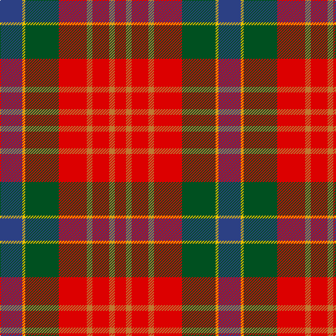

In pattern [BYGRRRRR](/patterns/bygrrrrr/).

This was sourced from register-of-tartans.  It is a [8 stripes tartan](/stripes/stripes8/).

Original link https://www.tartanregister.gov.uk/tartanDetails.aspx?ref=5874

## Thread count
B/32 Y4 G48 R40 DO8 R24 DO8 R/16

## Palette
Each colour and its ΔE from the base-6 reference it is a variant of.

| Colour | Shade | Base | ΔE (OKLab) |
|---|---|---|---|
| B | <code style="background-color:#2C4084;">#2C4084</code> `#2C4084` | B <code style="background-color:#2C4084;">#2C4084</code> | 0.00 |
| DO | <code style="background-color:#BE7832;">#BE7832</code> `#BE7832` | R <code style="background-color:#C80000;">#C80000</code> | 0.17 |
| G | <code style="background-color:#005020;">#005020</code> `#005020` | G <code style="background-color:#006400;">#006400</code> | 0.08 |
| R | <code style="background-color:#DC0000;">#DC0000</code> `#DC0000` | R <code style="background-color:#C80000;">#C80000</code> | 0.04 |
| Y | <code style="background-color:#E8C000;">#E8C000</code> `#E8C000` | Y <code style="background-color:#E8C000;">#E8C000</code> | 0.00 |

# Sample pattern

## Nearest tartans

The nearest existing variants by ΔTartan distance.

1. [Australia Dress](/setts/s9/y22r8g4k8g4r8g24r40b4-b2888c4-g8c7038-k101010-ra00000-yb8b8b8/) — ΔT 0.86
1. [Wilson's, No 2](/setts/s8/b4r22ba18b22y4g26r42w4-b300030-ba5480b0-g008000-rc00000-we0e0e0-yf0c000/) — ΔT 1.07
1. [Craik of Assington Personal Tartan Tartan Number: 494. Earliest known date: 1981 Restricted See products available Copyright © Blair Urquhart, Comrie, 2015](/setts/s8/b16r44b4g32r8g16k4y8-b2c2c80-g006818-k101010-rc80000-ye8c000/) — ΔT 1.08
1. [MacBean/MacElvain](/setts/s7/k4r24b12r6g24r8b2-b2c4084-g005020-k101010-rdc0000/) — ΔT 1.09
1. [Unidentified No 57](/setts/s10/r12w2r12b4r12g24y2b16ba8r8-b2c4084-ba3c82af-g005020-rdc0000-we0e0e0-ye8c000/) — ΔT 1.10
1. [Unnamed No 57 Tartan Tartan Number: 1317. Earliest known date: 1870 This sett is taken from the records of Messrs Bolingbroke and Jones of Norwich, who were weavers around 1870. Some of the tartans have been adopted or modified in recent times as the copyright of the designs is now in the public domain. See products available Copyright © Blair Urquhart, Comrie, 2015](/setts/s10/r12w2r12b4r12g24y2b16ba8r8-b2c2c80-ba5c8ca8-g006818-rc80000-we0e0e0-ye8c000/) — ΔT 1.11
1. [Sturrock (Blue/Black)](/setts/s12/r32y6r32g44k32b32r104b32k32g44r32y6-b1870a4-g006818-k101010-rc80000-yd09800/) — ΔT 1.13
1. [Ulster Ancestry (Fashion)](/setts/s9/b94r16k44r14w6r48b18r20y6-b5c5c5c-k101010-rc80000-we8ccb8-ybc8c00/) — ΔT 1.13
1. [Unnamed No 57](/setts/s10/r12w2r12b4r12g24y2b16ba8r8-b304080-ba5480b0-g008000-rc00000-we0e0e0-yf0c000/) — ΔT 1.14
1. [Graham of Montrose Red](/setts/s9/w4k4r40g40k20w20r40k4w4-g006818-k101010-r880000-wa8ace8/) — ΔT 1.18

## Neighbour map

Every grey dot is one of 15726 variants placed by the first two principal components of the ΔTartan feature space (44% of its variance). Red is this tartan; blue dots are its nearest — click one to open its page.

<svg viewBox="0 0 640 380" role="img" style="max-width:100%;height:auto;border:1px solid #e0e0e0;border-radius:4px;display:block" xmlns="http://www.w3.org/2000/svg"><image href="/nn/cloud.v1.png" width="640" height="380"/><a href="/setts/s9/y22r8g4k8g4r8g24r40b4-b2888c4-g8c7038-k101010-ra00000-yb8b8b8/"><circle cx="231.5" cy="166.2" r="4" fill="#3465a4"><title>Australia Dress</title></circle></a><a href="/setts/s8/b4r22ba18b22y4g26r42w4-b300030-ba5480b0-g008000-rc00000-we0e0e0-yf0c000/"><circle cx="169.2" cy="160.1" r="4" fill="#3465a4"><title>Wilson's, No 2</title></circle></a><a href="/setts/s8/b16r44b4g32r8g16k4y8-b2c2c80-g006818-k101010-rc80000-ye8c000/"><circle cx="193.6" cy="172.2" r="4" fill="#3465a4"><title>Craik of Assington Personal Tartan Tartan Number: 494. Earliest known date: 1981 Restricted See products available Copyright © Blair Urquhart, Comrie, 2015</title></circle></a><a href="/setts/s7/k4r24b12r6g24r8b2-b2c4084-g005020-k101010-rdc0000/"><circle cx="259.5" cy="198.0" r="4" fill="#3465a4"><title>MacBean/MacElvain</title></circle></a><a href="/setts/s10/r12w2r12b4r12g24y2b16ba8r8-b2c4084-ba3c82af-g005020-rdc0000-we0e0e0-ye8c000/"><circle cx="171.5" cy="157.3" r="4" fill="#3465a4"><title>Unidentified No 57</title></circle></a><a href="/setts/s10/r12w2r12b4r12g24y2b16ba8r8-b2c2c80-ba5c8ca8-g006818-rc80000-we0e0e0-ye8c000/"><circle cx="172.3" cy="159.0" r="4" fill="#3465a4"><title>Unnamed No 57 Tartan Tartan Number: 1317. Earliest known date: 1870 This sett is taken from the records of Messrs Bolingbroke and Jones of Norwich, who were weavers around 1870. Some of the tartans have been adopted or modified in recent times as the copyright of the designs is now in the public domain. See products available Copyright © Blair Urquhart, Comrie, 2015</title></circle></a><a href="/setts/s12/r32y6r32g44k32b32r104b32k32g44r32y6-b1870a4-g006818-k101010-rc80000-yd09800/"><circle cx="212.0" cy="152.4" r="4" fill="#3465a4"><title>Sturrock (Blue/Black)</title></circle></a><a href="/setts/s9/b94r16k44r14w6r48b18r20y6-b5c5c5c-k101010-rc80000-we8ccb8-ybc8c00/"><circle cx="251.7" cy="154.0" r="4" fill="#3465a4"><title>Ulster Ancestry (Fashion)</title></circle></a><a href="/setts/s10/r12w2r12b4r12g24y2b16ba8r8-b304080-ba5480b0-g008000-rc00000-we0e0e0-yf0c000/"><circle cx="175.1" cy="161.1" r="4" fill="#3465a4"><title>Unnamed No 57</title></circle></a><a href="/setts/s9/w4k4r40g40k20w20r40k4w4-g006818-k101010-r880000-wa8ace8/"><circle cx="196.6" cy="171.6" r="4" fill="#3465a4"><title>Graham of Montrose Red</title></circle></a><circle cx="211.2" cy="181.2" r="5" fill="#c00000"/></svg>

ID: /setts/s8/b32y4g48r40ra8r24ra8r16-b2c4084-g005020-rdc0000-rabe7832-ye8c000/
