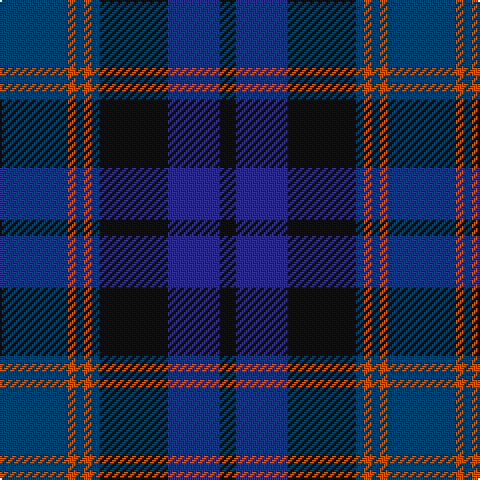

In pattern [BRBRBKBK](/patterns/brbrbkbk/).

This was sourced from register-of-tartans.  It is a [8 stripes tartan](/stripes/stripes8/).

Original link https://www.tartanregister.gov.uk/tartanDetails.aspx?ref=5100

## Thread count
DBa/34 DO4 DBa4 DO4 DBa4 K34 DB26 K/8

## Palette
Each colour and its ΔE from the base-6 reference it is a variant of.

| Colour | Shade | Base | ΔE (OKLab) |
|---|---|---|---|
| DB | <code style="background-color:#2C2C80;">#2C2C80</code> `#2C2C80` | B <code style="background-color:#2C4084;">#2C4084</code> | 0.05 |
| DBa | <code style="background-color:#003C64;">#003C64</code> `#003C64` | B <code style="background-color:#2C4084;">#2C4084</code> | 0.07 |
| DO | <code style="background-color:#C04C08;">#C04C08</code> `#C04C08` | R <code style="background-color:#C80000;">#C80000</code> | 0.08 |
| K | <code style="background-color:#101010;">#101010</code> `#101010` | K <code style="background-color:#000000;">#000000</code> | 0.17 |

# Sample pattern

## Nearest tartans

The nearest existing variants by ΔTartan distance.

1. [Caledonian Hotel (Corporate)](/setts/s8/b36ba4b4ba4b4ba28g28r8-b5c5c5c-ba1c0070-g003820-r880000/) — ΔT 0.83
1. [MacAndreis (Personal)](/setts/s10/k6g8b50k32g6k6g6k6g12r6-b2c2c80-g003820-k101010-re87878/) — ΔT 0.90
1. [Christian Dewar (Personal)](/setts/s9/b32k4b4k4b4k12ba26y4ba6-b00248c-ba142814-k3c0000-ya08c28/) — ΔT 0.92
1. [Dewar, Christian (Personal)](/setts/s9/b32r4b4r4b4r12g26y4g6-b1c1c50-g003820-r880000-ybc8c00/) — ΔT 1.23
1. [Grampian (District)](/setts/s8/g48r4g6b28ba48r4ba6b6-b303070-ba14283c-g5c6428-rc80000/) — ΔT 1.31
1. [Caledonian Hotel (Corporate)](/setts/s8/b36ba4b4ba4b4ba28k28r8-b5c5c5c-ba1c0070-k101010-r880000/) — ΔT 1.31
1. [Brethwe Powys](/setts/s11/g24b7g7b7k22b7k4ga4k4b40r14-b2c4084-g003c14-ga503c14-k000028-r781c38/) — ΔT 1.39
1. [Unidentified No 59](/setts/s6/b2ba22k22g22k4b2-b3c82af-ba2c4084-g005020-k101010/) — ΔT 1.40
1. [Louise of Lorne](/setts/s11/b2k2b18k12g2k2g2k2g12r2k2-b2c4084-g005020-k101010-rdc0000/) — ΔT 1.42
1. [South Australia](/setts/s10/b26g38k4g14k4g14k4ba36r4b26-b102040-ba304080-g004010-k000000-rc00000/) — ΔT 1.43

## Neighbour map

Every grey dot is one of 15726 variants placed by the first two principal components of the ΔTartan feature space (44% of its variance). Red is this tartan; blue dots are its nearest — click one to open its page.

<svg viewBox="0 0 640 380" role="img" style="max-width:100%;height:auto;border:1px solid #e0e0e0;border-radius:4px;display:block" xmlns="http://www.w3.org/2000/svg"><image href="/nn/cloud.v1.png" width="640" height="380"/><a href="/setts/s8/b36ba4b4ba4b4ba28g28r8-b5c5c5c-ba1c0070-g003820-r880000/"><circle cx="251.9" cy="227.7" r="4" fill="#3465a4"><title>Caledonian Hotel (Corporate)</title></circle></a><a href="/setts/s10/k6g8b50k32g6k6g6k6g12r6-b2c2c80-g003820-k101010-re87878/"><circle cx="251.9" cy="213.1" r="4" fill="#3465a4"><title>MacAndreis (Personal)</title></circle></a><a href="/setts/s9/b32k4b4k4b4k12ba26y4ba6-b00248c-ba142814-k3c0000-ya08c28/"><circle cx="268.3" cy="224.5" r="4" fill="#3465a4"><title>Christian Dewar (Personal)</title></circle></a><a href="/setts/s9/b32r4b4r4b4r12g26y4g6-b1c1c50-g003820-r880000-ybc8c00/"><circle cx="278.4" cy="223.4" r="4" fill="#3465a4"><title>Dewar, Christian (Personal)</title></circle></a><a href="/setts/s8/g48r4g6b28ba48r4ba6b6-b303070-ba14283c-g5c6428-rc80000/"><circle cx="273.4" cy="212.4" r="4" fill="#3465a4"><title>Grampian (District)</title></circle></a><a href="/setts/s8/b36ba4b4ba4b4ba28k28r8-b5c5c5c-ba1c0070-k101010-r880000/"><circle cx="235.7" cy="218.8" r="4" fill="#3465a4"><title>Caledonian Hotel (Corporate)</title></circle></a><a href="/setts/s11/g24b7g7b7k22b7k4ga4k4b40r14-b2c4084-g003c14-ga503c14-k000028-r781c38/"><circle cx="243.8" cy="200.1" r="4" fill="#3465a4"><title>Brethwe Powys</title></circle></a><a href="/setts/s6/b2ba22k22g22k4b2-b3c82af-ba2c4084-g005020-k101010/"><circle cx="239.0" cy="242.9" r="4" fill="#3465a4"><title>Unidentified No 59</title></circle></a><a href="/setts/s11/b2k2b18k12g2k2g2k2g12r2k2-b2c4084-g005020-k101010-rdc0000/"><circle cx="239.2" cy="201.5" r="4" fill="#3465a4"><title>Louise of Lorne</title></circle></a><a href="/setts/s10/b26g38k4g14k4g14k4ba36r4b26-b102040-ba304080-g004010-k000000-rc00000/"><circle cx="229.6" cy="223.2" r="4" fill="#3465a4"><title>South Australia</title></circle></a><circle cx="255.2" cy="239.0" r="5" fill="#c00000"/></svg>

ID: /setts/s8/b34r4b4r4b4k34ba26k8-b003c64-ba2c2c80-k101010-rc04c08/
