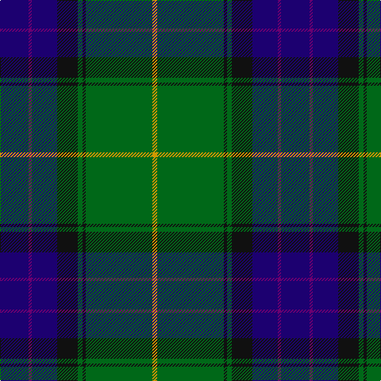

In pattern [BBBKGKGY](/patterns/bbbkgkgy/).

This was sourced from register-of-tartans.  It is a [8 stripes tartan](/stripes/stripes8/).

Original link https://www.tartanregister.gov.uk/tartanDetails.aspx?ref=2881

## Attestations

This cloth appears in 2 source records; the oldest owns this page.

- 01/09/1999 — McFadden (Personal) (register-of-tartans, [record](https://www.tartanregister.gov.uk/tartanDetails.aspx?ref=2881))
- March 2000 — McFadden (Personal) (tartans-authority, [record](http://www.tartansauthority.com/tartan-ferret/display/2656/))

## Thread count
DB/36 P4 DB32 K26 G6 K4 G84 DY/6

## Palette
Each colour and its ΔE from the base-6 reference it is a variant of.

| Colour | Shade | Base | ΔE (OKLab) |
|---|---|---|---|
| DB | <code style="background-color:#1C0070;">#1C0070</code> `#1C0070` | B <code style="background-color:#2C4084;">#2C4084</code> | 0.14 |
| DY | <code style="background-color:#D09800;">#D09800</code> `#D09800` | Y <code style="background-color:#E8C000;">#E8C000</code> | 0.11 |
| G | <code style="background-color:#006818;">#006818</code> `#006818` | G <code style="background-color:#006400;">#006400</code> | 0.02 |
| K | <code style="background-color:#101010;">#101010</code> `#101010` | K <code style="background-color:#000000;">#000000</code> | 0.17 |
| P | <code style="background-color:#6C0070;">#6C0070</code> `#6C0070` | B <code style="background-color:#2C4084;">#2C4084</code> | 0.15 |

# Sample pattern

## Nearest tartans

The nearest existing variants by ΔTartan distance.

1. [Lowry Clan Tartan Tartan Number: 3203. Earliest known date: 2000 One of a set of three similar designs for Laurie, Lawrie and Lowry, designed by Peter MacDonald for Iain Laurie. See products available Copyright © Blair Urquhart, Comrie, 2015](/setts/s7/b12y4b2g50ba32k4ba8-b440044-ba2c2c80-g006818-k101010-ye8c000/) — ΔT 0.68
1. [MacLaren Clan Tartan Tartan Number: 342. Earliest known date: pre 1820 The MacLaren differs from The Ferguson only in having a yellow line where the latter has a white. They share the unusual feature of an unbroken band of blue. The present tartan appears under this name in Mclan's plate for Clan MacLaren. The Wilsons of Bannockburn were producing it before 1820 - but only under the name of 'Regent'. The Regency ended when George IV succeeded the throne in that year, the name of the tartan then becoming outdated; but production of the sett continued, as we know from specimens attached to customers' orders for more. Writers of the period tell us that the demand around 1822 for Clan tartans exceeded the authentic supply, and that not only were new setts invented but pre-existing ones acquired new names. Our present tartan may have been one of the latter; no older MacLaren has come to light. (MacLaren Society) See products available Copyright © Blair Urquhart, Comrie, 2015](/setts/s7/b48k16g16r4g16k2y4-b2c2c80-g006818-k101010-rc80000-ye8c000/) — ΔT 0.71
1. [Ferguson of Athol Clan Tartan Tartan Number: 337. Earliest known date: 1850 D.C. Stewart points to the similarity with the Murray of Athol as a common source or association for the tartan. Some of the Fergussons of Athol and the MacLarens were followers of the Murray of Athol. The Ferguson tartan has a white stripe where the MacLaren has yellow. Chiefs of the clan are the Fergussons of Kilkerran, descended from Fergus of Dalriada, who brought the Stone of Scone to Scotland. See products available Copyright © Blair Urquhart, Comrie, 2015](/setts/s7/b48k16g16r4g16k2w4-b2c2c80-g006818-k101010-rc80000-we0e0e0/) — ΔT 0.77
1. [Wishart Htg (Clan)](/setts/s7/k14b8g62b6y4b54w8-b2c2c80-g004c00-k000000-wc8c8c8-ye8c000/) — ΔT 0.78
1. [Sinclair Hunting (VS)](/setts/s7/g4r2g60k32w2b32r4-b2c2c80-g006818-k101010-rc80000-we0e0e0/) — ΔT 0.87
1. [Singh Name Tartan Tartan Number: 2600. Earliest known date: 1999 Created for the use of those with the name Singh. The proposer was Sirdar Iqubal Singh, Lord of Butley See products available Copyright © Blair Urquhart, Comrie, 2015](/setts/s8/b6r6b72g34y4g42w4r6-b2c2c80-g006818-rc80000-we0e0e0-ye8c000/) — ΔT 0.89
1. [Dollar Academy (1999) (Corporate)](/setts/s8/w8b76k16b16k16g36ba8k4-b005088-ba1c0070-g006818-k101010-we0e0e0/) — ΔT 0.91
1. [West Lothian](/setts/s9/g40k8g4k8g4r14b64ba9b3-b1c0070-ba5c8ca8-g006818-k101010-r800000/) — ΔT 0.95
1. [Snodgrass Family Tartan Tartan Number: 1216. Earliest known date: 1978 Designed for the Snodgrass Clan Association. It is based on the Cunningham tartan, and the colours chosen were, Black, Green and Gold - of the Snodgrass Coat of Arms, Green - for the 'grasy place' (sic) alluded to in the name, and Blue - representing the traditional Highland 'Blue Bonnet'. See products available Copyright © Blair Urquhart, Comrie, 2015](/setts/s8/k6r2y2b22g26b10r2y2-b2c2c80-g006818-k101010-rc80000-ye8c000/) — ΔT 0.96
1. [Ferguson of Atholl Clan](/setts/s7/b48k16g16r4g16k2w4-b1860a8-g006818-k101010-rc80000-wfcfcfc/) — ΔT 0.96

## Neighbour map

Every grey dot is one of 15726 variants placed by the first two principal components of the ΔTartan feature space (44% of its variance). Red is this tartan; blue dots are its nearest — click one to open its page.

<svg viewBox="0 0 640 380" role="img" style="max-width:100%;height:auto;border:1px solid #e0e0e0;border-radius:4px;display:block" xmlns="http://www.w3.org/2000/svg"><image href="/nn/cloud.v1.png" width="640" height="380"/><a href="/setts/s7/b12y4b2g50ba32k4ba8-b440044-ba2c2c80-g006818-k101010-ye8c000/"><circle cx="280.7" cy="155.0" r="4" fill="#3465a4"><title>Lowry Clan Tartan Tartan Number: 3203. Earliest known date: 2000 One of a set of three similar designs for Laurie, Lawrie and Lowry, designed by Peter MacDonald for Iain Laurie. See products available Copyright © Blair Urquhart, Comrie, 2015</title></circle></a><a href="/setts/s7/b48k16g16r4g16k2y4-b2c2c80-g006818-k101010-rc80000-ye8c000/"><circle cx="262.5" cy="157.8" r="4" fill="#3465a4"><title>MacLaren Clan Tartan Tartan Number: 342. Earliest known date: pre 1820 The MacLaren differs from The Ferguson only in having a yellow line where the latter has a white. They share the unusual feature of an unbroken band of blue. The present tartan appears under this name in Mclan's plate for Clan MacLaren. The Wilsons of Bannockburn were producing it before 1820 - but only under the name of 'Regent'. The Regency ended when George IV succeeded the throne in that year, the name of the tartan then becoming outdated; but production of the sett continued, as we know from specimens attached to customers' orders for more. Writers of the period tell us that the demand around 1822 for Clan tartans exceeded the authentic supply, and that not only were new setts invented but pre-existing ones acquired new names. Our present tartan may have been one of the latter; no older MacLaren has come to light. (MacLaren Society) See products available Copyright © Blair Urquhart, Comrie, 2015</title></circle></a><a href="/setts/s7/b48k16g16r4g16k2w4-b2c2c80-g006818-k101010-rc80000-we0e0e0/"><circle cx="259.0" cy="156.3" r="4" fill="#3465a4"><title>Ferguson of Athol Clan Tartan Tartan Number: 337. Earliest known date: 1850 D.C. Stewart points to the similarity with the Murray of Athol as a common source or association for the tartan. Some of the Fergussons of Athol and the MacLarens were followers of the Murray of Athol. The Ferguson tartan has a white stripe where the MacLaren has yellow. Chiefs of the clan are the Fergussons of Kilkerran, descended from Fergus of Dalriada, who brought the Stone of Scone to Scotland. See products available Copyright © Blair Urquhart, Comrie, 2015</title></circle></a><a href="/setts/s7/k14b8g62b6y4b54w8-b2c2c80-g004c00-k000000-wc8c8c8-ye8c000/"><circle cx="242.0" cy="165.9" r="4" fill="#3465a4"><title>Wishart Htg (Clan)</title></circle></a><a href="/setts/s7/g4r2g60k32w2b32r4-b2c2c80-g006818-k101010-rc80000-we0e0e0/"><circle cx="287.4" cy="145.5" r="4" fill="#3465a4"><title>Sinclair Hunting (VS)</title></circle></a><a href="/setts/s8/b6r6b72g34y4g42w4r6-b2c2c80-g006818-rc80000-we0e0e0-ye8c000/"><circle cx="279.2" cy="154.1" r="4" fill="#3465a4"><title>Singh Name Tartan Tartan Number: 2600. Earliest known date: 1999 Created for the use of those with the name Singh. The proposer was Sirdar Iqubal Singh, Lord of Butley See products available Copyright © Blair Urquhart, Comrie, 2015</title></circle></a><a href="/setts/s8/w8b76k16b16k16g36ba8k4-b005088-ba1c0070-g006818-k101010-we0e0e0/"><circle cx="279.1" cy="164.6" r="4" fill="#3465a4"><title>Dollar Academy (1999) (Corporate)</title></circle></a><a href="/setts/s9/g40k8g4k8g4r14b64ba9b3-b1c0070-ba5c8ca8-g006818-k101010-r800000/"><circle cx="255.4" cy="140.9" r="4" fill="#3465a4"><title>West Lothian</title></circle></a><a href="/setts/s8/k6r2y2b22g26b10r2y2-b2c2c80-g006818-k101010-rc80000-ye8c000/"><circle cx="236.5" cy="167.0" r="4" fill="#3465a4"><title>Snodgrass Family Tartan Tartan Number: 1216. Earliest known date: 1978 Designed for the Snodgrass Clan Association. It is based on the Cunningham tartan, and the colours chosen were, Black, Green and Gold - of the Snodgrass Coat of Arms, Green - for the 'grasy place' (sic) alluded to in the name, and Blue - representing the traditional Highland 'Blue Bonnet'. See products available Copyright © Blair Urquhart, Comrie, 2015</title></circle></a><a href="/setts/s7/b48k16g16r4g16k2w4-b1860a8-g006818-k101010-rc80000-wfcfcfc/"><circle cx="248.6" cy="153.3" r="4" fill="#3465a4"><title>Ferguson of Atholl Clan</title></circle></a><circle cx="265.3" cy="155.6" r="5" fill="#c00000"/></svg>

ID: /setts/s8/b36ba4b32k26g6k4g84y6-b1c0070-ba6c0070-g006818-k101010-yd09800/
