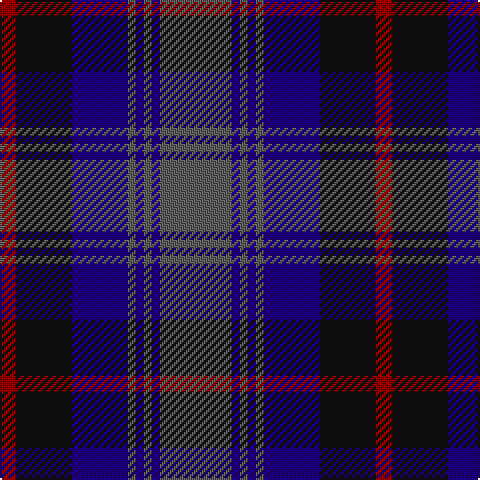

In pattern [BBBBBBKR](/patterns/bbbbbbkr/).

This was sourced from register-of-tartans.  It is a [8 stripes tartan](/stripes/stripes8/).

Original link https://www.tartanregister.gov.uk/tartanDetails.aspx?ref=474

## Thread count
DR/8 K28 DB28 N4 DB4 N4 DB4 N/36

## Palette
Each colour and its ΔE from the base-6 reference it is a variant of.

| Colour | Shade | Base | ΔE (OKLab) |
|---|---|---|---|
| DB | <code style="background-color:#1C0070;">#1C0070</code> `#1C0070` | B <code style="background-color:#2A418A;">#2A418A</code> | 0.14 |
| DR | <code style="background-color:#880000;">#880000</code> `#880000` | R <code style="background-color:#CC0000;">#CC0000</code> | 0.15 |
| K | <code style="background-color:#101010;">#101010</code> `#101010` | K <code style="background-color:#000000;">#000000</code> | 0.17 |
| N | <code style="background-color:#5C5C5C;">#5C5C5C</code> `#5C5C5C` | B <code style="background-color:#2A418A;">#2A418A</code> | 0.15 |

# Sample pattern

## Nearest tartans

The nearest existing variants by ΔTartan distance.

1. [Caledonian Hotel (Corporate)](/setts/s8/b36ba4b4ba4b4ba28g28r8-b5c5c5c-ba1c0070-g003820-r880000/) — ΔT 0.84
1. [Christian Dewar (Personal)](/setts/s9/b32k4b4k4b4k12g26y4g6-b00248c-g142814-k3c0000-ya08c28/) — ΔT 0.93
1. [Forbes #5](/setts/s9/b56k6b12k6b12k40g56k6w12-b2c4084-g503c14-k101010-we0e0e0/) — ΔT 0.93
1. [Brabender](/setts/s8/g6b42k6b6k24r6g24k6-b2c2c80-g006818-k101010-rc80000/) — ΔT 0.94
1. [Bareback (Corporate)](/setts/s6/b6k6b21k16ba36y4-b5c5c5c-ba2c2c80-k101010-ye8c000/) — ΔT 0.96
1. [Baird (Modern)](/setts/s8/b12k8b32k32g32ba4g4ba12-b2c2c80-ba780078-g006818-k101010/) — ΔT 1.03
1. [Baird Clan Tartan Tartan Number: 104. Earliest known date: 1906 This tartan is first recorded in Johnston's work of 1906, and the sample from the Highland Society of London probably dates from the same period. In both these early references the triple stripes are rendered in red. Today, however, they are generally woven in purple. The name originates from 'bard' meaning poet. The Bairds owned estates in Aberdeenshire which were later purchased by the Gordons. See products available Copyright © Blair Urquhart, Comrie, 2015](/setts/s8/b6k4b16k16g16ba2g2ba6-b2c2c80-ba780078-g006818-k101010/) — ΔT 1.03
1. [Forbes #3](/setts/s9/b16k4b4k4b4k16g14k2w2-b2c4084-g005020-k101010-we0e0e0/) — ΔT 1.06
1. [Lamont](/setts/s8/b40k4b4k4b8k32g40w4-b2c4084-g005020-k101010-we0e0e0/) — ΔT 1.06
1. [MacAndreis (Personal)](/setts/s10/k6g8b50k32g6k6g6k6g12r6-b2c2c80-g003820-k101010-re87878/) — ΔT 1.07

## Neighbour map

Every grey dot is one of 15726 variants placed by the first two principal components of the ΔTartan feature space (44% of its variance). Red is this tartan; blue dots are its nearest — click one to open its page.

<svg viewBox="0 0 640 380" role="img" style="max-width:100%;height:auto;border:1px solid #e0e0e0;border-radius:4px;display:block" xmlns="http://www.w3.org/2000/svg"><image href="/nn/cloud.v1.png" width="640" height="380"/><a href="/setts/s8/b36ba4b4ba4b4ba28g28r8-b5c5c5c-ba1c0070-g003820-r880000/"><circle cx="251.9" cy="227.7" r="4" fill="#3465a4"><title>Caledonian Hotel (Corporate)</title></circle></a><a href="/setts/s9/b32k4b4k4b4k12g26y4g6-b00248c-g142814-k3c0000-ya08c28/"><circle cx="268.3" cy="224.5" r="4" fill="#3465a4"><title>Christian Dewar (Personal)</title></circle></a><a href="/setts/s9/b56k6b12k6b12k40g56k6w12-b2c4084-g503c14-k101010-we0e0e0/"><circle cx="214.9" cy="203.2" r="4" fill="#3465a4"><title>Forbes #5</title></circle></a><a href="/setts/s8/g6b42k6b6k24r6g24k6-b2c2c80-g006818-k101010-rc80000/"><circle cx="219.5" cy="228.0" r="4" fill="#3465a4"><title>Brabender</title></circle></a><a href="/setts/s6/b6k6b21k16ba36y4-b5c5c5c-ba2c2c80-k101010-ye8c000/"><circle cx="229.7" cy="235.8" r="4" fill="#3465a4"><title>Bareback (Corporate)</title></circle></a><a href="/setts/s8/b12k8b32k32g32ba4g4ba12-b2c2c80-ba780078-g006818-k101010/"><circle cx="177.0" cy="236.5" r="4" fill="#3465a4"><title>Baird (Modern)</title></circle></a><a href="/setts/s8/b6k4b16k16g16ba2g2ba6-b2c2c80-ba780078-g006818-k101010/"><circle cx="177.0" cy="236.5" r="4" fill="#3465a4"><title>Baird Clan Tartan Tartan Number: 104. Earliest known date: 1906 This tartan is first recorded in Johnston's work of 1906, and the sample from the Highland Society of London probably dates from the same period. In both these early references the triple stripes are rendered in red. Today, however, they are generally woven in purple. The name originates from 'bard' meaning poet. The Bairds owned estates in Aberdeenshire which were later purchased by the Gordons. See products available Copyright © Blair Urquhart, Comrie, 2015</title></circle></a><a href="/setts/s9/b16k4b4k4b4k16g14k2w2-b2c4084-g005020-k101010-we0e0e0/"><circle cx="222.3" cy="227.6" r="4" fill="#3465a4"><title>Forbes #3</title></circle></a><a href="/setts/s8/b40k4b4k4b8k32g40w4-b2c4084-g005020-k101010-we0e0e0/"><circle cx="239.3" cy="213.2" r="4" fill="#3465a4"><title>Lamont</title></circle></a><a href="/setts/s10/k6g8b50k32g6k6g6k6g12r6-b2c2c80-g003820-k101010-re87878/"><circle cx="251.9" cy="213.1" r="4" fill="#3465a4"><title>MacAndreis (Personal)</title></circle></a><circle cx="235.7" cy="218.8" r="5" fill="#c00000"/></svg>

ID: /setts/s8/b36ba4b4ba4b4ba28k28r8-b5c5c5c-ba1c0070-k101010-r880000/
