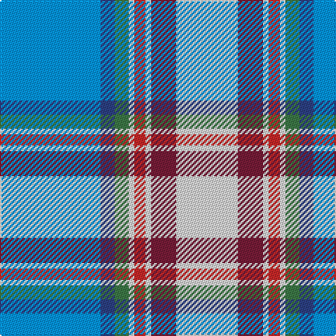

In pattern [BBGWRWRW](/patterns/bbgwrwrw/).

This was sourced from register-of-tartans.  It is a [8 stripes tartan](/stripes/stripes8/).

Original link https://www.tartanregister.gov.uk/tartanDetails.aspx?ref=1912

## Register references

External register numbers recorded for this tartan.

- Scottish Register of Tartans: [1912](https://www.tartanregister.gov.uk/tartanDetails.aspx?ref=1912)
- Scottish Tartans World Register: 2431

## Thread count
B/72 Ba10 G10 LN4 R8 LN4 DR18 LN/44

## Palette
Each colour and its ΔE from the base-6 reference it is a variant of.

| Colour | Shade | Base | ΔE (OKLab) |
|---|---|---|---|
| B | <code style="background-color:#0596FA;">#0596FA</code> `#0596FA` | B <code style="background-color:#2A418A;">#2A418A</code> | 0.27 |
| Ba | <code style="background-color:#2C4084;">#2C4084</code> `#2C4084` | B <code style="background-color:#2A418A;">#2A418A</code> | 0.01 |
| DR | <code style="background-color:#781C38;">#781C38</code> `#781C38` | R <code style="background-color:#CC0000;">#CC0000</code> | 0.18 |
| G | <code style="background-color:#3C7846;">#3C7846</code> `#3C7846` | G <code style="background-color:#006100;">#006100</code> | 0.10 |
| LN | <code style="background-color:#E0E0E0;">#E0E0E0</code> `#E0E0E0` | W <code style="background-color:#F7F7F7;">#F7F7F7</code> | 0.07 |
| R | <code style="background-color:#C82828;">#C82828</code> `#C82828` | R <code style="background-color:#CC0000;">#CC0000</code> | 0.03 |

# Sample pattern

## Nearest tartans

The nearest existing variants by ΔTartan distance.

1. [South Canterbury Jubillee (Corporate](/setts/s8/b36ba5g5w2r4w2ra9w22~b2888c4-ba2c2c80-g289c18-re87878-ra901c38-we0e0e0~x2/) — ΔT 0.59
1. [South Canterbury Centre P. & D. Assoc., Jubilee](/setts/s8/b36ba5g5w2r4w2ra9w22~b8080d0-ba304080-g407040-rd03030-ra802040-we0e0e0~x2/) — ΔT 1.03
1. [Dignan School of Dancing](/setts/s7/y4r2b32k10ba4w21ba2~b2474e8-ba6c0070-k101010-r880000-wc0c0c0-yd09800~x2/) — ΔT 1.05
1. [Forfar](/setts/s10/b3y1b23w20ya1w4ba22b4ba4r1~b5c8ca8-ba2c2c80-rc80000-wfcfcfc-ye8c000-yaa08858~x2/) — ΔT 1.07
1. [Queensferry High (School)](/setts/s9/y5w3wa7y5wa27b8ba43wb3wa3~b4444bc-ba003c64-wc8c8c8-waa8ace8-wbe0e0e0-y949494/) — ΔT 1.10
1. [Congo, The Democratic Republic of the](/setts/s11/w4k1b16ba20y2r8y2ba20y2ba1y4~b2c4084-ba0596fa-k101010-rdc0000-we0e0e0-ye8c000~x2/) — ΔT 1.15
1. [Corryvrechan Dress (Corporate)](/setts/s10/b40ba12y2ba2b2ba2g6w21r2b2~b2888c4-ba202060-g006818-rc80000-we0e0e0-yfccc00~x2/) — ΔT 1.18
1. [Jong Nederland Born Union (Corp)](/setts/s10/r2w1r1w13b12y2k2b2k1ya1~b2888c4-k101010-r880000-we0e0e0-yc4bc68-yae8c000~x4/) — ΔT 1.30
1. [St Andrews, Earl of, dress](/setts/s7/w28b19ba19w4bb2wa2ba7~b5480b0-ba304080-bb000050-we0e0e0-wac0a0e0~x2/) — ΔT 1.33
1. [WCWM 3947](/setts/s8/r2b30y3b2r16ra2g16w2~b3850c8-g289c18-r888888-rac80000-we0e0e0-ye8c000~x2/) — ΔT 1.35

## Neighbour map

Every grey dot is one of 15726 variants placed by the first two principal components of the ΔTartan feature space (44% of its variance). Red is this tartan; blue dots are its nearest — click one to open its page.

<svg viewBox="0 0 640 380" role="img" style="max-width:100%;height:auto;border:1px solid #e0e0e0;border-radius:4px;display:block" xmlns="http://www.w3.org/2000/svg"><image href="/nn/cloud.v1.png" width="640" height="380"/><a href="/setts/s8/b36ba5g5w2r4w2ra9w22~b2888c4-ba2c2c80-g289c18-re87878-ra901c38-we0e0e0~x2/"><circle cx="191.8" cy="113.5" r="4" fill="#3465a4"><title>South Canterbury Jubillee (Corporate</title></circle></a><a href="/setts/s8/b36ba5g5w2r4w2ra9w22~b8080d0-ba304080-g407040-rd03030-ra802040-we0e0e0~x2/"><circle cx="202.9" cy="111.7" r="4" fill="#3465a4"><title>South Canterbury Centre P. &amp; D. Assoc., Jubilee</title></circle></a><a href="/setts/s7/y4r2b32k10ba4w21ba2~b2474e8-ba6c0070-k101010-r880000-wc0c0c0-yd09800~x2/"><circle cx="175.0" cy="127.8" r="4" fill="#3465a4"><title>Dignan School of Dancing</title></circle></a><a href="/setts/s10/b3y1b23w20ya1w4ba22b4ba4r1~b5c8ca8-ba2c2c80-rc80000-wfcfcfc-ye8c000-yaa08858~x2/"><circle cx="162.5" cy="88.7" r="4" fill="#3465a4"><title>Forfar</title></circle></a><a href="/setts/s9/y5w3wa7y5wa27b8ba43wb3wa3~b4444bc-ba003c64-wc8c8c8-waa8ace8-wbe0e0e0-y949494/"><circle cx="193.6" cy="119.5" r="4" fill="#3465a4"><title>Queensferry High (School)</title></circle></a><a href="/setts/s11/w4k1b16ba20y2r8y2ba20y2ba1y4~b2c4084-ba0596fa-k101010-rdc0000-we0e0e0-ye8c000~x2/"><circle cx="223.7" cy="105.2" r="4" fill="#3465a4"><title>Congo, The Democratic Republic of the</title></circle></a><a href="/setts/s10/b40ba12y2ba2b2ba2g6w21r2b2~b2888c4-ba202060-g006818-rc80000-we0e0e0-yfccc00~x2/"><circle cx="225.4" cy="90.0" r="4" fill="#3465a4"><title>Corryvrechan Dress (Corporate)</title></circle></a><a href="/setts/s10/r2w1r1w13b12y2k2b2k1ya1~b2888c4-k101010-r880000-we0e0e0-yc4bc68-yae8c000~x4/"><circle cx="155.9" cy="100.1" r="4" fill="#3465a4"><title>Jong Nederland Born Union (Corp)</title></circle></a><a href="/setts/s7/w28b19ba19w4bb2wa2ba7~b5480b0-ba304080-bb000050-we0e0e0-wac0a0e0~x2/"><circle cx="171.1" cy="158.4" r="4" fill="#3465a4"><title>St Andrews, Earl of, dress</title></circle></a><a href="/setts/s8/r2b30y3b2r16ra2g16w2~b3850c8-g289c18-r888888-rac80000-we0e0e0-ye8c000~x2/"><circle cx="213.3" cy="134.8" r="4" fill="#3465a4"><title>WCWM 3947</title></circle></a><circle cx="186.3" cy="111.9" r="5" fill="#c00000"/></svg>

ID: /setts/s8/b36ba5g5w2r4w2ra9w22~b0596fa-ba2c4084-g3c7846-rc82828-ra781c38-we0e0e0~x2/
