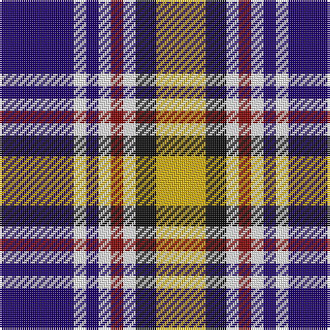

In pattern [BWBWRWKY](/patterns/bwbwrwky/).

This was sourced from tartans-authority.  It is a [8 stripes tartan](/stripes/stripes8/).

Original link http://www.tartansauthority.com/tartan-ferret/display/4180/

## Thread count
DB/36 W6 DB6 W6 DR6 W6 K10 Y/24

## Palette
Each colour and its ΔE from the base-6 reference it is a variant of.

| Colour | Shade | Base | ΔE (OKLab) |
|---|---|---|---|
| DB | <code style="background-color:#1C0070;">#1C0070</code> `#1C0070` | B <code style="background-color:#2C4084;">#2C4084</code> | 0.14 |
| DR | <code style="background-color:#880000;">#880000</code> `#880000` | R <code style="background-color:#C80000;">#C80000</code> | 0.14 |
| K | <code style="background-color:#101010;">#101010</code> `#101010` | K <code style="background-color:#000000;">#000000</code> | 0.17 |
| W | <code style="background-color:#FCFCFC;">#FCFCFC</code> `#FCFCFC` | W <code style="background-color:#F4F4F0;">#F4F4F0</code> | 0.03 |
| Y | <code style="background-color:#D8B000;">#D8B000</code> `#D8B000` | Y <code style="background-color:#E8C000;">#E8C000</code> | 0.05 |

# Sample pattern

## Nearest tartans

The nearest existing variants by ΔTartan distance.

1. [Sibbald Blue (2014)](/setts/s9/g8b44ba12w20b6w12bb8ba6w8-b141e46-ba003c64-bb64008c-g003c14-wfcfcfc/) — ΔT 0.76
1. [Ailsa Craig Trade Tartan Tartan Number: 1673. Earliest known date: 1972 Nothing See products available Copyright © Blair Urquhart, Comrie, 2015](/setts/s8/r10w4b40y4k32w36k4w10-b2c2c80-k101010-rc80000-we0e0e0-ye8c000/) — ΔT 0.92
1. [Kervegant, Suzanne (Personal)](/setts/s10/g12b22w16k8w16r8w16k54w8r8-b2c2c80-g006818-k101010-rdc0000-wc8c8c8/) — ΔT 0.93
1. [U.S. Postal Service (Corporate)](/setts/s7/k12b60r30w12ba12w12r12-b2888c4-ba1c0070-k101010-rc80000-wfcfcfc/) — ΔT 0.94
1. [Ailsa, Craig](/setts/s8/r10w4b40y4k32w36k4w10-b304080-k000000-rc00000-we0e0e0-yf0c000/) — ΔT 0.94
1. [Mitsukoshi (Corporate)](/setts/s8/w24k6wa6k6w26b12k34r6-b5c8ca8-k101010-rc80000-wc0c0c0-wae8ccb8/) — ΔT 0.97
1. [Thom(p)son](/setts/s10/r4k4w8k8w8k4w16k4b36y4-b304080-k000000-rc00000-we0e0e0-yf0c000/) — ΔT 0.98
1. [Strakan](/setts/s9/b36r10b36y28k6w6k6y28r6-b000064-k000000-r8c8c8c-wfcfcfc-yfccc00/) — ΔT 1.00
1. [Sibbald Blue (2014)](/setts/s9/g8b44ba12w20b6w12bb8ba6w8-b202060-ba2c2c80-bb780078-g003820-wfcfcfc/) — ΔT 1.02
1. [Pengelly, The Cornish (Name)](/setts/s7/w10k52y8w48b16k6r8-b780078-k101010-rc80000-wcccccc-ye8c000/) — ΔT 1.02

## Neighbour map

Every grey dot is one of 15726 variants placed by the first two principal components of the ΔTartan feature space (44% of its variance). Red is this tartan; blue dots are its nearest — click one to open its page.

<svg viewBox="0 0 640 380" role="img" style="max-width:100%;height:auto;border:1px solid #e0e0e0;border-radius:4px;display:block" xmlns="http://www.w3.org/2000/svg"><image href="/nn/cloud.v1.png" width="640" height="380"/><a href="/setts/s9/g8b44ba12w20b6w12bb8ba6w8-b141e46-ba003c64-bb64008c-g003c14-wfcfcfc/"><circle cx="119.6" cy="166.0" r="4" fill="#3465a4"><title>Sibbald Blue (2014)</title></circle></a><a href="/setts/s8/r10w4b40y4k32w36k4w10-b2c2c80-k101010-rc80000-we0e0e0-ye8c000/"><circle cx="118.2" cy="156.0" r="4" fill="#3465a4"><title>Ailsa Craig Trade Tartan Tartan Number: 1673. Earliest known date: 1972 Nothing See products available Copyright © Blair Urquhart, Comrie, 2015</title></circle></a><a href="/setts/s10/g12b22w16k8w16r8w16k54w8r8-b2c2c80-g006818-k101010-rdc0000-wc8c8c8/"><circle cx="104.9" cy="169.7" r="4" fill="#3465a4"><title>Kervegant, Suzanne (Personal)</title></circle></a><a href="/setts/s7/k12b60r30w12ba12w12r12-b2888c4-ba1c0070-k101010-rc80000-wfcfcfc/"><circle cx="116.7" cy="191.0" r="4" fill="#3465a4"><title>U.S. Postal Service (Corporate)</title></circle></a><a href="/setts/s8/r10w4b40y4k32w36k4w10-b304080-k000000-rc00000-we0e0e0-yf0c000/"><circle cx="113.3" cy="155.8" r="4" fill="#3465a4"><title>Ailsa, Craig</title></circle></a><a href="/setts/s8/w24k6wa6k6w26b12k34r6-b5c8ca8-k101010-rc80000-wc0c0c0-wae8ccb8/"><circle cx="129.4" cy="191.8" r="4" fill="#3465a4"><title>Mitsukoshi (Corporate)</title></circle></a><a href="/setts/s10/r4k4w8k8w8k4w16k4b36y4-b304080-k000000-rc00000-we0e0e0-yf0c000/"><circle cx="128.6" cy="140.1" r="4" fill="#3465a4"><title>Thom(p)son</title></circle></a><a href="/setts/s9/b36r10b36y28k6w6k6y28r6-b000064-k000000-r8c8c8c-wfcfcfc-yfccc00/"><circle cx="127.9" cy="184.3" r="4" fill="#3465a4"><title>Strakan</title></circle></a><a href="/setts/s9/g8b44ba12w20b6w12bb8ba6w8-b202060-ba2c2c80-bb780078-g003820-wfcfcfc/"><circle cx="122.1" cy="164.6" r="4" fill="#3465a4"><title>Sibbald Blue (2014)</title></circle></a><a href="/setts/s7/w10k52y8w48b16k6r8-b780078-k101010-rc80000-wcccccc-ye8c000/"><circle cx="150.1" cy="164.4" r="4" fill="#3465a4"><title>Pengelly, The Cornish (Name)</title></circle></a><circle cx="118.5" cy="173.0" r="5" fill="#c00000"/></svg>

ID: /setts/s8/b36w6b6w6r6w6k10y24-b1c0070-k101010-r880000-wfcfcfc-yd8b000/
