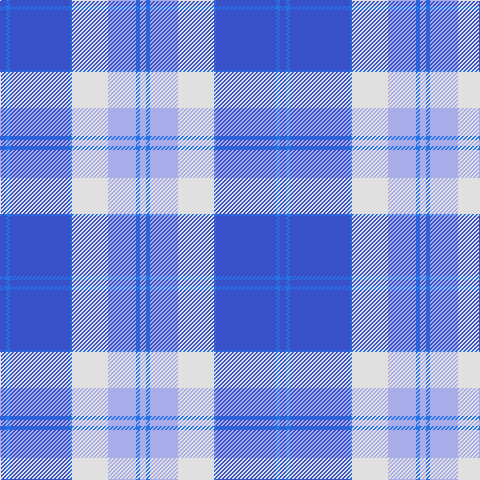

**Bands:** [BBBBWWBW](/stripes/bbbbwwbw/) · **Stripes:** [B B B B W LB B LB](/stripes/stripes8/) B B B B W LB B LB

This was sourced from register-of-tartans.  It is a [8 band tartan](/bands/bands8/).

Original link https://www.tartanregister.gov.uk/tartanDetails.aspx?ref=5046

## Register references

External register numbers recorded for this tartan.

- Scottish Register of Tartans: [5046](https://www.tartanregister.gov.uk/tartanDetails.aspx?ref=5046)
- Scottish Tartans Authority (ITI): 3654

## Thread count
Ba/6 B4 Ba60 B2 LN36 LP28 B4 LP/6

## Palette
Each colour and its ΔE from the base-6 reference it is a variant of.

| Colour | Shade | Base | ΔE (OKLab) |
|---|---|---|---|
| B | <code style="background-color:#2474E8;">#2474E8</code> `#2474E8` | B <code style="background-color:#2A418A;">#2A418A</code> | 0.19 |
| Ba | <code style="background-color:#3850C8;">#3850C8</code> `#3850C8` | B <code style="background-color:#2A418A;">#2A418A</code> | 0.11 |
| LN | <code style="background-color:#E0E0E0;">#E0E0E0</code> `#E0E0E0` | W <code style="background-color:#F7F7F7;">#F7F7F7</code> | 0.07 |
| LP | <code style="background-color:#A8ACE8;">#A8ACE8</code> `#A8ACE8` | W <code style="background-color:#F7F7F7;">#F7F7F7</code> | 0.23 |

# Sample pattern

## Nearest tartans

The nearest existing variants by ΔTartan distance.

1. [Gorman Blue (Personal)](/setts/s8/w4t1lo2t22b20w2b4w2~x2/) — ΔT 1.28
1. [Edinburgh '86](/setts/s11/db6w2db2w2db4w6db28b4db4b45r4/) — ΔT 1.52
1. [Thorburn #1 (Name)](/setts/s9/db12lb2db2t6db4lb3db4lb18r1~x4/) — ΔT 1.57
1. [Harmony, Eildon](/setts/s8/db41t2w2t2db5b12w31db4~x2/) — ΔT 1.63
1. [Longniddry Lavender (Dance)](/setts/s8/db42o2lb2o2db5p12lb32db4~x2/) — ΔT 1.68
1. [Gothenburg](/setts/s7/b26w28b14ly3k1ly2k1~x2/) — ΔT 1.69
1. [Bannockbane](/setts/s8/b2db2b15w10b1db15b2db2~x2/) — ΔT 1.69
1. [Commonwealth Games 1986 (Corp)](/setts/s11/db3w1db1w1db2w3db15t2db2t22r2~x2/) — ΔT 1.72
1. [Harmony Eildon (Dance)](/setts/s8/db41t2w2t2db5t12w31db4~x2/) — ΔT 1.75
1. [Longniddry, dress (Turquoise)](/setts/s8/t42k2w2k2t5n12w32t4~x2/) — ΔT 1.75

## Neighbour map

Every grey dot is one of 14313 variants placed by the first two principal components of the ΔTartan feature space (44% of its variance). Red is this tartan; blue dots are its nearest — click one to open its page.

<svg viewBox="0 0 640 380" role="img" style="max-width:100%;height:auto;border:1px solid #e0e0e0;border-radius:4px;display:block" xmlns="http://www.w3.org/2000/svg"><image href="/nn/cloud.v1.png" width="640" height="380"/><a href="/setts/s8/w4t1lo2t22b20w2b4w2~x2/"><circle cx="298.3" cy="161.2" r="4" fill="#3465a4"><title>Gorman Blue (Personal)</title></circle></a><a href="/setts/s11/db6w2db2w2db4w6db28b4db4b45r4/"><circle cx="305.8" cy="127.9" r="4" fill="#3465a4"><title>Edinburgh '86</title></circle></a><a href="/setts/s9/db12lb2db2t6db4lb3db4lb18r1~x4/"><circle cx="250.1" cy="157.2" r="4" fill="#3465a4"><title>Thorburn #1 (Name)</title></circle></a><a href="/setts/s8/db41t2w2t2db5b12w31db4~x2/"><circle cx="286.9" cy="135.5" r="4" fill="#3465a4"><title>Harmony, Eildon</title></circle></a><a href="/setts/s8/db42o2lb2o2db5p12lb32db4~x2/"><circle cx="305.6" cy="136.8" r="4" fill="#3465a4"><title>Longniddry Lavender (Dance)</title></circle></a><a href="/setts/s7/b26w28b14ly3k1ly2k1~x2/"><circle cx="313.7" cy="134.2" r="4" fill="#3465a4"><title>Gothenburg</title></circle></a><a href="/setts/s8/b2db2b15w10b1db15b2db2~x2/"><circle cx="260.9" cy="185.4" r="4" fill="#3465a4"><title>Bannockbane</title></circle></a><a href="/setts/s11/db3w1db1w1db2w3db15t2db2t22r2~x2/"><circle cx="293.3" cy="124.8" r="4" fill="#3465a4"><title>Commonwealth Games 1986 (Corp)</title></circle></a><a href="/setts/s8/db41t2w2t2db5t12w31db4~x2/"><circle cx="279.5" cy="134.0" r="4" fill="#3465a4"><title>Harmony Eildon (Dance)</title></circle></a><a href="/setts/s8/t42k2w2k2t5n12w32t4~x2/"><circle cx="297.7" cy="138.0" r="4" fill="#3465a4"><title>Longniddry, dress (Turquoise)</title></circle></a><circle cx="277.5" cy="134.7" r="5" fill="#c00000"/></svg>

ID: /setts/s8/b3b2b30b1w18lb14b2lb3~x2/
