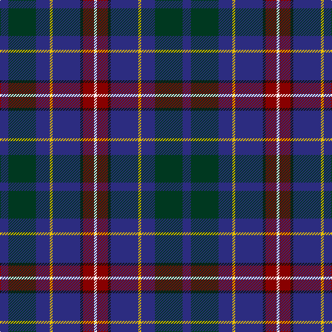

In pattern [BGBYBKRW](/patterns/bgbybkrw/).

This was sourced from tartans-authority.  It is a [8 stripes tartan](/stripes/stripes8/).

Original link http://www.tartansauthority.com/tartan-ferret/display/10993/

## Thread count
DB/12 DG40 DB20 Y4 DB40 K4 DR16 W/4

## Palette
Each colour and its ΔE from the base-6 reference it is a variant of.

| Colour | Shade | Base | ΔE (OKLab) |
|---|---|---|---|
| DB | <code style="background-color:#2C2C80;">#2C2C80</code> `#2C2C80` | B <code style="background-color:#2A418A;">#2A418A</code> | 0.06 |
| DG | <code style="background-color:#003820;">#003820</code> `#003820` | G <code style="background-color:#006100;">#006100</code> | 0.15 |
| DR | <code style="background-color:#880000;">#880000</code> `#880000` | R <code style="background-color:#CC0000;">#CC0000</code> | 0.15 |
| K | <code style="background-color:#101010;">#101010</code> `#101010` | K <code style="background-color:#000000;">#000000</code> | 0.17 |
| W | <code style="background-color:#FCFCFC;">#FCFCFC</code> `#FCFCFC` | W <code style="background-color:#F7F7F7;">#F7F7F7</code> | 0.01 |
| Y | <code style="background-color:#E8C000;">#E8C000</code> `#E8C000` | Y <code style="background-color:#F2BF00;">#F2BF00</code> | 0.02 |

# Sample pattern

## Nearest tartans

The nearest existing variants by ΔTartan distance.

1. [Côté-Haché (Personal)](/setts/s8/b3g10b5y1b10k1r4w1x4~b2c2c80-g003c14-k101010-r880000-wffffff-yffe600/) — ΔT 0.37
1. [Wrigglesworth Family Canada (Personal)](/setts/s7/b30ba10g10b5r3y3ga3x2~b172d60-ba576982-g75786c-ga588658-ra20d22-yf9c75c/) — ΔT 0.94
1. [Royal Navy Submarine Service](/setts/s9/w3b3r2b14k3g12k14b16y2x2~b141e46-g005448-k101010-r880000-wf0e0c8-yc88c00/) — ΔT 1.10
1. [Spirit of Fife (Corporate)](/setts/s8/g10w2b3ga2r14ba26g2ba6x2~b14283c-ba003c64-g005448-ga408060-rb468ac-wf8f8f8/) — ΔT 1.10
1. [Stinson Ancient U.S.A. Tartan Tartan Number: 438. Earliest known date: 1985 A kilt in this material was brought into the Scottish Tartans Museum in Comrie which could be dated to before 1930. It belonged to a member of the Stewart Society at that time. The threadcount and the name were documented by Mackinlay, who studied and collected tartans between 1930 and 1950. See products available Copyright © Blair Urquhart, Comrie, 2015](/setts/s11/k7b20ba2r6ba2k20y3g20b27r3b6x2~b2c2c80-ba5c8ca8-g006818-k101010-rc80000-ye8c000/) — ΔT 1.16
1. [Loch Lomond Millenium](/setts/s11/k3g2k12b4ba19r3ba19b4k12g2y3x2~b303070-ba1474b4-g005448-k101010-r880000-yd09800/) — ΔT 1.19
1. [Tupper, John Charles (Personal)](/setts/s10/r2w2g8ga2g2b20ba8ga2b15w2x2~b1c1c50-ba5f749c-g003820-ga649848-r800028-wffffff/) — ΔT 1.19
1. [Scottish Italian](/setts/s8/b11ba5g4w3r3k16ba28b2x2~b1474b4-ba202060-g006818-k101010-rc80000-wfcfcfc/) — ΔT 1.20
1. [Coulthard (Personal)](/setts/s7/r3g9ga15b10k2b18w3x2~b202060-g006818-ga5c6428-k101010-rc8002c-we0e0e0/) — ΔT 1.21
1. [Grainger (Name)](/setts/s7/b36r4b6g18b15k18w4x2~b2c2c80-g006818-k101010-rc80000-wfcfcfc/) — ΔT 1.21

## Neighbour map

Every grey dot is one of 15726 variants placed by the first two principal components of the ΔTartan feature space (44% of its variance). Red is this tartan; blue dots are its nearest — click one to open its page.

<svg viewBox="0 0 640 380" role="img" style="max-width:100%;height:auto;border:1px solid #e0e0e0;border-radius:4px;display:block" xmlns="http://www.w3.org/2000/svg"><image href="/nn/cloud.v1.png" width="640" height="380"/><a href="/setts/s8/b3g10b5y1b10k1r4w1x4~b2c2c80-g003c14-k101010-r880000-wffffff-yffe600/"><circle cx="232.5" cy="179.3" r="4" fill="#3465a4"><title>Côté-Haché (Personal)</title></circle></a><a href="/setts/s7/b30ba10g10b5r3y3ga3x2~b172d60-ba576982-g75786c-ga588658-ra20d22-yf9c75c/"><circle cx="273.1" cy="176.1" r="4" fill="#3465a4"><title>Wrigglesworth Family Canada (Personal)</title></circle></a><a href="/setts/s9/w3b3r2b14k3g12k14b16y2x2~b141e46-g005448-k101010-r880000-wf0e0c8-yc88c00/"><circle cx="208.5" cy="197.3" r="4" fill="#3465a4"><title>Royal Navy Submarine Service</title></circle></a><a href="/setts/s8/g10w2b3ga2r14ba26g2ba6x2~b14283c-ba003c64-g005448-ga408060-rb468ac-wf8f8f8/"><circle cx="249.6" cy="161.2" r="4" fill="#3465a4"><title>Spirit of Fife (Corporate)</title></circle></a><a href="/setts/s11/k7b20ba2r6ba2k20y3g20b27r3b6x2~b2c2c80-ba5c8ca8-g006818-k101010-rc80000-ye8c000/"><circle cx="199.7" cy="150.5" r="4" fill="#3465a4"><title>Stinson Ancient U.S.A. Tartan Tartan Number: 438. Earliest known date: 1985 A kilt in this material was brought into the Scottish Tartans Museum in Comrie which could be dated to before 1930. It belonged to a member of the Stewart Society at that time. The threadcount and the name were documented by Mackinlay, who studied and collected tartans between 1930 and 1950. See products available Copyright © Blair Urquhart, Comrie, 2015</title></circle></a><a href="/setts/s11/k3g2k12b4ba19r3ba19b4k12g2y3x2~b303070-ba1474b4-g005448-k101010-r880000-yd09800/"><circle cx="188.9" cy="161.4" r="4" fill="#3465a4"><title>Loch Lomond Millenium</title></circle></a><a href="/setts/s10/r2w2g8ga2g2b20ba8ga2b15w2x2~b1c1c50-ba5f749c-g003820-ga649848-r800028-wffffff/"><circle cx="236.7" cy="150.6" r="4" fill="#3465a4"><title>Tupper, John Charles (Personal)</title></circle></a><a href="/setts/s8/b11ba5g4w3r3k16ba28b2x2~b1474b4-ba202060-g006818-k101010-rc80000-wfcfcfc/"><circle cx="205.0" cy="152.1" r="4" fill="#3465a4"><title>Scottish Italian</title></circle></a><a href="/setts/s7/r3g9ga15b10k2b18w3x2~b202060-g006818-ga5c6428-k101010-rc8002c-we0e0e0/"><circle cx="183.6" cy="197.0" r="4" fill="#3465a4"><title>Coulthard (Personal)</title></circle></a><a href="/setts/s7/b36r4b6g18b15k18w4x2~b2c2c80-g006818-k101010-rc80000-wfcfcfc/"><circle cx="261.1" cy="211.9" r="4" fill="#3465a4"><title>Grainger (Name)</title></circle></a><circle cx="242.4" cy="183.3" r="5" fill="#c00000"/></svg>

ID: /setts/s8/b3g10b5y1b10k1r4w1x4~b2c2c80-g003820-k101010-r880000-wfcfcfc-ye8c000/
