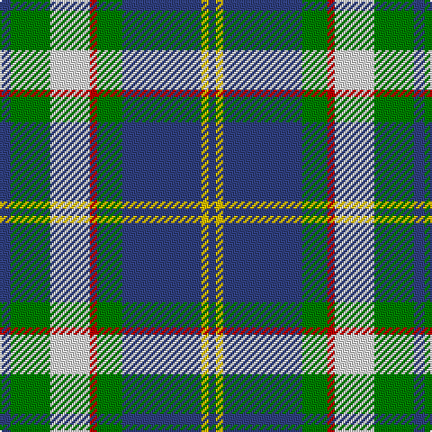

In pattern [BGWRGBYB](/patterns/bgwrgbyb/).

This was sourced from weddslist.  It is a [8 stripes tartan](/stripes/stripes8/).

Original link http://www.weddslist.com/cgi-bin/tartans/pg.pl?source=sts

## Thread count
B/6 G22 LN22 R4 G14 B44 Y4 B/4

## Palette
Each colour and its ΔE from the base-6 reference it is a variant of.

| Colour | Shade | Base | ΔE (OKLab) |
|---|---|---|---|
| B | <code style="background-color:#304080;">#304080</code> `#304080` | B <code style="background-color:#2A418A;">#2A418A</code> | 0.02 |
| G | <code style="background-color:#008000;">#008000</code> `#008000` | G <code style="background-color:#006100;">#006100</code> | 0.10 |
| LN | <code style="background-color:#E0E0E0;">#E0E0E0</code> `#E0E0E0` | W <code style="background-color:#F7F7F7;">#F7F7F7</code> | 0.07 |
| R | <code style="background-color:#C00000;">#C00000</code> `#C00000` | R <code style="background-color:#CC0000;">#CC0000</code> | 0.03 |
| Y | <code style="background-color:#F0C000;">#F0C000</code> `#F0C000` | Y <code style="background-color:#F2BF00;">#F2BF00</code> | 0.00 |

# Sample pattern

## Nearest tartans

The nearest existing variants by ΔTartan distance.

1. [Ayrshire](/setts/s8/b2r1b10w1g4ga8ga1ga2x4~b1c0070-g785000-ga30ac38-r880000-we0e0e0/) — ΔT 0.79
1. [Bahamas District Tartan Tartan Number: 2089. Earliest known date: 1966 Designed by Gordon Rees of the Scottish Shop in Nassau, now owned by Colin and Beverley Honnes. It was intended to perpetuate the memory of early Scottish settlers in the Bahamas including Thompson, Sands, Forsythe, Munroe, Johnston, Russell, Christie, Roberts, Kelly, MacKinney, Saunders, Malcolm, Crawford, MacPherson, Clark and Rae. The tartan was formally approved by the Bahamas Government in 1966. See products available Copyright © Blair Urquhart, Comrie, 2015](/setts/s8/b6y2b22g7r2w11g11b3x2~b2c2c80-g006818-rc80000-we0e0e0-ye8c000/) — ΔT 0.91
1. [Gillies (House of Edgar)](/setts/s8/b32k12b12g6r6g18k2y3x2~b1474b4-g289c18-k101010-rc80000-ye8c000/) — ΔT 0.92
1. [MacTavish Dress](/setts/s6/r4b28k6w12k12y3x2~b5c8ca8-k101010-r880000-wc0c0c0-yd09800/) — ΔT 1.03
1. [Thomson Dress (Blue)](/setts/s6/r1b10k2w4k4y1x6~b1870a4-k101010-rc80000-we0e0e0-ye8c000/) — ΔT 1.05
1. [Antrim Irish County Tartan Tartan Number: 2282. Earliest known date: 1993 One of a series of Irish District tartans designed by Polly Wittering of the House of Edgar, with colours reminiscent of the Country with soft warm colours dominating. See products available Copyright © Blair Urquhart, Comrie, 2015](/setts/s10/g5b2g17y2ba5y2r5ba17g2y4x2~b043c48-ba101448-g4c9864-rb03000-yf4bc3c/) — ΔT 1.05
1. [Riley (Personal)](/setts/s8/b26g6k8g3k8g30w3g3x2~b9058d8-g289c18-k101010-wfcfcfc/) — ΔT 1.05
1. [MacMillan, hunting](/setts/s9/b10y3b30y5k8g16r4g16r2x2~b304080-g008000-k000000-rd03030-yf0c000/) — ΔT 1.06
1. [Loyalhanna](/setts/s8/b15w2g2y15r3b21r3g15x2~b00008c-g007800-r8c0000-wc8c8c8-ydcbc00/) — ΔT 1.08
1. [Snodgrass](/setts/s8/k3r1y1b11g13b5r1y1x2~b304080-g008000-k000000-rc00000-yf0c000/) — ΔT 1.09

## Neighbour map

Every grey dot is one of 15726 variants placed by the first two principal components of the ΔTartan feature space (44% of its variance). Red is this tartan; blue dots are its nearest — click one to open its page.

<svg viewBox="0 0 640 380" role="img" style="max-width:100%;height:auto;border:1px solid #e0e0e0;border-radius:4px;display:block" xmlns="http://www.w3.org/2000/svg"><image href="/nn/cloud.v1.png" width="640" height="380"/><a href="/setts/s8/b2r1b10w1g4ga8ga1ga2x4~b1c0070-g785000-ga30ac38-r880000-we0e0e0/"><circle cx="174.0" cy="169.9" r="4" fill="#3465a4"><title>Ayrshire</title></circle></a><a href="/setts/s8/b6y2b22g7r2w11g11b3x2~b2c2c80-g006818-rc80000-we0e0e0-ye8c000/"><circle cx="197.7" cy="175.0" r="4" fill="#3465a4"><title>Bahamas District Tartan Tartan Number: 2089. Earliest known date: 1966 Designed by Gordon Rees of the Scottish Shop in Nassau, now owned by Colin and Beverley Honnes. It was intended to perpetuate the memory of early Scottish settlers in the Bahamas including Thompson, Sands, Forsythe, Munroe, Johnston, Russell, Christie, Roberts, Kelly, MacKinney, Saunders, Malcolm, Crawford, MacPherson, Clark and Rae. The tartan was formally approved by the Bahamas Government in 1966. See products available Copyright © Blair Urquhart, Comrie, 2015</title></circle></a><a href="/setts/s8/b32k12b12g6r6g18k2y3x2~b1474b4-g289c18-k101010-rc80000-ye8c000/"><circle cx="220.9" cy="167.5" r="4" fill="#3465a4"><title>Gillies (House of Edgar)</title></circle></a><a href="/setts/s6/r4b28k6w12k12y3x2~b5c8ca8-k101010-r880000-wc0c0c0-yd09800/"><circle cx="165.5" cy="188.2" r="4" fill="#3465a4"><title>MacTavish Dress</title></circle></a><a href="/setts/s6/r1b10k2w4k4y1x6~b1870a4-k101010-rc80000-we0e0e0-ye8c000/"><circle cx="176.7" cy="179.9" r="4" fill="#3465a4"><title>Thomson Dress (Blue)</title></circle></a><a href="/setts/s10/g5b2g17y2ba5y2r5ba17g2y4x2~b043c48-ba101448-g4c9864-rb03000-yf4bc3c/"><circle cx="153.0" cy="161.4" r="4" fill="#3465a4"><title>Antrim Irish County Tartan Tartan Number: 2282. Earliest known date: 1993 One of a series of Irish District tartans designed by Polly Wittering of the House of Edgar, with colours reminiscent of the Country with soft warm colours dominating. See products available Copyright © Blair Urquhart, Comrie, 2015</title></circle></a><a href="/setts/s8/b26g6k8g3k8g30w3g3x2~b9058d8-g289c18-k101010-wfcfcfc/"><circle cx="220.8" cy="180.6" r="4" fill="#3465a4"><title>Riley (Personal)</title></circle></a><a href="/setts/s9/b10y3b30y5k8g16r4g16r2x2~b304080-g008000-k000000-rd03030-yf0c000/"><circle cx="185.7" cy="160.6" r="4" fill="#3465a4"><title>MacMillan, hunting</title></circle></a><a href="/setts/s8/b15w2g2y15r3b21r3g15x2~b00008c-g007800-r8c0000-wc8c8c8-ydcbc00/"><circle cx="172.4" cy="177.6" r="4" fill="#3465a4"><title>Loyalhanna</title></circle></a><a href="/setts/s8/k3r1y1b11g13b5r1y1x2~b304080-g008000-k000000-rc00000-yf0c000/"><circle cx="218.7" cy="159.9" r="4" fill="#3465a4"><title>Snodgrass</title></circle></a><circle cx="189.1" cy="166.2" r="5" fill="#c00000"/></svg>

ID: /setts/s8/b3g11w11r2g7b22y2b2x2~b304080-g008000-rc00000-we0e0e0-yf0c000/
