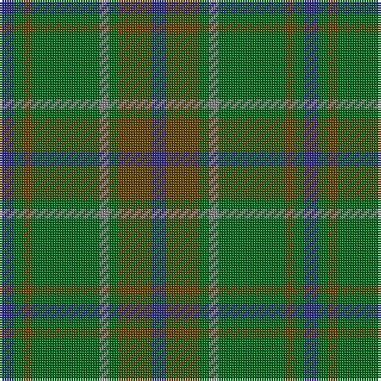

In pattern [BGGGGGGB](/patterns/bggggggb/).

This was sourced from register-of-tartans.  It is a [8 stripes tartan](/stripes/stripes8/).

Original link https://www.tartanregister.gov.uk/tartanDetails.aspx?ref=871

## Thread count
DB/6 G4 T4 G28 N4 G4 T14 DB/6

## Palette
Each colour and its ΔE from the base-6 reference it is a variant of.

| Colour | Shade | Base | ΔE (OKLab) |
|---|---|---|---|
| DB | <code style="background-color:#2C2C80;">#2C2C80</code> `#2C2C80` | B <code style="background-color:#2A418A;">#2A418A</code> | 0.06 |
| G | <code style="background-color:#006818;">#006818</code> `#006818` | G <code style="background-color:#006100;">#006100</code> | 0.02 |
| N | <code style="background-color:#808080;">#808080</code> `#808080` | G <code style="background-color:#006100;">#006100</code> | 0.23 |
| T | <code style="background-color:#604000;">#604000</code> `#604000` | G <code style="background-color:#006100;">#006100</code> | 0.14 |

# Sample pattern

## Nearest tartans

The nearest existing variants by ΔTartan distance.

1. [Daks, Tartan-Loden](/setts/s8/b3r7g2ra2g14r2g2b3~b304080-g008000-r806050-rac00000~x2/) — ΔT 1.06
1. [Armagh, County](/setts/s9/g4y2g17ga2r4ga2g3ga11g2~g005448-ga003820-r880000-yc4bc68~x2/) — ΔT 1.20
1. [John Telfar Dunbar/Hunting Tartan Tartan Number: 776. Earliest known date: pre 2003 Check this entry... See products available Copyright © Blair Urquhart, Comrie, 2015](/setts/s7/g5k2g28k10ga26b4g4~b2c2c80-g006818-ga604000-k101010~x2/) — ΔT 1.29
1. [Harkness Htg (Name)](/setts/s10/g10b2w2b16g6y2g4r2g3b6~b0c585c-g006818-rc80000-we0e0e0-ya8a834~x4/) — ΔT 1.38
1. [St. Andrews New Golf Club](/setts/s9/b4ba18r2ba2r2ba9g20ba3g4~b780078-ba003c64-g006818-r880000~x2/) — ΔT 1.42
1. [Hueg (Hunting) (Personal)](/setts/s10/b17g5b5g17b4g17k2ga2k2g5~b003c64-g006818-ga604000-k101010~x2/) — ΔT 1.43
1. [Taylor](/setts/s8/g8k2g13y4g12b22g5ya3~b506878-g006818-k101010-yd0908c-yabc8c00~x2/) — ΔT 1.47
1. [MacKinnon Hunting Clan Tartan Tartan Number: 917. Earliest known date: 1960 The modern hunting MacKinnon is based on the sett published in the Vestiarium Scoticum in 1842. The change is simply from red in the V.S. to brown in the modern version. The result was registered with Lord Lyon in 1960. See products available Copyright © Blair Urquhart, Comrie, 2015](/setts/s7/g1ga8g8r1g8ga8w1~g006818-ga604000-rc80000-we0e0e0~x2/) — ΔT 1.51
1. [Cranston](/setts/s8/g14b2g2b2g3b6ga12r2~b5c8ca8-g006818-ga289c18-rc80000~x2/) — ΔT 1.54
1. [Ancient Universal (Fashion?)](/setts/s8/g12ga2g2ga2g2gb8gc8gb1~g789484-ga003820-gb604000-gc5c6428~x2/) — ΔT 1.54

## Neighbour map

Every grey dot is one of 15726 variants placed by the first two principal components of the ΔTartan feature space (44% of its variance). Red is this tartan; blue dots are its nearest — click one to open its page.

<svg viewBox="0 0 640 380" role="img" style="max-width:100%;height:auto;border:1px solid #e0e0e0;border-radius:4px;display:block" xmlns="http://www.w3.org/2000/svg"><image href="/nn/cloud.v1.png" width="640" height="380"/><a href="/setts/s8/b3r7g2ra2g14r2g2b3~b304080-g008000-r806050-rac00000~x2/"><circle cx="303.0" cy="231.5" r="4" fill="#3465a4"><title>Daks, Tartan-Loden</title></circle></a><a href="/setts/s9/g4y2g17ga2r4ga2g3ga11g2~g005448-ga003820-r880000-yc4bc68~x2/"><circle cx="384.3" cy="243.3" r="4" fill="#3465a4"><title>Armagh, County</title></circle></a><a href="/setts/s7/g5k2g28k10ga26b4g4~b2c2c80-g006818-ga604000-k101010~x2/"><circle cx="331.6" cy="224.3" r="4" fill="#3465a4"><title>John Telfar Dunbar/Hunting Tartan Tartan Number: 776. Earliest known date: pre 2003 Check this entry... See products available Copyright © Blair Urquhart, Comrie, 2015</title></circle></a><a href="/setts/s10/g10b2w2b16g6y2g4r2g3b6~b0c585c-g006818-rc80000-we0e0e0-ya8a834~x4/"><circle cx="281.4" cy="220.1" r="4" fill="#3465a4"><title>Harkness Htg (Name)</title></circle></a><a href="/setts/s9/b4ba18r2ba2r2ba9g20ba3g4~b780078-ba003c64-g006818-r880000~x2/"><circle cx="338.8" cy="223.7" r="4" fill="#3465a4"><title>St. Andrews New Golf Club</title></circle></a><a href="/setts/s10/b17g5b5g17b4g17k2ga2k2g5~b003c64-g006818-ga604000-k101010~x2/"><circle cx="378.6" cy="245.4" r="4" fill="#3465a4"><title>Hueg (Hunting) (Personal)</title></circle></a><a href="/setts/s8/g8k2g13y4g12b22g5ya3~b506878-g006818-k101010-yd0908c-yabc8c00~x2/"><circle cx="334.5" cy="227.0" r="4" fill="#3465a4"><title>Taylor</title></circle></a><a href="/setts/s7/g1ga8g8r1g8ga8w1~g006818-ga604000-rc80000-we0e0e0~x2/"><circle cx="352.2" cy="270.9" r="4" fill="#3465a4"><title>MacKinnon Hunting Clan Tartan Tartan Number: 917. Earliest known date: 1960 The modern hunting MacKinnon is based on the sett published in the Vestiarium Scoticum in 1842. The change is simply from red in the V.S. to brown in the modern version. The result was registered with Lord Lyon in 1960. See products available Copyright © Blair Urquhart, Comrie, 2015</title></circle></a><a href="/setts/s8/g14b2g2b2g3b6ga12r2~b5c8ca8-g006818-ga289c18-rc80000~x2/"><circle cx="268.4" cy="240.5" r="4" fill="#3465a4"><title>Cranston</title></circle></a><a href="/setts/s8/g12ga2g2ga2g2gb8gc8gb1~g789484-ga003820-gb604000-gc5c6428~x2/"><circle cx="282.1" cy="217.6" r="4" fill="#3465a4"><title>Ancient Universal (Fashion?)</title></circle></a><circle cx="327.7" cy="245.4" r="5" fill="#c00000"/></svg>

ID: /setts/s8/b3g7ga2gb2ga14g2ga2b3~b2c2c80-g604000-ga006818-gb808080~x2/
