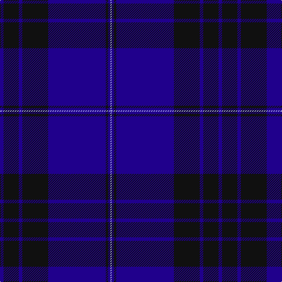

In pattern [BKBKBKBW](/patterns/bkbkbkbw/).

This was sourced from tartans-authority.  It is a [8 stripes tartan](/stripes/stripes8/).

Original link http://www.tartansauthority.com/tartan-ferret/display/7001/

## Thread count
DB/6 K26 DB6 K44 DB98 K4 DB4 LP/2

## Palette
Each colour and its ΔE from the base-6 reference it is a variant of.

| Colour | Shade | Base | ΔE (OKLab) |
|---|---|---|---|
| DB | <code style="background-color:#20008C;">#20008C</code> `#20008C` | B <code style="background-color:#2A418A;">#2A418A</code> | 0.12 |
| K | <code style="background-color:#101010;">#101010</code> `#101010` | K <code style="background-color:#000000;">#000000</code> | 0.17 |
| LP | <code style="background-color:#A8ACE8;">#A8ACE8</code> `#A8ACE8` | W <code style="background-color:#F7F7F7;">#F7F7F7</code> | 0.23 |

# Sample pattern

## Nearest tartans

The nearest existing variants by ΔTartan distance.

1. [Blue Spirit Fashion Tartan Tartan Number: 7001. Earliest known date: 01/08/2006 Designed by Kirsty Anderson of The House of Edgar for ACS Clothing of Glasgow. See products available Copyright © Blair Urquhart, Comrie, 2015](/setts/s8/b3k12b3k17b40k2b2w1x2~b1b056a-k1e1a10-we0e0e0/) — ΔT 1.39
1. [Blue Spirit](/setts/s8/b3k13b3k22b49k2b2w1x2~b1c0070-k101010-wa8ace8/) — ΔT 1.40
1. [Dalziel Rugby Club (Corporate)](/setts/s7/b56k4w1b6k20w2k20x2~b202060-k101010-we0e0e0/) — ΔT 1.47
1. [Earl Blue Marl](/setts/s6/b80k28ba9k3r5k12x2~b2c2c80-ba780078-k101010-r9c68a4/) — ΔT 1.74
1. [Lewis Welsh Name Tartan Tartan Number: 5758. Earliest known date: 22002 The tartan for this Welsh surname and its variations, Lewis, Lewys, Lou, Louis, Lew, Lewes, is actually woven in Wales at the Cambrian Woollen Mill, weaving on the same site since 1830. This tartan differs from many traditional patterns in that the warp and weft differ, giving the finished worsted wool cloth more of a predominant stripe, vertically noticeable in the finished Kilt, or Cilt in Wales. See products available Copyright © Blair Urquhart, Comrie, 2015](/setts/s7/b56y2g19y1g2y1b2x2~b202060-g005c34-ya08858/) — ΔT 1.74
1. [Danzas](/setts/s7/y4b3y1b17ba40b2ba3x2~b102040-ba304080-yf0c000/) — ΔT 1.76
1. [Munster Ancestry (Fashion)](/setts/s8/b4ba48b21ba14g3ba6b1y3x2~b5c5c5c-ba2c2c80-g604000-ye8c000/) — ΔT 1.78
1. [Scotland's Own (Fashion)](/setts/s12/b4g1b30k15ba4b2k2b2k10b4ba2b2x2~b2c2c80-ba780078-g808080-k101010/) — ΔT 1.79
1. [Marist School, The](/setts/s8/b29ba2b1ba1b1ba1bb8y1x4~b102040-ba4000ff-bb304080-yf0c000/) — ΔT 1.79
1. [S.C.O.T.S.](/setts/s6/b55ba18w3ba2r2ba6x2~b304080-ba000050-rc00020-we0e0e0/) — ΔT 1.83

## Neighbour map

Every grey dot is one of 15726 variants placed by the first two principal components of the ΔTartan feature space (44% of its variance). Red is this tartan; blue dots are its nearest — click one to open its page.

<svg viewBox="0 0 640 380" role="img" style="max-width:100%;height:auto;border:1px solid #e0e0e0;border-radius:4px;display:block" xmlns="http://www.w3.org/2000/svg"><image href="/nn/cloud.v1.png" width="640" height="380"/><a href="/setts/s8/b3k12b3k17b40k2b2w1x2~b1b056a-k1e1a10-we0e0e0/"><circle cx="535.5" cy="195.6" r="4" fill="#3465a4"><title>Blue Spirit Fashion Tartan Tartan Number: 7001. Earliest known date: 01/08/2006 Designed by Kirsty Anderson of The House of Edgar for ACS Clothing of Glasgow. See products available Copyright © Blair Urquhart, Comrie, 2015</title></circle></a><a href="/setts/s8/b3k13b3k22b49k2b2w1x2~b1c0070-k101010-wa8ace8/"><circle cx="555.6" cy="189.6" r="4" fill="#3465a4"><title>Blue Spirit</title></circle></a><a href="/setts/s7/b56k4w1b6k20w2k20x2~b202060-k101010-we0e0e0/"><circle cx="497.7" cy="187.6" r="4" fill="#3465a4"><title>Dalziel Rugby Club (Corporate)</title></circle></a><a href="/setts/s6/b80k28ba9k3r5k12x2~b2c2c80-ba780078-k101010-r9c68a4/"><circle cx="451.2" cy="193.1" r="4" fill="#3465a4"><title>Earl Blue Marl</title></circle></a><a href="/setts/s7/b56y2g19y1g2y1b2x2~b202060-g005c34-ya08858/"><circle cx="579.7" cy="164.2" r="4" fill="#3465a4"><title>Lewis Welsh Name Tartan Tartan Number: 5758. Earliest known date: 22002 The tartan for this Welsh surname and its variations, Lewis, Lewys, Lou, Louis, Lew, Lewes, is actually woven in Wales at the Cambrian Woollen Mill, weaving on the same site since 1830. This tartan differs from many traditional patterns in that the warp and weft differ, giving the finished worsted wool cloth more of a predominant stripe, vertically noticeable in the finished Kilt, or Cilt in Wales. See products available Copyright © Blair Urquhart, Comrie, 2015</title></circle></a><a href="/setts/s7/y4b3y1b17ba40b2ba3x2~b102040-ba304080-yf0c000/"><circle cx="474.1" cy="167.7" r="4" fill="#3465a4"><title>Danzas</title></circle></a><a href="/setts/s8/b4ba48b21ba14g3ba6b1y3x2~b5c5c5c-ba2c2c80-g604000-ye8c000/"><circle cx="531.0" cy="161.9" r="4" fill="#3465a4"><title>Munster Ancestry (Fashion)</title></circle></a><a href="/setts/s12/b4g1b30k15ba4b2k2b2k10b4ba2b2x2~b2c2c80-ba780078-g808080-k101010/"><circle cx="444.9" cy="158.1" r="4" fill="#3465a4"><title>Scotland's Own (Fashion)</title></circle></a><a href="/setts/s8/b29ba2b1ba1b1ba1bb8y1x4~b102040-ba4000ff-bb304080-yf0c000/"><circle cx="528.1" cy="156.1" r="4" fill="#3465a4"><title>Marist School, The</title></circle></a><a href="/setts/s6/b55ba18w3ba2r2ba6x2~b304080-ba000050-rc00020-we0e0e0/"><circle cx="466.1" cy="175.3" r="4" fill="#3465a4"><title>S.C.O.T.S.</title></circle></a><circle cx="519.2" cy="174.0" r="5" fill="#c00000"/></svg>

ID: /setts/s8/b3k13b3k22b49k2b2w1x2~b20008c-k101010-wa8ace8/
