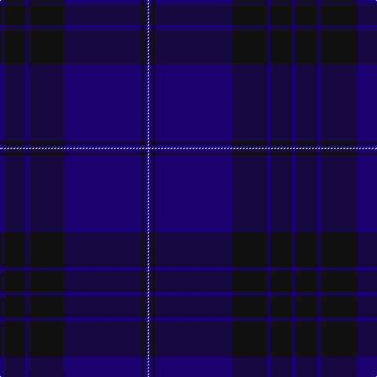

In pattern [BKBKBKBW](/patterns/bkbkbkbw/).

This was sourced from register-of-tartans.  It is a [8 stripes tartan](/stripes/stripes8/).

Original link https://www.tartanregister.gov.uk/tartanDetails.aspx?ref=305

## Thread count
DB/6 K26 DB6 K44 DB98 K4 DB4 LP/2

## Palette
Each colour and its ΔE from the base-6 reference it is a variant of.

| Colour | Shade | Base | ΔE (OKLab) |
|---|---|---|---|
| DB | <code style="background-color:#1C0070;">#1C0070</code> `#1C0070` | B <code style="background-color:#2A418A;">#2A418A</code> | 0.14 |
| K | <code style="background-color:#101010;">#101010</code> `#101010` | K <code style="background-color:#000000;">#000000</code> | 0.17 |
| LP | <code style="background-color:#A8ACE8;">#A8ACE8</code> `#A8ACE8` | W <code style="background-color:#F7F7F7;">#F7F7F7</code> | 0.23 |

# Sample pattern

## Nearest tartans

The nearest existing variants by ΔTartan distance.

1. [Blue Spirit Fashion Tartan Tartan Number: 7001. Earliest known date: 01/08/2006 Designed by Kirsty Anderson of The House of Edgar for ACS Clothing of Glasgow. See products available Copyright © Blair Urquhart, Comrie, 2015](/setts/s8/b3k12b3k17b40k2b2w1~b1b056a-k1e1a10-we0e0e0~x2/) — ΔT 0.57
1. [Blue Spirit (Fashion)](/setts/s8/b3k13b3k22b49k2b2w1~b20008c-k101010-wa8ace8~x2/) — ΔT 1.40
1. [Dalziel Rugby Club (Corporate)](/setts/s7/b56k4w1b6k20w2k20~b202060-k101010-we0e0e0~x2/) — ΔT 1.48
1. [Orman (Midlothian) (Personal)](/setts/s9/k10b3k3b32g1b1g1b2ba2~b14146a-ba544e4f-g085e23-k101010~x2/) — ΔT 1.51
1. [Scotland's Own (Fashion)](/setts/s12/b4g1b30k15ba4b2k2b2k10b4ba2b2~b2c2c80-ba780078-g808080-k101010~x2/) — ΔT 1.92
1. [U.S. Navy/Edzell (Military)](/setts/s6/b45ba7w3ba27r1ba7~b14283c-ba2c2c80-rc80000-we0e0e0~x2/) — ΔT 2.01
1. [Little of Morton Rigg Red (Personal)](/setts/s8/k3b1k32ba6k4ba16k3r2~b5c8ca8-ba1c1c50-k101010-rc80000~x2/) — ΔT 2.02
1. [Potts (Personal)](/setts/s6/g1b36ba28b3g3k1~b202060-ba441800-g74846c-k000000~x2/) — ΔT 2.02
1. [Earl Blue Marl](/setts/s6/b80k28ba9k3r5k12~b2c2c80-ba780078-k101010-r9c68a4~x2/) — ΔT 2.03
1. [Munster Ancestry (Fashion)](/setts/s8/b4ba48b21ba14g3ba6b1y3~b5c5c5c-ba2c2c80-g604000-ye8c000~x2/) — ΔT 2.03

## Neighbour map

Every grey dot is one of 15726 variants placed by the first two principal components of the ΔTartan feature space (44% of its variance). Red is this tartan; blue dots are its nearest — click one to open its page.

<svg viewBox="0 0 640 380" role="img" style="max-width:100%;height:auto;border:1px solid #e0e0e0;border-radius:4px;display:block" xmlns="http://www.w3.org/2000/svg"><image href="/nn/cloud.v1.png" width="640" height="380"/><a href="/setts/s8/b3k12b3k17b40k2b2w1~b1b056a-k1e1a10-we0e0e0~x2/"><circle cx="535.5" cy="195.6" r="4" fill="#3465a4"><title>Blue Spirit Fashion Tartan Tartan Number: 7001. Earliest known date: 01/08/2006 Designed by Kirsty Anderson of The House of Edgar for ACS Clothing of Glasgow. See products available Copyright © Blair Urquhart, Comrie, 2015</title></circle></a><a href="/setts/s8/b3k13b3k22b49k2b2w1~b20008c-k101010-wa8ace8~x2/"><circle cx="519.2" cy="174.0" r="4" fill="#3465a4"><title>Blue Spirit (Fashion)</title></circle></a><a href="/setts/s7/b56k4w1b6k20w2k20~b202060-k101010-we0e0e0~x2/"><circle cx="497.7" cy="187.6" r="4" fill="#3465a4"><title>Dalziel Rugby Club (Corporate)</title></circle></a><a href="/setts/s9/k10b3k3b32g1b1g1b2ba2~b14146a-ba544e4f-g085e23-k101010~x2/"><circle cx="581.0" cy="178.5" r="4" fill="#3465a4"><title>Orman (Midlothian) (Personal)</title></circle></a><a href="/setts/s12/b4g1b30k15ba4b2k2b2k10b4ba2b2~b2c2c80-ba780078-g808080-k101010~x2/"><circle cx="444.9" cy="158.1" r="4" fill="#3465a4"><title>Scotland's Own (Fashion)</title></circle></a><a href="/setts/s6/b45ba7w3ba27r1ba7~b14283c-ba2c2c80-rc80000-we0e0e0~x2/"><circle cx="448.3" cy="189.8" r="4" fill="#3465a4"><title>U.S. Navy/Edzell (Military)</title></circle></a><a href="/setts/s8/k3b1k32ba6k4ba16k3r2~b5c8ca8-ba1c1c50-k101010-rc80000~x2/"><circle cx="538.3" cy="202.2" r="4" fill="#3465a4"><title>Little of Morton Rigg Red (Personal)</title></circle></a><a href="/setts/s6/g1b36ba28b3g3k1~b202060-ba441800-g74846c-k000000~x2/"><circle cx="471.4" cy="188.0" r="4" fill="#3465a4"><title>Potts (Personal)</title></circle></a><a href="/setts/s6/b80k28ba9k3r5k12~b2c2c80-ba780078-k101010-r9c68a4~x2/"><circle cx="451.2" cy="193.1" r="4" fill="#3465a4"><title>Earl Blue Marl</title></circle></a><a href="/setts/s8/b4ba48b21ba14g3ba6b1y3~b5c5c5c-ba2c2c80-g604000-ye8c000~x2/"><circle cx="531.0" cy="161.9" r="4" fill="#3465a4"><title>Munster Ancestry (Fashion)</title></circle></a><circle cx="555.6" cy="189.6" r="5" fill="#c00000"/></svg>

ID: /setts/s8/b3k13b3k22b49k2b2w1~b1c0070-k101010-wa8ace8~x2/
