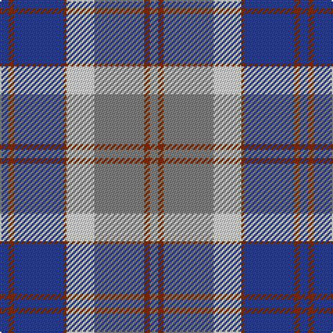

In pattern [BRBRWGRG](/patterns/brbrwgrg/).

This was sourced from weddslist.  It is a [8 stripes tartan](/stripes/stripes8/).

Original link http://www.weddslist.com/cgi-bin/tartans/pg.pl?source=sts

## Thread count
B/6 T4 B36 T2 LN20 N36 T4 N/6

## Palette
Each colour and its ΔE from the base-6 reference it is a variant of.

| Colour | Shade | Base | ΔE (OKLab) |
|---|---|---|---|
| B | <code style="background-color:#304080;">#304080</code> `#304080` | B <code style="background-color:#2A418A;">#2A418A</code> | 0.02 |
| LN | <code style="background-color:#E0E0E0;">#E0E0E0</code> `#E0E0E0` | W <code style="background-color:#F7F7F7;">#F7F7F7</code> | 0.07 |
| N | <code style="background-color:#808080;">#808080</code> `#808080` | G <code style="background-color:#006100;">#006100</code> | 0.23 |
| T | <code style="background-color:#703000;">#703000</code> `#703000` | R <code style="background-color:#CC0000;">#CC0000</code> | 0.19 |

# Sample pattern

## Nearest tartans

The nearest existing variants by ΔTartan distance.

1. [Bannockbane Silver](/setts/s8/b3ba2b18ba1w10r18ba2r3x2~b202060-ba480800-r888888-we0e0e0/) — ΔT 0.94
1. [Keela (Corporate)](/setts/s7/b7w3b2w6b16ba26r4x2~b003c64-ba5c8ca8-r880000-wfcfcfc/) — ΔT 1.16
1. [Scotland 2000 Commemorative Tartan Tartan Number: 2514. Earliest known date: 1999 Strathmore Woollen Mills Millenium tartan designed by Arthur Mackie of Strathmore Woollen Co., Forfar See products available Copyright © Blair Urquhart, Comrie, 2015](/setts/s8/w4b30g6r2g6r28y2r3x2~b2888c4-g006818-r901c38-we0e0e0-ye8c000/) — ΔT 1.21
1. [Gorman Blue (Personal)](/setts/s8/w4b1y2b22ba20w2ba4w2x2~b3e647a-ba14465c-wf7f1e8-ybfab40/) — ΔT 1.25
1. [MacPherson Hunting](/setts/s9/b11r1k8r1b1r1ra8r1b1x4~b1860a8-k101010-rc80000-ra888888/) — ΔT 1.28
1. [Sean F Forrester (Personal)](/setts/s9/w3y4w1y15b24ba15ya1ba4ya3x4~b663399-ba333333-wffffff-y999999-yaffee00/) — ΔT 1.30
1. [Scottish Highlander, dress](/setts/s8/w26wa2w3b15g26r2g3b4x2~b000050-g808080-r802040-wc0a0e0-wae0e0e0/) — ΔT 1.32
1. [Confederate (Military)](/setts/s7/r12b18k1r4k1g6k2x2~b1474b4-g006800-k000000-rc80000/) — ΔT 1.37
1. [Sonsub](/setts/s10/b30k5b19k5b2y20ya2y20k5ya4x2~b646464-k101010-ya0a0a0-yad0d40c/) — ΔT 1.38
1. [Halesowen (District)](/setts/s8/w9b3y3b24ba24y2ba2y2x2~b1474b4-ba2c2c80-we0e0e0-ye8c000/) — ΔT 1.39

## Neighbour map

Every grey dot is one of 15726 variants placed by the first two principal components of the ΔTartan feature space (44% of its variance). Red is this tartan; blue dots are its nearest — click one to open its page.

<svg viewBox="0 0 640 380" role="img" style="max-width:100%;height:auto;border:1px solid #e0e0e0;border-radius:4px;display:block" xmlns="http://www.w3.org/2000/svg"><image href="/nn/cloud.v1.png" width="640" height="380"/><a href="/setts/s8/b3ba2b18ba1w10r18ba2r3x2~b202060-ba480800-r888888-we0e0e0/"><circle cx="199.1" cy="153.3" r="4" fill="#3465a4"><title>Bannockbane Silver</title></circle></a><a href="/setts/s7/b7w3b2w6b16ba26r4x2~b003c64-ba5c8ca8-r880000-wfcfcfc/"><circle cx="210.2" cy="182.1" r="4" fill="#3465a4"><title>Keela (Corporate)</title></circle></a><a href="/setts/s8/w4b30g6r2g6r28y2r3x2~b2888c4-g006818-r901c38-we0e0e0-ye8c000/"><circle cx="236.3" cy="145.6" r="4" fill="#3465a4"><title>Scotland 2000 Commemorative Tartan Tartan Number: 2514. Earliest known date: 1999 Strathmore Woollen Mills Millenium tartan designed by Arthur Mackie of Strathmore Woollen Co., Forfar See products available Copyright © Blair Urquhart, Comrie, 2015</title></circle></a><a href="/setts/s8/w4b1y2b22ba20w2ba4w2x2~b3e647a-ba14465c-wf7f1e8-ybfab40/"><circle cx="275.1" cy="152.6" r="4" fill="#3465a4"><title>Gorman Blue (Personal)</title></circle></a><a href="/setts/s9/b11r1k8r1b1r1ra8r1b1x4~b1860a8-k101010-rc80000-ra888888/"><circle cx="211.1" cy="171.9" r="4" fill="#3465a4"><title>MacPherson Hunting</title></circle></a><a href="/setts/s9/w3y4w1y15b24ba15ya1ba4ya3x4~b663399-ba333333-wffffff-y999999-yaffee00/"><circle cx="180.3" cy="118.8" r="4" fill="#3465a4"><title>Sean F Forrester (Personal)</title></circle></a><a href="/setts/s8/w26wa2w3b15g26r2g3b4x2~b000050-g808080-r802040-wc0a0e0-wae0e0e0/"><circle cx="175.6" cy="146.3" r="4" fill="#3465a4"><title>Scottish Highlander, dress</title></circle></a><a href="/setts/s7/r12b18k1r4k1g6k2x2~b1474b4-g006800-k000000-rc80000/"><circle cx="235.9" cy="163.8" r="4" fill="#3465a4"><title>Confederate (Military)</title></circle></a><a href="/setts/s10/b30k5b19k5b2y20ya2y20k5ya4x2~b646464-k101010-ya0a0a0-yad0d40c/"><circle cx="254.2" cy="171.8" r="4" fill="#3465a4"><title>Sonsub</title></circle></a><a href="/setts/s8/w9b3y3b24ba24y2ba2y2x2~b1474b4-ba2c2c80-we0e0e0-ye8c000/"><circle cx="207.5" cy="167.7" r="4" fill="#3465a4"><title>Halesowen (District)</title></circle></a><circle cx="221.5" cy="161.5" r="5" fill="#c00000"/></svg>

ID: /setts/s8/b3r2b18r1w10g18r2g3x2~b304080-g808080-r703000-we0e0e0/
