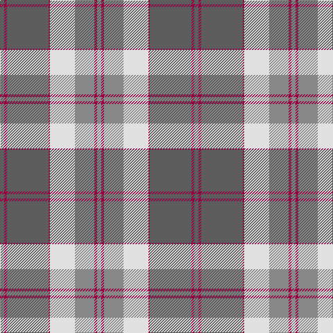

In pattern [BRBRWRRR](/patterns/brbrwrrr/).

This was sourced from register-of-tartans.  It is a [8 stripes tartan](/stripes/stripes8/).

Original link https://www.tartanregister.gov.uk/tartanDetails.aspx?ref=5009

## Thread count
N/6 R4 N60 R2 LN36 Na28 R4 Na/6

## Palette
Each colour and its ΔE from the base-6 reference it is a variant of.

| Colour | Shade | Base | ΔE (OKLab) |
|---|---|---|---|
| LN | <code style="background-color:#E0E0E0;">#E0E0E0</code> `#E0E0E0` | W <code style="background-color:#F7F7F7;">#F7F7F7</code> | 0.07 |
| N | <code style="background-color:#5C5C5C;">#5C5C5C</code> `#5C5C5C` | B <code style="background-color:#2A418A;">#2A418A</code> | 0.15 |
| Na | <code style="background-color:#888888;">#888888</code> `#888888` | R <code style="background-color:#CC0000;">#CC0000</code> | 0.24 |
| R | <code style="background-color:#980044;">#980044</code> `#980044` | R <code style="background-color:#CC0000;">#CC0000</code> | 0.13 |

# Sample pattern

## Nearest tartans

The nearest existing variants by ΔTartan distance.

1. [Ailsa, Grey (Fashion)](/setts/s9/r9w9r9b25r1w1r1w1g3~b5c5c5c-g00881c-r888888-we0e0e0~x2/) — ΔT 0.98
1. [Evergreen](/setts/s8/w2b30y10w1y10b1g10b1~b3c3c3c-g848870-we0e0e0-ya88c58~x4/) — ΔT 1.23
1. [Berger-MacLaren (Personal)](/setts/s7/y37k12ya17r3ya17k1yb3~k101010-rc80000-y80b4bc-yaa08858-ybe8c000~x2/) — ΔT 1.37
1. [Greater St. Louis Firefighters (Cor)](/setts/s9/b3w3w38b25r3b6w7b3r2~b5c5c5c-rc80000-wd8d8b0~x2/) — ΔT 1.39
1. [Spens/Spence (Clan)](/setts/s9/r26b1b10b1g32r11b8w3b1~b2888c4-g408060-r901c38-wf8f8f8~x2/) — ΔT 1.41
1. [Bannockbane, Modern Silver](/setts/s8/b3r2b18r1w10g18r2g3~b304080-g808080-r703000-we0e0e0~x2/) — ΔT 1.41
1. [Spens/Spence](/setts/s14/r56w2b6w2g32r11b6w5b6r11g32w2b6w2~b2888c4-g408060-r901c38-wf8f8f8~x2/) — ΔT 1.42
1. [Ben Vorlich (Fashion)](/setts/s11/r68w3r3w8r3w3r24b16ra3b20w3~b1c1c1c-r888888-ra70000c-we0e0e0~x2/) — ΔT 1.46
1. [President High School](/setts/s10/r32k5w3r3w3r7ra5k1ra17w3~k101010-r888888-raa00000-wfcfcfc~x2/) — ΔT 1.50
1. [Sonsub](/setts/s10/b30k5b19k5b2y20ya2y20k5ya4~b646464-k101010-ya0a0a0-yad0d40c~x2/) — ΔT 1.52

## Neighbour map

Every grey dot is one of 15726 variants placed by the first two principal components of the ΔTartan feature space (44% of its variance). Red is this tartan; blue dots are its nearest — click one to open its page.

<svg viewBox="0 0 640 380" role="img" style="max-width:100%;height:auto;border:1px solid #e0e0e0;border-radius:4px;display:block" xmlns="http://www.w3.org/2000/svg"><image href="/nn/cloud.v1.png" width="640" height="380"/><a href="/setts/s9/r9w9r9b25r1w1r1w1g3~b5c5c5c-g00881c-r888888-we0e0e0~x2/"><circle cx="296.0" cy="144.0" r="4" fill="#3465a4"><title>Ailsa, Grey (Fashion)</title></circle></a><a href="/setts/s8/w2b30y10w1y10b1g10b1~b3c3c3c-g848870-we0e0e0-ya88c58~x4/"><circle cx="336.1" cy="144.5" r="4" fill="#3465a4"><title>Evergreen</title></circle></a><a href="/setts/s7/y37k12ya17r3ya17k1yb3~k101010-rc80000-y80b4bc-yaa08858-ybe8c000~x2/"><circle cx="249.4" cy="127.9" r="4" fill="#3465a4"><title>Berger-MacLaren (Personal)</title></circle></a><a href="/setts/s9/b3w3w38b25r3b6w7b3r2~b5c5c5c-rc80000-wd8d8b0~x2/"><circle cx="265.7" cy="130.0" r="4" fill="#3465a4"><title>Greater St. Louis Firefighters (Cor)</title></circle></a><a href="/setts/s9/r26b1b10b1g32r11b8w3b1~b2888c4-g408060-r901c38-wf8f8f8~x2/"><circle cx="273.4" cy="126.4" r="4" fill="#3465a4"><title>Spens/Spence (Clan)</title></circle></a><a href="/setts/s8/b3r2b18r1w10g18r2g3~b304080-g808080-r703000-we0e0e0~x2/"><circle cx="221.5" cy="161.5" r="4" fill="#3465a4"><title>Bannockbane, Modern Silver</title></circle></a><a href="/setts/s14/r56w2b6w2g32r11b6w5b6r11g32w2b6w2~b2888c4-g408060-r901c38-wf8f8f8~x2/"><circle cx="290.9" cy="109.1" r="4" fill="#3465a4"><title>Spens/Spence</title></circle></a><a href="/setts/s11/r68w3r3w8r3w3r24b16ra3b20w3~b1c1c1c-r888888-ra70000c-we0e0e0~x2/"><circle cx="266.7" cy="100.1" r="4" fill="#3465a4"><title>Ben Vorlich (Fashion)</title></circle></a><a href="/setts/s10/r32k5w3r3w3r7ra5k1ra17w3~k101010-r888888-raa00000-wfcfcfc~x2/"><circle cx="325.1" cy="111.1" r="4" fill="#3465a4"><title>President High School</title></circle></a><a href="/setts/s10/b30k5b19k5b2y20ya2y20k5ya4~b646464-k101010-ya0a0a0-yad0d40c~x2/"><circle cx="254.2" cy="171.8" r="4" fill="#3465a4"><title>Sonsub</title></circle></a><circle cx="289.9" cy="134.6" r="5" fill="#c00000"/></svg>

ID: /setts/s8/b3r2b30r1w18ra14r2ra3~b5c5c5c-r980044-ra888888-we0e0e0~x2/
