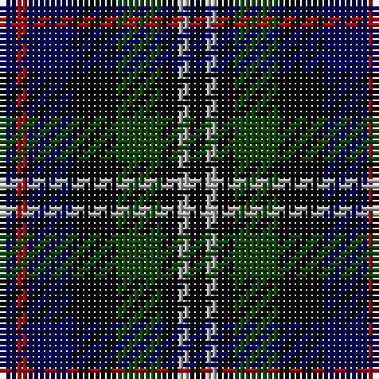

In pattern [BRBKGKYK](/patterns/brbkgkyk/).

This was sourced from weddslist.  It is a [8 stripes tartan](/stripes/stripes8/).

Original link http://www.weddslist.com/cgi-bin/tartans/pg.pl?source=x

## Thread count
DB/3 DR2 DB8 K8 DG8 K3 N2 K/3

## Palette
Each colour and its ΔE from the base-6 reference it is a variant of.

| Colour | Shade | Base | ΔE (OKLab) |
|---|---|---|---|
| DB | <code style="background-color:#000052;">#000052</code> `#000052` | B <code style="background-color:#2C4084;">#2C4084</code> | 0.20 |
| DG | <code style="background-color:#11450D;">#11450D</code> `#11450D` | G <code style="background-color:#006400;">#006400</code> | 0.10 |
| DR | <code style="background-color:#AA0000;">#AA0000</code> `#AA0000` | R <code style="background-color:#C80000;">#C80000</code> | 0.06 |
| K | <code style="background-color:#000000;">#000000</code> `#000000` | K <code style="background-color:#000000;">#000000</code> | 0.00 |
| N | <code style="background-color:#AAAAAA;">#AAAAAA</code> `#AAAAAA` | Y <code style="background-color:#E8C000;">#E8C000</code> | 0.19 |

# Sample pattern

## Nearest tartans

The nearest existing variants by ΔTartan distance.

1. [Davidson Double](/setts/s8/b6r4b16k16g16k6y4k6-b000052-g11450d-k000000-raa0000-yaaaaaa/) — ΔT 0.00
1. [Davidson Double](/setts/s8/b3r2b8k8g8k3w2g3-b000064-g004c00-k000000-rc80000-wd0d0d0/) — ΔT 0.90
1. [MacKean dress](/setts/s9/r6k12g24k6g6k12b18k6w6-b304080-g004010-k000000-rc00000-we0e0e0/) — ΔT 0.96
1. [Davidson Double.. Clan Tartan Tartan Number: 444. Earliest known date: 1847 Wilson's of Bannockburn produced this sett in 1847, calling it 'Double Davidson'. See products available Copyright © Blair Urquhart, Comrie, 2015](/setts/s8/b6r4b16k16g16k6w4k6-b2c2c80-g006818-k101010-rc80000-we0e0e0/) — ΔT 1.24
1. [Vosko](/setts/s9/b32k16y8k12r8k12y8k16g32-b1c0070-g006818-k101010-r880000-yd09800/) — ΔT 1.25
1. [Brodie Hunting](/setts/s7/r4b16g16k16y2k16r4-b000052-g11450d-k000000-raa0000-yaaaa00/) — ΔT 1.25
1. [Brodie Hunting](/setts/s7/r2b8g8k8y1k8r2-b000052-g11450d-k000000-raa0000-yaaaa00/) — ΔT 1.25
1. [Davidson, Double](/setts/s8/b6r4b16k16g16k6w4k6-b2c2c80-g006818-k101010-rc80000-wfcfcfc/) — ΔT 1.27
1. [Davidson, Double..](/setts/s8/b6r4b16k16g16k6w4k6-b304080-g008000-k000000-rc00000-we0e0e0/) — ΔT 1.29
1. [Hinnigan (Personal)](/setts/s8/r16g8b32g8k28r28b8ba6-b000064-ba3474fc-g006818-k000000-r8c6428/) — ΔT 1.29

## Neighbour map

Every grey dot is one of 15726 variants placed by the first two principal components of the ΔTartan feature space (44% of its variance). Red is this tartan; blue dots are its nearest — click one to open its page.

<svg viewBox="0 0 640 380" role="img" style="max-width:100%;height:auto;border:1px solid #e0e0e0;border-radius:4px;display:block" xmlns="http://www.w3.org/2000/svg"><image href="/nn/cloud.v1.png" width="640" height="380"/><a href="/setts/s8/b6r4b16k16g16k6y4k6-b000052-g11450d-k000000-raa0000-yaaaaaa/"><circle cx="107.7" cy="250.1" r="4" fill="#3465a4"><title>Davidson Double</title></circle></a><a href="/setts/s8/b3r2b8k8g8k3w2g3-b000064-g004c00-k000000-rc80000-wd0d0d0/"><circle cx="62.1" cy="242.9" r="4" fill="#3465a4"><title>Davidson Double</title></circle></a><a href="/setts/s9/r6k12g24k6g6k12b18k6w6-b304080-g004010-k000000-rc00000-we0e0e0/"><circle cx="85.9" cy="232.8" r="4" fill="#3465a4"><title>MacKean dress</title></circle></a><a href="/setts/s8/b6r4b16k16g16k6w4k6-b2c2c80-g006818-k101010-rc80000-we0e0e0/"><circle cx="107.2" cy="243.5" r="4" fill="#3465a4"><title>Davidson Double.. Clan Tartan Tartan Number: 444. Earliest known date: 1847 Wilson's of Bannockburn produced this sett in 1847, calling it 'Double Davidson'. See products available Copyright © Blair Urquhart, Comrie, 2015</title></circle></a><a href="/setts/s9/b32k16y8k12r8k12y8k16g32-b1c0070-g006818-k101010-r880000-yd09800/"><circle cx="101.5" cy="239.0" r="4" fill="#3465a4"><title>Vosko</title></circle></a><a href="/setts/s7/r4b16g16k16y2k16r4-b000052-g11450d-k000000-raa0000-yaaaa00/"><circle cx="162.0" cy="228.3" r="4" fill="#3465a4"><title>Brodie Hunting</title></circle></a><a href="/setts/s7/r2b8g8k8y1k8r2-b000052-g11450d-k000000-raa0000-yaaaa00/"><circle cx="162.0" cy="228.3" r="4" fill="#3465a4"><title>Brodie Hunting</title></circle></a><a href="/setts/s8/b6r4b16k16g16k6w4k6-b2c2c80-g006818-k101010-rc80000-wfcfcfc/"><circle cx="101.2" cy="240.8" r="4" fill="#3465a4"><title>Davidson, Double</title></circle></a><a href="/setts/s8/b6r4b16k16g16k6w4k6-b304080-g008000-k000000-rc00000-we0e0e0/"><circle cx="79.1" cy="233.7" r="4" fill="#3465a4"><title>Davidson, Double..</title></circle></a><a href="/setts/s8/r16g8b32g8k28r28b8ba6-b000064-ba3474fc-g006818-k000000-r8c6428/"><circle cx="80.6" cy="222.6" r="4" fill="#3465a4"><title>Hinnigan (Personal)</title></circle></a><circle cx="107.7" cy="250.1" r="5" fill="#c00000"/></svg>

ID: /setts/s8/b3r2b8k8g8k3y2k3-b000052-g11450d-k000000-raa0000-yaaaaaa/
