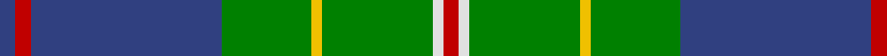

In pattern [BRBGYGWR](/patterns/brbgygwr/).

This was sourced from weddslist.  It is a [8 stripes tartan](/stripes/stripes8/).

Original link http://www.weddslist.com/cgi-bin/tartans/pg.pl?source=sts

## Thread count
B/6 R6 B72 G34 Y4 G42 LN4 R/6

## Palette
Each colour and its ΔE from the base-6 reference it is a variant of.

| Colour | Shade | Base | ΔE (OKLab) |
|---|---|---|---|
| B | <code style="background-color:#304080;">#304080</code> `#304080` | B <code style="background-color:#2A418A;">#2A418A</code> | 0.02 |
| G | <code style="background-color:#008000;">#008000</code> `#008000` | G <code style="background-color:#006100;">#006100</code> | 0.10 |
| LN | <code style="background-color:#E0E0E0;">#E0E0E0</code> `#E0E0E0` | W <code style="background-color:#F7F7F7;">#F7F7F7</code> | 0.07 |
| R | <code style="background-color:#C00000;">#C00000</code> `#C00000` | R <code style="background-color:#CC0000;">#CC0000</code> | 0.03 |
| Y | <code style="background-color:#F0C000;">#F0C000</code> `#F0C000` | Y <code style="background-color:#F2BF00;">#F2BF00</code> | 0.00 |

# Sample pattern

## Nearest tartans

The nearest existing variants by ΔTartan distance.

1. [Fox Hunting](/setts/s8/r4k2g36k2b18y3b18k2~b1474b4-g006818-k101010-rc80000-ye8c000~x2/) — ΔT 0.71
1. [Singh Name Tartan Tartan Number: 2600. Earliest known date: 1999 Created for the use of those with the name Singh. The proposer was Sirdar Iqubal Singh, Lord of Butley See products available Copyright © Blair Urquhart, Comrie, 2015](/setts/s8/b3r3b36g17y2g21w2r3~b2c2c80-g006818-rc80000-we0e0e0-ye8c000~x2/) — ΔT 0.75
1. [Carmichael](/setts/s6/k3g36b28r2b2y3~b304080-g008000-k000000-rc00000-yf0c000~x2/) — ΔT 0.84
1. [Carmichael Family Tartan Tartan Number: 1078. Earliest known date: 1907 It was the Carmichael of Artherstone who, in 1907, sealed a sample of the Carmichael tartan in the Collection of the Highland Society. This is the first known appearance of the tartan. This sett is sometimes woven in slightly different proportions, most noticable in the black and green stripes. Carmichaels are associated with the Stewarts of Appin and with the MacDougalls (MacMichaels), but all of the name, Carmichael, have the chiefs approval for the wearing of the Carmichael tartan. See products available Copyright © Blair Urquhart, Comrie, 2015](/setts/s6/k3g36b28r2b2y3~b2c2c80-g006818-k101010-rc80000-ye8c000~x2/) — ΔT 0.94
1. [Chartered Accountants of Scotland](/setts/s8/y4g3r2g36b30k3b3k3~b1870a4-g006818-k101010-rc8002c-ye8c000~x2/) — ΔT 0.98
1. [New Mexico](/setts/s8/r1g16b2g10b22y4r2y1~b304080-g008000-rc00000-yf0c000~x2/) — ΔT 0.99
1. [MX-5 Owners' Club](/setts/s7/r6b27ba2g2ba2g30w4~b2c2c80-ba2888c4-g006818-rc80000-wfcfcfc~x2/) — ΔT 1.00
1. [Hydesville Tower (Corporate)](/setts/s7/g30b6r2b2y2b15w2~b202060-g285800-rc80000-we0e0e0-yfccc00~x2/) — ΔT 1.02
1. [MacOrrell](/setts/s9/b5y2b17g14w1g1w1g4y2~b304080-g008000-we0e0e0-yf0c000~x2/) — ΔT 1.04
1. [Downie (Name)](/setts/s10/b24k2r2b2ba12g28r4g5b3g3~b5c8ca8-ba202060-g006818-k101010-rc80000~x2/) — ΔT 1.09

## Neighbour map

Every grey dot is one of 15726 variants placed by the first two principal components of the ΔTartan feature space (44% of its variance). Red is this tartan; blue dots are its nearest — click one to open its page.

<svg viewBox="0 0 640 380" role="img" style="max-width:100%;height:auto;border:1px solid #e0e0e0;border-radius:4px;display:block" xmlns="http://www.w3.org/2000/svg"><image href="/nn/cloud.v1.png" width="640" height="380"/><a href="/setts/s8/r4k2g36k2b18y3b18k2~b1474b4-g006818-k101010-rc80000-ye8c000~x2/"><circle cx="268.0" cy="157.9" r="4" fill="#3465a4"><title>Fox Hunting</title></circle></a><a href="/setts/s8/b3r3b36g17y2g21w2r3~b2c2c80-g006818-rc80000-we0e0e0-ye8c000~x2/"><circle cx="280.8" cy="154.7" r="4" fill="#3465a4"><title>Singh Name Tartan Tartan Number: 2600. Earliest known date: 1999 Created for the use of those with the name Singh. The proposer was Sirdar Iqubal Singh, Lord of Butley See products available Copyright © Blair Urquhart, Comrie, 2015</title></circle></a><a href="/setts/s6/k3g36b28r2b2y3~b304080-g008000-k000000-rc00000-yf0c000~x2/"><circle cx="293.4" cy="161.7" r="4" fill="#3465a4"><title>Carmichael</title></circle></a><a href="/setts/s6/k3g36b28r2b2y3~b2c2c80-g006818-k101010-rc80000-ye8c000~x2/"><circle cx="310.3" cy="168.5" r="4" fill="#3465a4"><title>Carmichael Family Tartan Tartan Number: 1078. Earliest known date: 1907 It was the Carmichael of Artherstone who, in 1907, sealed a sample of the Carmichael tartan in the Collection of the Highland Society. This is the first known appearance of the tartan. This sett is sometimes woven in slightly different proportions, most noticable in the black and green stripes. Carmichaels are associated with the Stewarts of Appin and with the MacDougalls (MacMichaels), but all of the name, Carmichael, have the chiefs approval for the wearing of the Carmichael tartan. See products available Copyright © Blair Urquhart, Comrie, 2015</title></circle></a><a href="/setts/s8/y4g3r2g36b30k3b3k3~b1870a4-g006818-k101010-rc8002c-ye8c000~x2/"><circle cx="301.2" cy="153.3" r="4" fill="#3465a4"><title>Chartered Accountants of Scotland</title></circle></a><a href="/setts/s8/r1g16b2g10b22y4r2y1~b304080-g008000-rc00000-yf0c000~x2/"><circle cx="286.8" cy="162.3" r="4" fill="#3465a4"><title>New Mexico</title></circle></a><a href="/setts/s7/r6b27ba2g2ba2g30w4~b2c2c80-ba2888c4-g006818-rc80000-wfcfcfc~x2/"><circle cx="239.7" cy="156.5" r="4" fill="#3465a4"><title>MX-5 Owners' Club</title></circle></a><a href="/setts/s7/g30b6r2b2y2b15w2~b202060-g285800-rc80000-we0e0e0-yfccc00~x2/"><circle cx="304.4" cy="162.3" r="4" fill="#3465a4"><title>Hydesville Tower (Corporate)</title></circle></a><a href="/setts/s9/b5y2b17g14w1g1w1g4y2~b304080-g008000-we0e0e0-yf0c000~x2/"><circle cx="279.3" cy="159.7" r="4" fill="#3465a4"><title>MacOrrell</title></circle></a><a href="/setts/s10/b24k2r2b2ba12g28r4g5b3g3~b5c8ca8-ba202060-g006818-k101010-rc80000~x2/"><circle cx="240.9" cy="154.2" r="4" fill="#3465a4"><title>Downie (Name)</title></circle></a><circle cx="278.6" cy="153.5" r="5" fill="#c00000"/></svg>

ID: /setts/s8/b3r3b36g17y2g21w2r3~b304080-g008000-rc00000-we0e0e0-yf0c000~x2/
