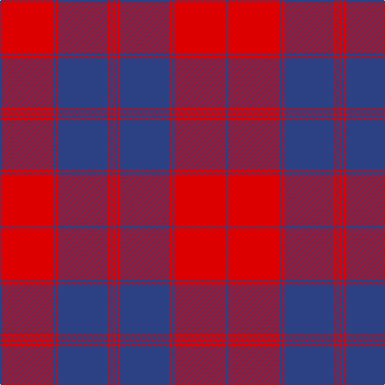

In pattern [BRBRBRBR](/patterns/brbrbrbr/).

This was sourced from register-of-tartans.  It is a [8 stripes tartan](/stripes/stripes8/).

Original link https://www.tartanregister.gov.uk/tartanDetails.aspx?ref=4345

## Register references

External register numbers recorded for this tartan.

- Scottish Register of Tartans: [4345](https://www.tartanregister.gov.uk/tartanDetails.aspx?ref=4345)
- Scottish Tartans World Register: 456

## Thread count
B/3 R64 B3 R3 B62 R3 B3 R/3

## Palette
Each colour and its ΔE from the base-6 reference it is a variant of.

| Colour | Shade | Base | ΔE (OKLab) |
|---|---|---|---|
| B | <code style="background-color:#2C4084;">#2C4084</code> `#2C4084` | B <code style="background-color:#2A418A;">#2A418A</code> | 0.01 |
| R | <code style="background-color:#DC0000;">#DC0000</code> `#DC0000` | R <code style="background-color:#CC0000;">#CC0000</code> | 0.03 |

# Sample pattern

## Nearest tartans

The nearest existing variants by ΔTartan distance.

1. [Unidentified Plaid 8](/setts/s8/b3r64b3r3b62r3b3r3~b304080-rc00000/) — ΔT 0.80
1. [Prince Charles Edward](/setts/s10/b40r40b44r2b2r40b2r2b2r7~b304080-rc00000~x2/) — ΔT 1.31
1. [Fraser, Isabella](/setts/s7/g2r21b60r48b2r3g2~b202060-g00643c-rc80000~x2/) — ΔT 1.35
1. [Auburn University (Alabama) (Corp)](/setts/s6/b3r3b24r30b3r2~b202060-rb84c00~x2/) — ΔT 1.48
1. [New Breckon (Fashion?)](/setts/s9/b6y2b27r27y2r2y2r2b4~b003c64-rc80000-ybc8c00~x2/) — ΔT 1.65
1. [31, Tartan (The.. )](/setts/s9/b2r21b1w4b7w2b2w2r2~b304080-rc00000-we0e0e0~x2/) — ΔT 1.77
1. [American](/setts/s9/b2r21b1w4b7w2b2w2r2~b000088-ra00000-wc8c8c8~x4/) — ΔT 1.80
1. [Auburn University (Alabama)](/setts/s6/b3y3b24y30b3y2~b2c2c80-yd87c00~x2/) — ΔT 1.87
1. [Harry (Welsh Name)](/setts/s10/b6r3b3r15ra7b7ra5b17ra46r4~b002c48-r888888-rac80000/) — ΔT 1.89
1. [Unnamed C18th - Prince Charles Edward #2](/setts/s18/b40r40b44r2b2r40b2r2b2r7b2r2b2r40b2r2b44r40~b2c2c80-rc80000~x2/) — ΔT 1.92

## Neighbour map

Every grey dot is one of 15726 variants placed by the first two principal components of the ΔTartan feature space (44% of its variance). Red is this tartan; blue dots are its nearest — click one to open its page.

<svg viewBox="0 0 640 380" role="img" style="max-width:100%;height:auto;border:1px solid #e0e0e0;border-radius:4px;display:block" xmlns="http://www.w3.org/2000/svg"><image href="/nn/cloud.v1.png" width="640" height="380"/><a href="/setts/s8/b3r64b3r3b62r3b3r3~b304080-rc00000/"><circle cx="453.9" cy="175.2" r="4" fill="#3465a4"><title>Unidentified Plaid 8</title></circle></a><a href="/setts/s10/b40r40b44r2b2r40b2r2b2r7~b304080-rc00000~x2/"><circle cx="426.7" cy="187.6" r="4" fill="#3465a4"><title>Prince Charles Edward</title></circle></a><a href="/setts/s7/g2r21b60r48b2r3g2~b202060-g00643c-rc80000~x2/"><circle cx="410.1" cy="158.4" r="4" fill="#3465a4"><title>Fraser, Isabella</title></circle></a><a href="/setts/s6/b3r3b24r30b3r2~b202060-rb84c00~x2/"><circle cx="411.0" cy="215.4" r="4" fill="#3465a4"><title>Auburn University (Alabama) (Corp)</title></circle></a><a href="/setts/s9/b6y2b27r27y2r2y2r2b4~b003c64-rc80000-ybc8c00~x2/"><circle cx="351.9" cy="172.2" r="4" fill="#3465a4"><title>New Breckon (Fashion?)</title></circle></a><a href="/setts/s9/b2r21b1w4b7w2b2w2r2~b304080-rc00000-we0e0e0~x2/"><circle cx="347.2" cy="135.6" r="4" fill="#3465a4"><title>31, Tartan (The.. )</title></circle></a><a href="/setts/s9/b2r21b1w4b7w2b2w2r2~b000088-ra00000-wc8c8c8~x4/"><circle cx="338.2" cy="139.7" r="4" fill="#3465a4"><title>American</title></circle></a><a href="/setts/s6/b3y3b24y30b3y2~b2c2c80-yd87c00~x2/"><circle cx="383.9" cy="203.7" r="4" fill="#3465a4"><title>Auburn University (Alabama)</title></circle></a><a href="/setts/s10/b6r3b3r15ra7b7ra5b17ra46r4~b002c48-r888888-rac80000/"><circle cx="338.1" cy="164.7" r="4" fill="#3465a4"><title>Harry (Welsh Name)</title></circle></a><a href="/setts/s18/b40r40b44r2b2r40b2r2b2r7b2r2b2r40b2r2b44r40~b2c2c80-rc80000~x2/"><circle cx="421.5" cy="150.9" r="4" fill="#3465a4"><title>Unnamed C18th - Prince Charles Edward #2</title></circle></a><circle cx="432.5" cy="164.1" r="5" fill="#c00000"/></svg>

ID: /setts/s8/b3r64b3r3b62r3b3r3~b2c4084-rdc0000/
