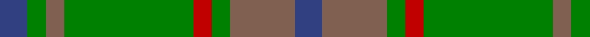

In pattern [BGRGRGRB](/patterns/bgrgrgrb/).

This was sourced from weddslist.  It is a [8 stripes tartan](/stripes/stripes8/).

Original link http://www.weddslist.com/cgi-bin/tartans/pg.pl?source=sts

## Thread count
B/6 G4 LT4 G28 R4 G4 LT14 B/6

## Palette
Each colour and its ΔE from the base-6 reference it is a variant of.

| Colour | Shade | Base | ΔE (OKLab) |
|---|---|---|---|
| B | <code style="background-color:#304080;">#304080</code> `#304080` | B <code style="background-color:#2A418A;">#2A418A</code> | 0.02 |
| G | <code style="background-color:#008000;">#008000</code> `#008000` | G <code style="background-color:#006100;">#006100</code> | 0.10 |
| LT | <code style="background-color:#806050;">#806050</code> `#806050` | R <code style="background-color:#CC0000;">#CC0000</code> | 0.17 |
| R | <code style="background-color:#C00000;">#C00000</code> `#C00000` | R <code style="background-color:#CC0000;">#CC0000</code> | 0.03 |

# Sample pattern

## Nearest tartans

The nearest existing variants by ΔTartan distance.

1. [Armagh Irish County Tartan Tartan Number: 2276. Earliest known date: 1996 One of a series of Irish District tartans designed by Polly Wittering of the House of Edgar, with colours reminiscent of the Country with soft warm colours dominating. See products available Copyright © Blair Urquhart, Comrie, 2015](/setts/s9/g4y2g17ga2r4ga2g3ga11g2~g407c40-ga043828-ra81830-ybcac20~x2/) — ΔT 0.92
1. [Daks (Loden)](/setts/s8/b3g7ga2gb2ga14g2ga2b3~b2c2c80-g604000-ga006818-gb808080~x2/) — ΔT 1.06
1. [Daks (Muted Loden)](/setts/s8/g3ga6gb2r2gb14ga2gb2g3~g604000-ga289c18-gb003820-rb03000~x2/) — ΔT 1.12
1. [Cranston](/setts/s8/g14b2g2b2g3b6ga12r2~b5c8ca8-g006818-ga289c18-rc80000~x2/) — ΔT 1.26
1. [Crantock](/setts/s8/g24b3g3b3g3b7ga20r3~b4c1864-g647c00-ga004028-rc80000~x2/) — ΔT 1.33
1. [Universal Ancient International Tartan Tartan Number: 136. Earliest known date: Canada This design is different in warp and weft. The display gives the general appearance only. Produced to celebrate American tourism is Scotland. The colours are taken from the flags of the two nations and the Atlantic Ocean that separates them. See products available Copyright © Blair Urquhart, Comrie, 2015](/setts/s8/b12g2b2g2b2ga8gb8ga1~b5c8ca8-g006818-ga604000-gb289c18~x2/) — ΔT 1.34
1. [Doyle](/setts/s7/g24r9g4ga19y2ga6g7~g006818-ga003820-rc80000-ye8c000~x2/) — ΔT 1.40
1. [Gammell (Personal)](/setts/s8/b32r3b3r3b3r10g24ra3~b5c8ca8-g006818-rb03000-ra901c38~x2/) — ΔT 1.40
1. [MacKinnon, hunting](/setts/s7/g1r8g8ra1g8r8w1~g008000-r806050-rac00000-we0e0e0~x4/) — ΔT 1.41
1. [O'Neill Pipe Band 1983 (Corporate)](/setts/s7/r1g1r5g8y1g1y1~g006818-rb84c00-y48a4c0~x4/) — ΔT 1.46

## Neighbour map

Every grey dot is one of 15726 variants placed by the first two principal components of the ΔTartan feature space (44% of its variance). Red is this tartan; blue dots are its nearest — click one to open its page.

<svg viewBox="0 0 640 380" role="img" style="max-width:100%;height:auto;border:1px solid #e0e0e0;border-radius:4px;display:block" xmlns="http://www.w3.org/2000/svg"><image href="/nn/cloud.v1.png" width="640" height="380"/><a href="/setts/s9/g4y2g17ga2r4ga2g3ga11g2~g407c40-ga043828-ra81830-ybcac20~x2/"><circle cx="334.1" cy="216.3" r="4" fill="#3465a4"><title>Armagh Irish County Tartan Tartan Number: 2276. Earliest known date: 1996 One of a series of Irish District tartans designed by Polly Wittering of the House of Edgar, with colours reminiscent of the Country with soft warm colours dominating. See products available Copyright © Blair Urquhart, Comrie, 2015</title></circle></a><a href="/setts/s8/b3g7ga2gb2ga14g2ga2b3~b2c2c80-g604000-ga006818-gb808080~x2/"><circle cx="327.7" cy="245.4" r="4" fill="#3465a4"><title>Daks (Loden)</title></circle></a><a href="/setts/s8/g3ga6gb2r2gb14ga2gb2g3~g604000-ga289c18-gb003820-rb03000~x2/"><circle cx="294.6" cy="228.7" r="4" fill="#3465a4"><title>Daks (Muted Loden)</title></circle></a><a href="/setts/s8/g14b2g2b2g3b6ga12r2~b5c8ca8-g006818-ga289c18-rc80000~x2/"><circle cx="268.4" cy="240.5" r="4" fill="#3465a4"><title>Cranston</title></circle></a><a href="/setts/s8/g24b3g3b3g3b7ga20r3~b4c1864-g647c00-ga004028-rc80000~x2/"><circle cx="266.3" cy="210.4" r="4" fill="#3465a4"><title>Crantock</title></circle></a><a href="/setts/s8/b12g2b2g2b2ga8gb8ga1~b5c8ca8-g006818-ga604000-gb289c18~x2/"><circle cx="262.8" cy="213.1" r="4" fill="#3465a4"><title>Universal Ancient International Tartan Tartan Number: 136. Earliest known date: Canada This design is different in warp and weft. The display gives the general appearance only. Produced to celebrate American tourism is Scotland. The colours are taken from the flags of the two nations and the Atlantic Ocean that separates them. See products available Copyright © Blair Urquhart, Comrie, 2015</title></circle></a><a href="/setts/s7/g24r9g4ga19y2ga6g7~g006818-ga003820-rc80000-ye8c000~x2/"><circle cx="301.5" cy="231.2" r="4" fill="#3465a4"><title>Doyle</title></circle></a><a href="/setts/s8/b32r3b3r3b3r10g24ra3~b5c8ca8-g006818-rb03000-ra901c38~x2/"><circle cx="302.0" cy="195.6" r="4" fill="#3465a4"><title>Gammell (Personal)</title></circle></a><a href="/setts/s7/g1r8g8ra1g8r8w1~g008000-r806050-rac00000-we0e0e0~x4/"><circle cx="334.0" cy="259.7" r="4" fill="#3465a4"><title>MacKinnon, hunting</title></circle></a><a href="/setts/s7/r1g1r5g8y1g1y1~g006818-rb84c00-y48a4c0~x4/"><circle cx="367.8" cy="236.0" r="4" fill="#3465a4"><title>O'Neill Pipe Band 1983 (Corporate)</title></circle></a><circle cx="303.0" cy="231.5" r="5" fill="#c00000"/></svg>

ID: /setts/s8/b3r7g2ra2g14r2g2b3~b304080-g008000-r806050-rac00000~x2/
