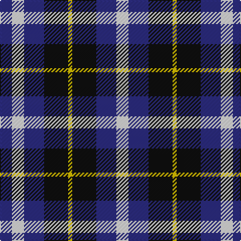

In pattern [BWBKYKBW](/patterns/bwbkykbw/).

This was sourced from register-of-tartans.  It is a [8 stripes tartan](/stripes/stripes8/).

Original link https://www.tartanregister.gov.uk/tartanDetails.aspx?ref=1975

## Thread count
DB/12 LN12 DB20 K24 Y4 K24 DB20 LN/12

## Palette
Each colour and its ΔE from the base-6 reference it is a variant of.

| Colour | Shade | Base | ΔE (OKLab) |
|---|---|---|---|
| B | <code style="background-color:#3850C8;">#3850C8</code> `#3850C8` | B <code style="background-color:#2A418A;">#2A418A</code> | 0.11 |
| DB | <code style="background-color:#2C2C80;">#2C2C80</code> `#2C2C80` | B <code style="background-color:#2A418A;">#2A418A</code> | 0.06 |
| K | <code style="background-color:#101010;">#101010</code> `#101010` | K <code style="background-color:#000000;">#000000</code> | 0.17 |
| LN | <code style="background-color:#E0E0E0;">#E0E0E0</code> `#E0E0E0` | W <code style="background-color:#F7F7F7;">#F7F7F7</code> | 0.07 |
| Y | <code style="background-color:#E8C000;">#E8C000</code> `#E8C000` | Y <code style="background-color:#F2BF00;">#F2BF00</code> | 0.02 |

# Sample pattern

## Nearest tartans

The nearest existing variants by ΔTartan distance.

1. [St. Johnstone F.C. (Sports)](/setts/s7/k6w3k8b7y2b7w1x4~b2c2c80-k101010-wc0c0c0-yd09800/) — ΔT 1.11
1. [St. Johnstone Football Club](/setts/s12/k6w3k8b7y2b7w1b7y2b7k8w3x4~b2c2c80-k101010-wc0c0c0-yd09800/) — ΔT 1.34
1. [Creek Indian Nation (District)](/setts/s7/b2b4y1b1y2b4y2x12~b2c2c80-ye8c000/) — ΔT 1.42
1. [Battle of Prestonpans (1745) Heritage Trust, The](/setts/s5/b9r12g9b5w2x4~b0000cd-g008b00-re3170d-wffffff/) — ΔT 1.53
1. [Broz Sanz Elementary (Corporate)](/setts/s9/k4b1k1b1k1b4r2b4w2x4~b2c2c80-k101010-rc80000-we0e0e0/) — ΔT 1.56
1. [City of Pointe-Claire (District)](/setts/s10/b4w1g1k2b4g2w1g1w1g1x4~b2c2c80-g604000-k101010-we0e0e0/) — ΔT 1.57
1. [Greyhound Grenadiers (Corporate)](/setts/s7/b9k7r5ra1r5k1r2x4~b1c0070-k101010-r888888-rac80000/) — ΔT 1.61
1. [Marshall of Keith (Personal)](/setts/s5/b10k10b10g26y5x2~b3f0ffe-g003c14-k101010-ye8c000/) — ΔT 1.61
1. [Unidentified #55](/setts/s11/y2b10r3y2w3y2b3r3b3w3y2x4~b000064-r8c0000-wc8c8c8-ybca06c/) — ΔT 1.62
1. [Raven (Fashion)](/setts/s4/k19b18w9r3x4~b1c0070-k101010-rc80000-we0e0e0/) — ΔT 1.63

## Neighbour map

Every grey dot is one of 15726 variants placed by the first two principal components of the ΔTartan feature space (44% of its variance). Red is this tartan; blue dots are its nearest — click one to open its page.

<svg viewBox="0 0 640 380" role="img" style="max-width:100%;height:auto;border:1px solid #e0e0e0;border-radius:4px;display:block" xmlns="http://www.w3.org/2000/svg"><image href="/nn/cloud.v1.png" width="640" height="380"/><a href="/setts/s7/k6w3k8b7y2b7w1x4~b2c2c80-k101010-wc0c0c0-yd09800/"><circle cx="177.5" cy="242.8" r="4" fill="#3465a4"><title>St. Johnstone F.C. (Sports)</title></circle></a><a href="/setts/s12/k6w3k8b7y2b7w1b7y2b7k8w3x4~b2c2c80-k101010-wc0c0c0-yd09800/"><circle cx="178.5" cy="224.0" r="4" fill="#3465a4"><title>St. Johnstone Football Club</title></circle></a><a href="/setts/s7/b2b4y1b1y2b4y2x12~b2c2c80-ye8c000/"><circle cx="160.4" cy="258.4" r="4" fill="#3465a4"><title>Creek Indian Nation (District)</title></circle></a><a href="/setts/s5/b9r12g9b5w2x4~b0000cd-g008b00-re3170d-wffffff/"><circle cx="118.0" cy="254.8" r="4" fill="#3465a4"><title>Battle of Prestonpans (1745) Heritage Trust, The</title></circle></a><a href="/setts/s9/k4b1k1b1k1b4r2b4w2x4~b2c2c80-k101010-rc80000-we0e0e0/"><circle cx="183.7" cy="247.0" r="4" fill="#3465a4"><title>Broz Sanz Elementary (Corporate)</title></circle></a><a href="/setts/s10/b4w1g1k2b4g2w1g1w1g1x4~b2c2c80-g604000-k101010-we0e0e0/"><circle cx="145.7" cy="230.0" r="4" fill="#3465a4"><title>City of Pointe-Claire (District)</title></circle></a><a href="/setts/s7/b9k7r5ra1r5k1r2x4~b1c0070-k101010-r888888-rac80000/"><circle cx="182.5" cy="220.5" r="4" fill="#3465a4"><title>Greyhound Grenadiers (Corporate)</title></circle></a><a href="/setts/s5/b10k10b10g26y5x2~b3f0ffe-g003c14-k101010-ye8c000/"><circle cx="153.8" cy="264.2" r="4" fill="#3465a4"><title>Marshall of Keith (Personal)</title></circle></a><a href="/setts/s11/y2b10r3y2w3y2b3r3b3w3y2x4~b000064-r8c0000-wc8c8c8-ybca06c/"><circle cx="134.8" cy="207.6" r="4" fill="#3465a4"><title>Unidentified #55</title></circle></a><a href="/setts/s4/k19b18w9r3x4~b1c0070-k101010-rc80000-we0e0e0/"><circle cx="142.8" cy="263.7" r="4" fill="#3465a4"><title>Raven (Fashion)</title></circle></a><circle cx="121.4" cy="252.0" r="5" fill="#c00000"/></svg>

ID: /setts/s8/b3w3b5k6y1k6b5w3x4~b2c2c80-k101010-we0e0e0-ye8c000/
