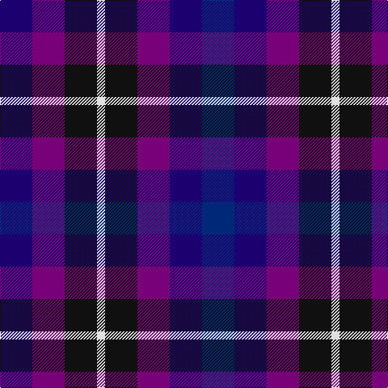

In pattern [BBBKWKBB](/patterns/bbbkwkbb/).

This was sourced from house-of-tartan.  It is a [8 stripes tartan](/stripes/stripes8/).

Original link http://www.house-of-tartan.scotland.net/house/TartanViewjs.asp?colr=Def&tnam=5777

## Thread count
DB/40 P40 K40 LN10 K40 P40 DB40 DBa/40

## Palette
Each colour and its ΔE from the base-6 reference it is a variant of.

| Colour | Shade | Base | ΔE (OKLab) |
|---|---|---|---|
| DB | <code style="background-color:#1C0070;">#1C0070</code> `#1C0070` | B <code style="background-color:#2C4084;">#2C4084</code> | 0.14 |
| DBa | <code style="background-color:#002878;">#002878</code> `#002878` | B <code style="background-color:#2C4084;">#2C4084</code> | 0.09 |
| DBb | <code style="background-color:#202060;">#202060</code> `#202060` | B <code style="background-color:#2C4084;">#2C4084</code> | 0.11 |
| DN | <code style="background-color:#14283C;">#14283C</code> `#14283C` | B <code style="background-color:#2C4084;">#2C4084</code> | 0.14 |
| K | <code style="background-color:#101010;">#101010</code> `#101010` | K <code style="background-color:#000000;">#000000</code> | 0.17 |
| LN | <code style="background-color:#E0E0E0;">#E0E0E0</code> `#E0E0E0` | W <code style="background-color:#F4F4F0;">#F4F4F0</code> | 0.06 |
| P | <code style="background-color:#780078;">#780078</code> `#780078` | B <code style="background-color:#2C4084;">#2C4084</code> | 0.16 |

# Sample pattern

## Nearest tartans

The nearest existing variants by ΔTartan distance.

1. [Weston (Personal)](/setts/s5/b40ba40bb40k40w10-b14283c-ba2c2c80-bb780078-k101010-we0e0e0/) — ΔT 1.35
1. [Crinnion (Personal)](/setts/s5/b12k4ba12bb16g12-b1c0070-ba5c5c5c-bb440044-g006818-k101010/) — ΔT 1.84
1. [Kintore](/setts/s10/b8r4b20k16ba20w4ba20k16b20r4-b6c0070-ba1c0070-k101010-rc80000-wa8ace8/) — ΔT 1.88
1. [Currens (2016)](/setts/s5/g54b40r18ba32bb40-b523e60-ba141e46-bb3850c8-g004c00-rc8002c/) — ΔT 2.08
1. [Blackdown Hills](/setts/s7/k32b32g8b32r32ba32w8-b14283c-ba202060-g604000-k101010-r880000-wffffff/) — ΔT 2.21
1. [Kintore (Fashion)](/setts/s6/b8r4b20k16ba20w4-b6c0070-ba1c0070-k101010-rc80000-wa8ace8/) — ΔT 2.22
1. [Vincent](/setts/s13/r6b24ba24b6ba24bb24ba6bb24r24bb6r24b24r6-b3474fc-ba3c2010-bb00008c-r8c0000/) — ΔT 2.36
1. [Blackdown Hills (Corporate)](/setts/s7/k32b32g8b32r32ba32y8-b14283c-ba202060-g604000-k101010-r880000-yb8b8b8/) — ΔT 2.37
1. [Williams, Edmund (Personal)](/setts/s6/b30ba30g30ga30k16w10-b1c0070-ba780078-g00643c-ga043828-k101010-wffffff/) — ΔT 2.39
1. [Austin (Wilson's No 137)](/setts/s5/b6k6b6g12r4-b5a008c-g005020-k101010-rdc0000/) — ΔT 2.45

## Neighbour map

Every grey dot is one of 15726 variants placed by the first two principal components of the ΔTartan feature space (44% of its variance). Red is this tartan; blue dots are its nearest — click one to open its page.

<svg viewBox="0 0 640 380" role="img" style="max-width:100%;height:auto;border:1px solid #e0e0e0;border-radius:4px;display:block" xmlns="http://www.w3.org/2000/svg"><image href="/nn/cloud.v1.png" width="640" height="380"/><a href="/setts/s5/b40ba40bb40k40w10-b14283c-ba2c2c80-bb780078-k101010-we0e0e0/"><circle cx="50.0" cy="299.0" r="4" fill="#3465a4"><title>Weston (Personal)</title></circle></a><a href="/setts/s5/b12k4ba12bb16g12-b1c0070-ba5c5c5c-bb440044-g006818-k101010/"><circle cx="84.0" cy="309.9" r="4" fill="#3465a4"><title>Crinnion (Personal)</title></circle></a><a href="/setts/s10/b8r4b20k16ba20w4ba20k16b20r4-b6c0070-ba1c0070-k101010-rc80000-wa8ace8/"><circle cx="149.3" cy="243.4" r="4" fill="#3465a4"><title>Kintore</title></circle></a><a href="/setts/s5/g54b40r18ba32bb40-b523e60-ba141e46-bb3850c8-g004c00-rc8002c/"><circle cx="63.9" cy="321.6" r="4" fill="#3465a4"><title>Currens (2016)</title></circle></a><a href="/setts/s7/k32b32g8b32r32ba32w8-b14283c-ba202060-g604000-k101010-r880000-wffffff/"><circle cx="87.0" cy="262.8" r="4" fill="#3465a4"><title>Blackdown Hills</title></circle></a><a href="/setts/s6/b8r4b20k16ba20w4-b6c0070-ba1c0070-k101010-rc80000-wa8ace8/"><circle cx="162.6" cy="253.0" r="4" fill="#3465a4"><title>Kintore (Fashion)</title></circle></a><a href="/setts/s13/r6b24ba24b6ba24bb24ba6bb24r24bb6r24b24r6-b3474fc-ba3c2010-bb00008c-r8c0000/"><circle cx="70.4" cy="241.0" r="4" fill="#3465a4"><title>Vincent</title></circle></a><a href="/setts/s7/k32b32g8b32r32ba32y8-b14283c-ba202060-g604000-k101010-r880000-yb8b8b8/"><circle cx="115.4" cy="275.8" r="4" fill="#3465a4"><title>Blackdown Hills (Corporate)</title></circle></a><a href="/setts/s6/b30ba30g30ga30k16w10-b1c0070-ba780078-g00643c-ga043828-k101010-wffffff/"><circle cx="14.0" cy="275.5" r="4" fill="#3465a4"><title>Williams, Edmund (Personal)</title></circle></a><a href="/setts/s5/b6k6b6g12r4-b5a008c-g005020-k101010-rdc0000/"><circle cx="121.8" cy="313.6" r="4" fill="#3465a4"><title>Austin (Wilson's No 137)</title></circle></a><circle cx="61.1" cy="298.8" r="5" fill="#c00000"/></svg>

ID: /setts/s8/b40ba40bb40k40w10k40bb40ba40-b002878-ba1c0070-bb780078-k101010-we0e0e0/
