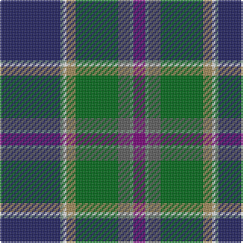

In pattern [BGBGYWGB](/patterns/bgbgywgb/).

This was sourced from register-of-tartans.  It is a [8 stripes tartan](/stripes/stripes8/).

Original link https://www.tartanregister.gov.uk/tartanDetails.aspx?ref=3887

## Attestations

This cloth appears in 3 source records; the oldest owns this page.

- 01/10/1996 — St. Columba (one green) (register-of-tartans, [record](https://www.tartanregister.gov.uk/tartanDetails.aspx?ref=3887))
- 1996 — St. Columba (one green) (Corporate) (tartans-authority, [record](http://www.tartansauthority.com/tartan-ferret/display/2383/))
- undated — St Columba District Tartan Tartan Number: 2383. Earliest known date: 1996 Commercial version with only one shade of green. Designed by Peter MacDonald for St.Columba's Church, Groline on Mull to commemorate the 1400th aniversary of St. Columba's death. Tartan Society entry states "Based on all the natural colours of Iona, this tartan was designed to raise money to restore a church roof." See products available Copyright © Blair Urquhart, Comrie, 2015 (house-of-tartan, [record](http://www.house-of-tartan.scotland.net/house/TartanViewjs.asp?colr=Def&tnam=2383))

## Thread count
DB/40 LG2 W2 LT6 G28 N8 LG2 P/8

## Palette
Each colour and its ΔE from the base-6 reference it is a variant of.

| Colour | Shade | Base | ΔE (OKLab) |
|---|---|---|---|
| DB | <code style="background-color:#202060;">#202060</code> `#202060` | B <code style="background-color:#2C4084;">#2C4084</code> | 0.11 |
| G | <code style="background-color:#006818;">#006818</code> `#006818` | G <code style="background-color:#006400;">#006400</code> | 0.02 |
| LG | <code style="background-color:#789484;">#789484</code> `#789484` | G <code style="background-color:#006400;">#006400</code> | 0.23 |
| LT | <code style="background-color:#A08858;">#A08858</code> `#A08858` | Y <code style="background-color:#E8C000;">#E8C000</code> | 0.21 |
| N | <code style="background-color:#5C5C5C;">#5C5C5C</code> `#5C5C5C` | B <code style="background-color:#2C4084;">#2C4084</code> | 0.14 |
| P | <code style="background-color:#780078;">#780078</code> `#780078` | B <code style="background-color:#2C4084;">#2C4084</code> | 0.16 |
| W | <code style="background-color:#FCFCFC;">#FCFCFC</code> `#FCFCFC` | W <code style="background-color:#F4F4F0;">#F4F4F0</code> | 0.03 |

# Sample pattern

ID: /setts/s8/b40g2w2y6ga28ba8g2bb8-b202060-ba5c5c5c-bb780078-g789484-ga006818-wfcfcfc-ya08858/
