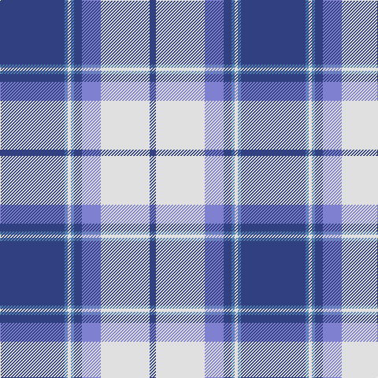

In pattern [BBWBBBWB](/patterns/bbwbbbwb/).

This was sourced from weddslist.  It is a [8 stripes tartan](/stripes/stripes8/).

Original link http://www.weddslist.com/cgi-bin/tartans/pg.pl?source=sts

## Thread count
Ba/82 Bb4 LN4 Bb4 Ba10 B24 LN62 Ba/8

## Palette
Each colour and its ΔE from the base-6 reference it is a variant of.

| Colour | Shade | Base | ΔE (OKLab) |
|---|---|---|---|
| B | <code style="background-color:#8080D0;">#8080D0</code> `#8080D0` | B <code style="background-color:#2A418A;">#2A418A</code> | 0.24 |
| Ba | <code style="background-color:#304080;">#304080</code> `#304080` | B <code style="background-color:#2A418A;">#2A418A</code> | 0.02 |
| Bb | <code style="background-color:#5480B0;">#5480B0</code> `#5480B0` | B <code style="background-color:#2A418A;">#2A418A</code> | 0.19 |
| LN | <code style="background-color:#E0E0E0;">#E0E0E0</code> `#E0E0E0` | W <code style="background-color:#F7F7F7;">#F7F7F7</code> | 0.07 |

# Sample pattern

## Nearest tartans

The nearest existing variants by ΔTartan distance.

1. [Harmony Eildon (Dance)](/setts/s8/b41ba2w2ba2b5bb12w31b4~b2c2c80-ba5c8ca8-bb2888c4-we0e0e0~x2/) — ΔT 0.43
1. [Eildon/Longniddry Blue Dress Fashion Tartan Tartan Number: 4799. Earliest known date: 01/01/1980 A Dancers' Fancy from Dalgliesh. This appears under three different names - Longniddry #5486, Eildon #4799 and Harmony Eildon #87 (original Scottish Tartans Authority references). Needs resolving. Sample in Scottish Tartans Authority's Dalgety Collection. /Threadcount and colours aren't 100% original. Generated manually./ See products available Copyright © Blair Urquhart, Comrie, 2015](/setts/s8/b30ba2w2ba2b4bb10w25b4~b202060-ba2888c4-bb5c8ca8-we0e0e0~x2/) — ΔT 0.85
1. [Longniddry, dress (Turquoise)](/setts/s8/b42k2w2k2b5ba12w32b4~b5480b0-ba606080-k000000-we0e0e0~x2/) — ΔT 0.91
1. [Cunningham, Dress Blue (Dance) Fashion Tartan Tartan Number: 4642. Earliest known date: 01/01/2002 Like so many of the invented 'Dance' tartans this one is not known by the relevant Clan Cunningham Association (USA). /Threadcount and colours aren't 100% original. Generated manually./ See products available Copyright © Blair Urquhart, Comrie, 2015](/setts/s7/b2ba1k1ba20w20ba1w2~b2888c4-ba2c2c80-k101010-we0e0e0~x4/) — ΔT 0.91
1. [Longniddry Eildon Blue Dress Fancy Tartan Tartan Number: 5486. Earliest known date: pre 1992 Dancers tartan See products available Copyright © Blair Urquhart, Comrie, 2015](/setts/s8/b42w2wa2w2b5ba12wa32b4~b202060-ba003c64-wa8ace8-wac0c0c0~x2/) — ΔT 0.97
1. [Gothenburg](/setts/s7/b26w28b14y3k1y2k1~b3850c8-k101010-we0e0e0-ye8c000~x2/) — ΔT 0.99
1. [Gothenburg/Goteborg](/setts/s7/b26w28b14y3k1y2k1~b2c4084-k101010-we0e0e0-ye8c000~x2/) — ΔT 0.99
1. [Thorburn #1 (Name)](/setts/s9/b12w2b2ba6b4w3b4w18r1~b2c2c80-ba2888c4-rc80000-w98c8e8~x4/) — ΔT 1.04
1. [Cunningham, Dress Blue (Dance)](/setts/s7/b3ba2k2ba28w30ba2w3~b2474e8-ba1c0070-k101010-we0e0e0~x2/) — ΔT 1.15
1. [Jack Sinclair (Personal)](/setts/s7/b4r2b40k11g2w16r2~b6495ed-g006818-k101010-rcc1100-wf8f8f8~x2/) — ΔT 1.16

## Neighbour map

Every grey dot is one of 15726 variants placed by the first two principal components of the ΔTartan feature space (44% of its variance). Red is this tartan; blue dots are its nearest — click one to open its page.

<svg viewBox="0 0 640 380" role="img" style="max-width:100%;height:auto;border:1px solid #e0e0e0;border-radius:4px;display:block" xmlns="http://www.w3.org/2000/svg"><image href="/nn/cloud.v1.png" width="640" height="380"/><a href="/setts/s8/b41ba2w2ba2b5bb12w31b4~b2c2c80-ba5c8ca8-bb2888c4-we0e0e0~x2/"><circle cx="276.1" cy="136.5" r="4" fill="#3465a4"><title>Harmony Eildon (Dance)</title></circle></a><a href="/setts/s8/b30ba2w2ba2b4bb10w25b4~b202060-ba2888c4-bb5c8ca8-we0e0e0~x2/"><circle cx="241.0" cy="150.0" r="4" fill="#3465a4"><title>Eildon/Longniddry Blue Dress Fashion Tartan Tartan Number: 4799. Earliest known date: 01/01/1980 A Dancers' Fancy from Dalgliesh. This appears under three different names - Longniddry #5486, Eildon #4799 and Harmony Eildon #87 (original Scottish Tartans Authority references). Needs resolving. Sample in Scottish Tartans Authority's Dalgety Collection. /Threadcount and colours aren't 100% original. Generated manually./ See products available Copyright © Blair Urquhart, Comrie, 2015</title></circle></a><a href="/setts/s8/b42k2w2k2b5ba12w32b4~b5480b0-ba606080-k000000-we0e0e0~x2/"><circle cx="294.9" cy="138.7" r="4" fill="#3465a4"><title>Longniddry, dress (Turquoise)</title></circle></a><a href="/setts/s7/b2ba1k1ba20w20ba1w2~b2888c4-ba2c2c80-k101010-we0e0e0~x4/"><circle cx="286.4" cy="133.2" r="4" fill="#3465a4"><title>Cunningham, Dress Blue (Dance) Fashion Tartan Tartan Number: 4642. Earliest known date: 01/01/2002 Like so many of the invented 'Dance' tartans this one is not known by the relevant Clan Cunningham Association (USA). /Threadcount and colours aren't 100% original. Generated manually./ See products available Copyright © Blair Urquhart, Comrie, 2015</title></circle></a><a href="/setts/s8/b42w2wa2w2b5ba12wa32b4~b202060-ba003c64-wa8ace8-wac0c0c0~x2/"><circle cx="286.3" cy="141.0" r="4" fill="#3465a4"><title>Longniddry Eildon Blue Dress Fancy Tartan Tartan Number: 5486. Earliest known date: pre 1992 Dancers tartan See products available Copyright © Blair Urquhart, Comrie, 2015</title></circle></a><a href="/setts/s7/b26w28b14y3k1y2k1~b3850c8-k101010-we0e0e0-ye8c000~x2/"><circle cx="310.7" cy="137.5" r="4" fill="#3465a4"><title>Gothenburg</title></circle></a><a href="/setts/s7/b26w28b14y3k1y2k1~b2c4084-k101010-we0e0e0-ye8c000~x2/"><circle cx="306.4" cy="136.7" r="4" fill="#3465a4"><title>Gothenburg/Goteborg</title></circle></a><a href="/setts/s9/b12w2b2ba6b4w3b4w18r1~b2c2c80-ba2888c4-rc80000-w98c8e8~x4/"><circle cx="246.6" cy="157.6" r="4" fill="#3465a4"><title>Thorburn #1 (Name)</title></circle></a><a href="/setts/s7/b3ba2k2ba28w30ba2w3~b2474e8-ba1c0070-k101010-we0e0e0~x2/"><circle cx="265.9" cy="145.6" r="4" fill="#3465a4"><title>Cunningham, Dress Blue (Dance)</title></circle></a><a href="/setts/s7/b4r2b40k11g2w16r2~b6495ed-g006818-k101010-rcc1100-wf8f8f8~x2/"><circle cx="284.5" cy="122.5" r="4" fill="#3465a4"><title>Jack Sinclair (Personal)</title></circle></a><circle cx="283.9" cy="137.5" r="5" fill="#c00000"/></svg>

ID: /setts/s8/b41ba2w2ba2b5bb12w31b4~b304080-ba5480b0-bb8080d0-we0e0e0~x2/
