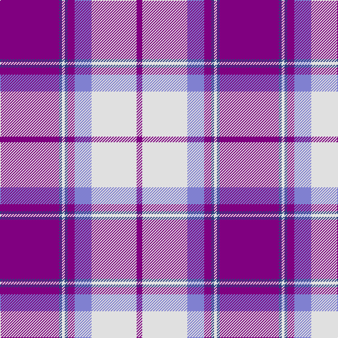

In pattern [BBWBBBWB](/patterns/bbwbbbwb/).

This was sourced from weddslist.  It is a [8 stripes tartan](/stripes/stripes8/).

Original link http://www.weddslist.com/cgi-bin/tartans/pg.pl?source=sts

## Thread count
P/84 Ba4 LN4 Ba4 P10 B24 LN64 P/8

## Palette
Each colour and its ΔE from the base-6 reference it is a variant of.

| Colour | Shade | Base | ΔE (OKLab) |
|---|---|---|---|
| B | <code style="background-color:#8080D0;">#8080D0</code> `#8080D0` | B <code style="background-color:#2A418A;">#2A418A</code> | 0.24 |
| Ba | <code style="background-color:#304080;">#304080</code> `#304080` | B <code style="background-color:#2A418A;">#2A418A</code> | 0.02 |
| LN | <code style="background-color:#E0E0E0;">#E0E0E0</code> `#E0E0E0` | W <code style="background-color:#F7F7F7;">#F7F7F7</code> | 0.07 |
| P | <code style="background-color:#800080;">#800080</code> `#800080` | B <code style="background-color:#2A418A;">#2A418A</code> | 0.17 |

# Sample pattern

## Nearest tartans

The nearest existing variants by ΔTartan distance.

1. [Longniddry Dress (Dance)](/setts/s8/b42w2wa2w2b5ba12wa32b4x2~b780078-ba2888c4-wa8ace8-wae0e0e0/) — ΔT 0.31
1. [Longniddry Dress District Tartan Tartan Number: 88. Earliest known date: pre 2003 A dancers tartan from D.C. Dalgleish weavers of Selkirk See products available Copyright © Blair Urquhart, Comrie, 2015](/setts/s8/b42ba2w2ba2b5bb12w32b4x2~b780078-ba2c2c80-bb2888c4-we0e0e0/) — ΔT 0.34
1. [Longniddry Purple](/setts/s8/b42w2wa2w2b5ba12wa32b4x2~b780078-ba2888c4-wa8ace8-waf8f8f8/) — ΔT 0.53
1. [Cunningham Dress Purple (Dance) Fashion Tartan Tartan Number: 6531. Earliest known date: 01/01/1986 A dancers' tartan from D C Dalgliesh of Selkirk. See products available Copyright © Blair Urquhart, Comrie, 2015](/setts/s7/b2ba1k1ba20w20ba1w2x4~b2888c4-ba780078-k101010-we0e0e0/) — ΔT 0.98
1. [Cunningham Dress Purple (Dance)](/setts/s7/w5b2w34b34k2b2ba4x2~b780078-ba2888c4-k101010-wf8f8f8/) — ΔT 1.20
1. [Longniddry Lavender (Dance)](/setts/s8/b42r2w2r2b5ba12w32b4x2~b481ca4-baa468c4-rd87478-wc0c0c0/) — ΔT 1.24
1. [Loughborough Sport](/setts/s7/r15b3w10b7ba40w3ba6x2~b5c5c5c-ba780078-re87878-wfcfcfc/) — ΔT 1.25
1. [St. Andrew's Links Dress (Corporate)](/setts/s7/y30w4y3b2r2b24wa2x2~b780078-re87878-wc49cd8-wafcfcfc-yb8b8b8/) — ΔT 1.35
1. [Lennox Purple Dress District Tartan Tartan Number: 8189. Earliest known date: pre 2003 Families with the surname 'Lennox' are usually considered related to Clans Stewart or MacFarlane. Some of this surname also choose to wear the distinctive and ancient 'Lennox' tartan. D W Stewart reproduced the sett from a 'lost' portrait of the Countess of Lennox dating from the 16th century./Threadcount and colours aren't 100% original. Generated manually./ See products available Copyright © Blair Urquhart, Comrie, 2015](/setts/s7/b8ba2b24ba5w26k2w8x2~b780078-ba2c2c80-k101010-we0e0e0/) — ΔT 1.36
1. [Masai Shuka 11 (Artefact)](/setts/s10/b30k5r2k1r10w1r1w1k3w2x4~b9050d8-k101010-rc80000-we0e0e0/) — ΔT 1.37

## Neighbour map

Every grey dot is one of 15726 variants placed by the first two principal components of the ΔTartan feature space (44% of its variance). Red is this tartan; blue dots are its nearest — click one to open its page.

<svg viewBox="0 0 640 380" role="img" style="max-width:100%;height:auto;border:1px solid #e0e0e0;border-radius:4px;display:block" xmlns="http://www.w3.org/2000/svg"><image href="/nn/cloud.v1.png" width="640" height="380"/><a href="/setts/s8/b42w2wa2w2b5ba12wa32b4x2~b780078-ba2888c4-wa8ace8-wae0e0e0/"><circle cx="291.3" cy="126.2" r="4" fill="#3465a4"><title>Longniddry Dress (Dance)</title></circle></a><a href="/setts/s8/b42ba2w2ba2b5bb12w32b4x2~b780078-ba2c2c80-bb2888c4-we0e0e0/"><circle cx="290.9" cy="126.9" r="4" fill="#3465a4"><title>Longniddry Dress District Tartan Tartan Number: 88. Earliest known date: pre 2003 A dancers tartan from D.C. Dalgleish weavers of Selkirk See products available Copyright © Blair Urquhart, Comrie, 2015</title></circle></a><a href="/setts/s8/b42w2wa2w2b5ba12wa32b4x2~b780078-ba2888c4-wa8ace8-waf8f8f8/"><circle cx="281.9" cy="121.6" r="4" fill="#3465a4"><title>Longniddry Purple</title></circle></a><a href="/setts/s7/b2ba1k1ba20w20ba1w2x4~b2888c4-ba780078-k101010-we0e0e0/"><circle cx="299.4" cy="125.8" r="4" fill="#3465a4"><title>Cunningham Dress Purple (Dance) Fashion Tartan Tartan Number: 6531. Earliest known date: 01/01/1986 A dancers' tartan from D C Dalgliesh of Selkirk. See products available Copyright © Blair Urquhart, Comrie, 2015</title></circle></a><a href="/setts/s7/w5b2w34b34k2b2ba4x2~b780078-ba2888c4-k101010-wf8f8f8/"><circle cx="278.7" cy="130.6" r="4" fill="#3465a4"><title>Cunningham Dress Purple (Dance)</title></circle></a><a href="/setts/s8/b42r2w2r2b5ba12w32b4x2~b481ca4-baa468c4-rd87478-wc0c0c0/"><circle cx="303.0" cy="138.2" r="4" fill="#3465a4"><title>Longniddry Lavender (Dance)</title></circle></a><a href="/setts/s7/r15b3w10b7ba40w3ba6x2~b5c5c5c-ba780078-re87878-wfcfcfc/"><circle cx="290.7" cy="159.0" r="4" fill="#3465a4"><title>Loughborough Sport</title></circle></a><a href="/setts/s7/y30w4y3b2r2b24wa2x2~b780078-re87878-wc49cd8-wafcfcfc-yb8b8b8/"><circle cx="282.5" cy="132.7" r="4" fill="#3465a4"><title>St. Andrew's Links Dress (Corporate)</title></circle></a><a href="/setts/s7/b8ba2b24ba5w26k2w8x2~b780078-ba2c2c80-k101010-we0e0e0/"><circle cx="236.0" cy="165.4" r="4" fill="#3465a4"><title>Lennox Purple Dress District Tartan Tartan Number: 8189. Earliest known date: pre 2003 Families with the surname 'Lennox' are usually considered related to Clans Stewart or MacFarlane. Some of this surname also choose to wear the distinctive and ancient 'Lennox' tartan. D W Stewart reproduced the sett from a 'lost' portrait of the Countess of Lennox dating from the 16th century./Threadcount and colours aren't 100% original. Generated manually./ See products available Copyright © Blair Urquhart, Comrie, 2015</title></circle></a><a href="/setts/s10/b30k5r2k1r10w1r1w1k3w2x4~b9050d8-k101010-rc80000-we0e0e0/"><circle cx="342.3" cy="91.4" r="4" fill="#3465a4"><title>Masai Shuka 11 (Artefact)</title></circle></a><circle cx="296.2" cy="126.2" r="5" fill="#c00000"/></svg>

ID: /setts/s8/b42ba2w2ba2b5bb12w32b4x2~b800080-ba304080-bb8080d0-we0e0e0/
