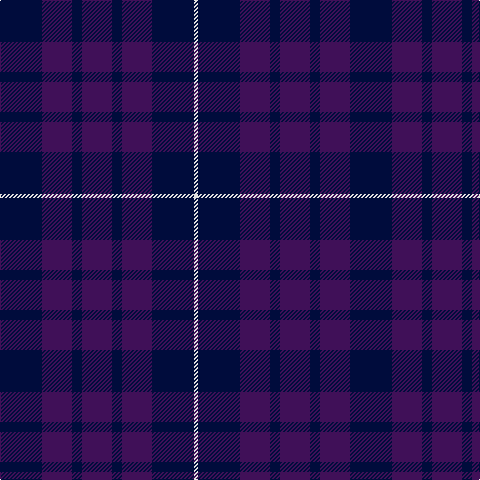

In pattern [BBBBBBBW](/patterns/bbbbbbbw/).

This was sourced from house-of-tartan.  It is a [8 stripes tartan](/stripes/stripes8/).

Original link http://www.house-of-tartan.scotland.net/house/TartanViewjs.asp?colr=Def&tnam=5739

## Thread count
DBa/42 DP30 DBa10 DP30 DBa10 DP30 DBa42 LN/4

## Palette
Each colour and its ΔE from the base-6 reference it is a variant of.

| Colour | Shade | Base | ΔE (OKLab) |
|---|---|---|---|
| DB | <code style="background-color:#003C64;">#003C64</code> `#003C64` | B <code style="background-color:#2C4084;">#2C4084</code> | 0.07 |
| DBa | <code style="background-color:#000C3C;">#000C3C</code> `#000C3C` | B <code style="background-color:#2C4084;">#2C4084</code> | 0.21 |
| DP | <code style="background-color:#401058;">#401058</code> `#401058` | B <code style="background-color:#2C4084;">#2C4084</code> | 0.13 |
| LN | <code style="background-color:#E0E0E0;">#E0E0E0</code> `#E0E0E0` | W <code style="background-color:#F4F4F0;">#F4F4F0</code> | 0.06 |
| P | <code style="background-color:#780078;">#780078</code> `#780078` | B <code style="background-color:#2C4084;">#2C4084</code> | 0.16 |

# Sample pattern

## Nearest tartans

The nearest existing variants by ΔTartan distance.

1. [Brash](/setts/s9/b60r5b60ba40b36r10b36ba40w5-b1c1c50-ba003c64-rc80000-wffffff/) — ΔT 1.67
1. [Casterton (Corporate)](/setts/s6/b14k4b66k66r4k14-b1c0070-k101010-rc80000/) — ΔT 2.01
1. [Edinburgh Monarchs (Corporate)](/setts/s8/b10ba8bb2ba28b28bb2b10y6-b1c3854-ba2c2c84-bb501400-yd09800/) — ΔT 2.02
1. [Edinburgh Monarchs](/setts/s8/b10ba8bb2ba28b28bb2b10y6-b14283c-ba202060-bb501400-yd09800/) — ΔT 2.04
1. [MacKerrell of Hillhouse Htg Family Tartan Tartan Number: 1758. Earliest known date: 1975 A MacKerral tartan was recorded by the Scottish Tartans Society in 1975. The Lyon Court Books contain the note "Wefted in scarlet", referring to an unusual feature, that of replacing the yellow warp stripe with red in the weft. The name, MacKerrell or MacKerral, was recorded in Ayrshire in the 12th century. See products available Copyright © Blair Urquhart, Comrie, 2015](/setts/s6/b56ba98y6ba98b56w8-b2c2c80-ba202060-we0e0e0-ye8c000/) — ΔT 2.12
1. [Feniston (Personal)](/setts/s5/b60ba20b6ba60r6-b680028-ba202060-rec34c4/) — ΔT 2.12
1. [Daks Muted blue Trade Tartan Tartan Number: 1725. Earliest known date: 1987 Submitted in 1981 as a potential Currie sett. See products available Copyright © Blair Urquhart, Comrie, 2015](/setts/s8/g5b12ba4y4ba22b3ba4g5-b2c2c80-ba202060-g604000-ya08858/) — ΔT 2.13
1. [Royal Scotsman Train](/setts/s7/b10k4b28k28b4k4r4-b141e46-k101010-rdc0000/) — ΔT 2.14
1. [Marchmont (Personal)](/setts/s12/b48k48g4k48b48g4b48k48g4k48b48k4-b2c2c80-g289c18-k101010/) — ΔT 2.16
1. [St. George's (Birmingham) (School)](/setts/s7/r8b42w4b40ba42b4ba4-b003c64-ba2c2c80-rc80000-wfcfcfc/) — ΔT 2.17

## Neighbour map

Every grey dot is one of 15726 variants placed by the first two principal components of the ΔTartan feature space (44% of its variance). Red is this tartan; blue dots are its nearest — click one to open its page.

<svg viewBox="0 0 640 380" role="img" style="max-width:100%;height:auto;border:1px solid #e0e0e0;border-radius:4px;display:block" xmlns="http://www.w3.org/2000/svg"><image href="/nn/cloud.v1.png" width="640" height="380"/><a href="/setts/s9/b60r5b60ba40b36r10b36ba40w5-b1c1c50-ba003c64-rc80000-wffffff/"><circle cx="428.7" cy="260.2" r="4" fill="#3465a4"><title>Brash</title></circle></a><a href="/setts/s6/b14k4b66k66r4k14-b1c0070-k101010-rc80000/"><circle cx="448.5" cy="256.0" r="4" fill="#3465a4"><title>Casterton (Corporate)</title></circle></a><a href="/setts/s8/b10ba8bb2ba28b28bb2b10y6-b1c3854-ba2c2c84-bb501400-yd09800/"><circle cx="379.7" cy="238.8" r="4" fill="#3465a4"><title>Edinburgh Monarchs (Corporate)</title></circle></a><a href="/setts/s8/b10ba8bb2ba28b28bb2b10y6-b14283c-ba202060-bb501400-yd09800/"><circle cx="382.8" cy="242.7" r="4" fill="#3465a4"><title>Edinburgh Monarchs</title></circle></a><a href="/setts/s6/b56ba98y6ba98b56w8-b2c2c80-ba202060-we0e0e0-ye8c000/"><circle cx="452.6" cy="270.6" r="4" fill="#3465a4"><title>MacKerrell of Hillhouse Htg Family Tartan Tartan Number: 1758. Earliest known date: 1975 A MacKerral tartan was recorded by the Scottish Tartans Society in 1975. The Lyon Court Books contain the note &quot;Wefted in scarlet&quot;, referring to an unusual feature, that of replacing the yellow warp stripe with red in the weft. The name, MacKerrell or MacKerral, was recorded in Ayrshire in the 12th century. See products available Copyright © Blair Urquhart, Comrie, 2015</title></circle></a><a href="/setts/s5/b60ba20b6ba60r6-b680028-ba202060-rec34c4/"><circle cx="424.1" cy="277.2" r="4" fill="#3465a4"><title>Feniston (Personal)</title></circle></a><a href="/setts/s8/g5b12ba4y4ba22b3ba4g5-b2c2c80-ba202060-g604000-ya08858/"><circle cx="331.7" cy="256.4" r="4" fill="#3465a4"><title>Daks Muted blue Trade Tartan Tartan Number: 1725. Earliest known date: 1987 Submitted in 1981 as a potential Currie sett. See products available Copyright © Blair Urquhart, Comrie, 2015</title></circle></a><a href="/setts/s7/b10k4b28k28b4k4r4-b141e46-k101010-rdc0000/"><circle cx="428.3" cy="297.2" r="4" fill="#3465a4"><title>Royal Scotsman Train</title></circle></a><a href="/setts/s12/b48k48g4k48b48g4b48k48g4k48b48k4-b2c2c80-g289c18-k101010/"><circle cx="350.2" cy="250.6" r="4" fill="#3465a4"><title>Marchmont (Personal)</title></circle></a><a href="/setts/s7/r8b42w4b40ba42b4ba4-b003c64-ba2c2c80-rc80000-wfcfcfc/"><circle cx="405.8" cy="247.6" r="4" fill="#3465a4"><title>St. George's (Birmingham) (School)</title></circle></a><circle cx="402.4" cy="298.0" r="5" fill="#c00000"/></svg>

ID: /setts/s8/b42ba30b10ba30b10ba30b42w4-b000c3c-ba401058-we0e0e0/
