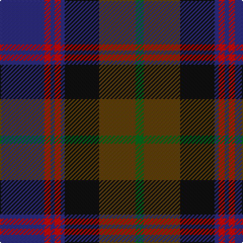

In pattern [BRBRBKGG](/patterns/brbrbkgg/).

This was sourced from register-of-tartans.  It is a [8 stripes tartan](/stripes/stripes8/).

Original link https://www.tartanregister.gov.uk/tartanDetails.aspx?ref=3668

## Attestations

This cloth appears in 2 source records; the oldest owns this page.

- 01/01/1999 — Scotch House 2000 Antique (register-of-tartans, [record](https://www.tartanregister.gov.uk/tartanDetails.aspx?ref=3668))
- 1999 — Scotch House 2000 Antique (Fashion) (tartans-authority, [record](http://www.tartansauthority.com/tartan-ferret/display/2636/))

## Thread count
DB/44 R6 DB4 R6 DB4 K34 T36 G/8

## Palette
Each colour and its ΔE from the base-6 reference it is a variant of.

| Colour | Shade | Base | ΔE (OKLab) |
|---|---|---|---|
| DB | <code style="background-color:#2C2C80;">#2C2C80</code> `#2C2C80` | B <code style="background-color:#2C4084;">#2C4084</code> | 0.05 |
| G | <code style="background-color:#006818;">#006818</code> `#006818` | G <code style="background-color:#006400;">#006400</code> | 0.02 |
| K | <code style="background-color:#101010;">#101010</code> `#101010` | K <code style="background-color:#000000;">#000000</code> | 0.17 |
| R | <code style="background-color:#C80000;">#C80000</code> `#C80000` | R <code style="background-color:#C80000;">#C80000</code> | 0.00 |
| T | <code style="background-color:#604000;">#604000</code> `#604000` | G <code style="background-color:#006400;">#006400</code> | 0.14 |

# Sample pattern

## Nearest tartans

The nearest existing variants by ΔTartan distance.

1. [Bootneck 350](/setts/s8/k12r8k38g8b50r10g6y4-b141e46-g003c14-k101010-rc8002c-yffd700/) — ΔT 0.87
1. [Dunbartonshire](/setts/s9/g44k8g4r16b4r16b52ba8b4-b2c2c80-ba5c8ca8-g006818-k101010-r901c38/) — ΔT 0.90
1. [Land's End (Unnamed Maroon)](/setts/s9/k46g4r6b14r6g4ga30r42g10-b304080-g908000-ga004010-k000030-r802040/) — ΔT 0.90
1. [Antique 2000](/setts/s8/b20r2b2r2b2k12g18ba4-b003c64-ba1870a4-g8c7038-k101010-rc80000/) — ΔT 0.92
1. [Damm, Alexander (Personal)](/setts/s9/b44k4b4k4b4k28g32r4ba28-b202060-ba5f749c-g005448-k101010-rdc0000/) — ΔT 0.95
1. [Bootneck 350](/setts/s8/k12r8k38g8b50r10g6y4-b202060-g285800-k101010-rc80000-ye8c000/) — ΔT 0.96
1. [Scotch House 2000 Original](/setts/s8/b44r6b4r6b4k34g36y8-b202060-g006818-k101010-rc80000-ya08858/) — ΔT 0.98
1. [Land's End Maroon](/setts/s9/b46y4r6ba14r6y4g30r42y10-b003c64-ba2c2c80-g006818-r901c38-ybc8c00/) — ΔT 0.99
1. [Skene](/setts/s7/b48k8r6k8g48k8ra8-b2c4084-g005020-k101010-rdc0000-rafa4b00/) — ΔT 1.07
1. [Brady 60th, Keith James (Personal)](/setts/s10/b4r4b28k12b4k4b4k4ba36y4-b666666-ba141f5f-k101010-r8f5b33-yc18d13/) — ΔT 1.07

## Neighbour map

Every grey dot is one of 15726 variants placed by the first two principal components of the ΔTartan feature space (44% of its variance). Red is this tartan; blue dots are its nearest — click one to open its page.

<svg viewBox="0 0 640 380" role="img" style="max-width:100%;height:auto;border:1px solid #e0e0e0;border-radius:4px;display:block" xmlns="http://www.w3.org/2000/svg"><image href="/nn/cloud.v1.png" width="640" height="380"/><a href="/setts/s8/k12r8k38g8b50r10g6y4-b141e46-g003c14-k101010-rc8002c-yffd700/"><circle cx="216.1" cy="182.7" r="4" fill="#3465a4"><title>Bootneck 350</title></circle></a><a href="/setts/s9/g44k8g4r16b4r16b52ba8b4-b2c2c80-ba5c8ca8-g006818-k101010-r901c38/"><circle cx="223.5" cy="172.0" r="4" fill="#3465a4"><title>Dunbartonshire</title></circle></a><a href="/setts/s9/k46g4r6b14r6g4ga30r42g10-b304080-g908000-ga004010-k000030-r802040/"><circle cx="166.6" cy="175.3" r="4" fill="#3465a4"><title>Land's End (Unnamed Maroon)</title></circle></a><a href="/setts/s8/b20r2b2r2b2k12g18ba4-b003c64-ba1870a4-g8c7038-k101010-rc80000/"><circle cx="199.7" cy="184.9" r="4" fill="#3465a4"><title>Antique 2000</title></circle></a><a href="/setts/s9/b44k4b4k4b4k28g32r4ba28-b202060-ba5f749c-g005448-k101010-rdc0000/"><circle cx="191.6" cy="192.9" r="4" fill="#3465a4"><title>Damm, Alexander (Personal)</title></circle></a><a href="/setts/s8/k12r8k38g8b50r10g6y4-b202060-g285800-k101010-rc80000-ye8c000/"><circle cx="207.6" cy="176.6" r="4" fill="#3465a4"><title>Bootneck 350</title></circle></a><a href="/setts/s8/b44r6b4r6b4k34g36y8-b202060-g006818-k101010-rc80000-ya08858/"><circle cx="183.6" cy="184.8" r="4" fill="#3465a4"><title>Scotch House 2000 Original</title></circle></a><a href="/setts/s9/b46y4r6ba14r6y4g30r42y10-b003c64-ba2c2c80-g006818-r901c38-ybc8c00/"><circle cx="181.8" cy="178.5" r="4" fill="#3465a4"><title>Land's End Maroon</title></circle></a><a href="/setts/s7/b48k8r6k8g48k8ra8-b2c4084-g005020-k101010-rdc0000-rafa4b00/"><circle cx="196.4" cy="202.7" r="4" fill="#3465a4"><title>Skene</title></circle></a><a href="/setts/s10/b4r4b28k12b4k4b4k4ba36y4-b666666-ba141f5f-k101010-r8f5b33-yc18d13/"><circle cx="217.5" cy="174.8" r="4" fill="#3465a4"><title>Brady 60th, Keith James (Personal)</title></circle></a><circle cx="208.7" cy="191.8" r="5" fill="#c00000"/></svg>

ID: /setts/s8/b44r6b4r6b4k34g36ga8-b2c2c80-g604000-ga006818-k101010-rc80000/
