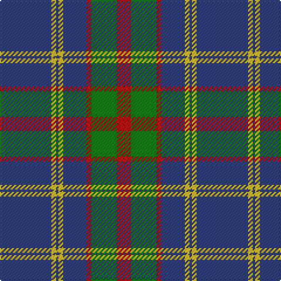

In pattern [BYBYBRGR](/patterns/bybybrgr/).

This was sourced from weddslist.  It is a [8 stripes tartan](/stripes/stripes8/).

Original link http://www.weddslist.com/cgi-bin/tartans/pg.pl?source=sts

## Thread count
B/44 Y4 B2 Y4 B20 R4 G22 R/12

## Palette
Each colour and its ΔE from the base-6 reference it is a variant of.

| Colour | Shade | Base | ΔE (OKLab) |
|---|---|---|---|
| B | <code style="background-color:#304080;">#304080</code> `#304080` | B <code style="background-color:#2A418A;">#2A418A</code> | 0.02 |
| G | <code style="background-color:#008000;">#008000</code> `#008000` | G <code style="background-color:#006100;">#006100</code> | 0.10 |
| R | <code style="background-color:#C00000;">#C00000</code> `#C00000` | R <code style="background-color:#CC0000;">#CC0000</code> | 0.03 |
| Y | <code style="background-color:#F0C000;">#F0C000</code> `#F0C000` | Y <code style="background-color:#F2BF00;">#F2BF00</code> | 0.00 |

# Sample pattern

## Nearest tartans

The nearest existing variants by ΔTartan distance.

1. [Katsushika Corporate Tartan Tartan Number: 2343. Earliest known date: 1997 Designed for Katsushika Scottish country dancers from Hiroshima. See products available Copyright © Blair Urquhart, Comrie, 2015](/setts/s8/b44y4b2y4b20r4g22r12-b2c2c80-g006818-rc80000-ye8c000/) — ΔT 0.65
1. [Katsushika (Corporate)](/setts/s8/b44y4b2y4b20g4ga22g12-b2c2c80-g808080-ga006818-ye8c000/) — ΔT 0.84
1. [Perkins (2015)](/setts/s7/k6b20y10b58k20r12k4-b5f749c-k101010-rc80000-ye0a126/) — ΔT 0.86
1. [Unnamed C20th - USA](/setts/s7/b4y2b36g14r14b2g2-b2c2c80-g006818-rc80000-ye8c000/) — ΔT 0.93
1. [Bedford Academy](/setts/s9/g16y8g70b4w16b4g8b42g8-b000080-g707070-w86c3e3-yeec327/) — ΔT 0.99
1. [Bedford Academy (Corporate)](/setts/s9/r16y8r70b4ba16b4r8b42r8-b242468-ba5c8ca8-r888888-ye8c000/) — ΔT 1.05
1. [Kelvinside Academy (School)](/setts/s8/w4g15b8k4b28k2b4w2-b3c3c68-g6c6c6c-k101010-we0e0e0/) — ΔT 1.05
1. [Doune District Tartan Tartan Number: 4707. Earliest known date: 01/01/2002 A colour variation of Stewart Bute. See products available Copyright © Blair Urquhart, Comrie, 2015](/setts/s9/r20b22k4b6k4b4k16r80ka8-b5c8ca8-k101010-ka000000-r888888/) — ΔT 1.07
1. [Titanium](/setts/s9/b88g16b16g44y8g8y22g4w4-b292929-g707070-wffffff-y979797/) — ΔT 1.09
1. [Perkins 2015](/setts/s7/k6b20y10b58k20r12k4-b5c8ca8-k101010-rc80000-ye8c000/) — ΔT 1.12

## Neighbour map

Every grey dot is one of 15726 variants placed by the first two principal components of the ΔTartan feature space (44% of its variance). Red is this tartan; blue dots are its nearest — click one to open its page.

<svg viewBox="0 0 640 380" role="img" style="max-width:100%;height:auto;border:1px solid #e0e0e0;border-radius:4px;display:block" xmlns="http://www.w3.org/2000/svg"><image href="/nn/cloud.v1.png" width="640" height="380"/><a href="/setts/s8/b44y4b2y4b20r4g22r12-b2c2c80-g006818-rc80000-ye8c000/"><circle cx="341.1" cy="162.7" r="4" fill="#3465a4"><title>Katsushika Corporate Tartan Tartan Number: 2343. Earliest known date: 1997 Designed for Katsushika Scottish country dancers from Hiroshima. See products available Copyright © Blair Urquhart, Comrie, 2015</title></circle></a><a href="/setts/s8/b44y4b2y4b20g4ga22g12-b2c2c80-g808080-ga006818-ye8c000/"><circle cx="345.9" cy="169.8" r="4" fill="#3465a4"><title>Katsushika (Corporate)</title></circle></a><a href="/setts/s7/k6b20y10b58k20r12k4-b5f749c-k101010-rc80000-ye0a126/"><circle cx="332.0" cy="181.7" r="4" fill="#3465a4"><title>Perkins (2015)</title></circle></a><a href="/setts/s7/b4y2b36g14r14b2g2-b2c2c80-g006818-rc80000-ye8c000/"><circle cx="347.6" cy="170.3" r="4" fill="#3465a4"><title>Unnamed C20th - USA</title></circle></a><a href="/setts/s9/g16y8g70b4w16b4g8b42g8-b000080-g707070-w86c3e3-yeec327/"><circle cx="333.9" cy="157.1" r="4" fill="#3465a4"><title>Bedford Academy</title></circle></a><a href="/setts/s9/r16y8r70b4ba16b4r8b42r8-b242468-ba5c8ca8-r888888-ye8c000/"><circle cx="355.0" cy="162.5" r="4" fill="#3465a4"><title>Bedford Academy (Corporate)</title></circle></a><a href="/setts/s8/w4g15b8k4b28k2b4w2-b3c3c68-g6c6c6c-k101010-we0e0e0/"><circle cx="349.4" cy="183.4" r="4" fill="#3465a4"><title>Kelvinside Academy (School)</title></circle></a><a href="/setts/s9/r20b22k4b6k4b4k16r80ka8-b5c8ca8-k101010-ka000000-r888888/"><circle cx="364.1" cy="140.8" r="4" fill="#3465a4"><title>Doune District Tartan Tartan Number: 4707. Earliest known date: 01/01/2002 A colour variation of Stewart Bute. See products available Copyright © Blair Urquhart, Comrie, 2015</title></circle></a><a href="/setts/s9/b88g16b16g44y8g8y22g4w4-b292929-g707070-wffffff-y979797/"><circle cx="323.1" cy="154.7" r="4" fill="#3465a4"><title>Titanium</title></circle></a><a href="/setts/s7/k6b20y10b58k20r12k4-b5c8ca8-k101010-rc80000-ye8c000/"><circle cx="315.5" cy="176.1" r="4" fill="#3465a4"><title>Perkins 2015</title></circle></a><circle cx="344.3" cy="164.0" r="5" fill="#c00000"/></svg>

ID: /setts/s8/b44y4b2y4b20r4g22r12-b304080-g008000-rc00000-yf0c000/
