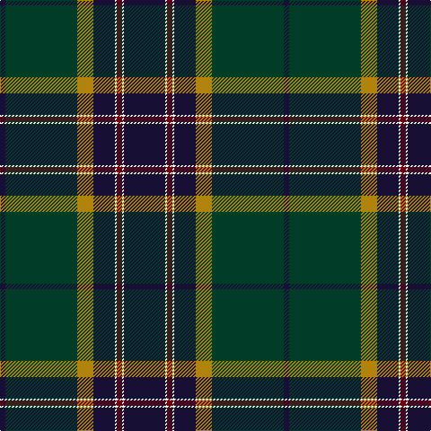

In pattern [BGYBWRWB](/patterns/bgybwrwb/).

This was sourced from register-of-tartans.  It is a [8 stripes tartan](/stripes/stripes8/).

Original link https://www.tartanregister.gov.uk/tartanDetails.aspx?ref=3334

## Thread count
DB/6 DG80 DY18 DBa24 W2 DR6 W2 DBa/46

## Palette
Each colour and its ΔE from the base-6 reference it is a variant of.

| Colour | Shade | Base | ΔE (OKLab) |
|---|---|---|---|
| DB | <code style="background-color:#181034;">#181034</code> `#181034` | B <code style="background-color:#2C4084;">#2C4084</code> | 0.20 |
| DBa | <code style="background-color:#181034;">#181034</code> `#181034` | B <code style="background-color:#2C4084;">#2C4084</code> | 0.20 |
| DG | <code style="background-color:#003C28;">#003C28</code> `#003C28` | G <code style="background-color:#006400;">#006400</code> | 0.15 |
| DR | <code style="background-color:#700014;">#700014</code> `#700014` | R <code style="background-color:#C80000;">#C80000</code> | 0.20 |
| DY | <code style="background-color:#B0840C;">#B0840C</code> `#B0840C` | Y <code style="background-color:#E8C000;">#E8C000</code> | 0.19 |
| W | <code style="background-color:#FCF8EC;">#FCF8EC</code> `#FCF8EC` | W <code style="background-color:#F4F4F0;">#F4F4F0</code> | 0.02 |

# Sample pattern

ID: /setts/s8/b46w2r6w2b24y18g80b6-b181034-g003c28-r700014-wfcf8ec-yb0840c/
