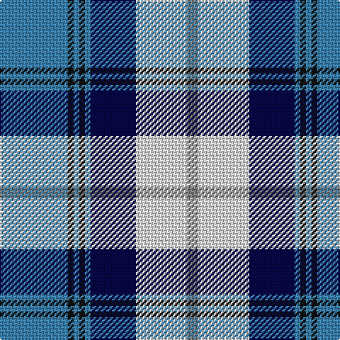

In pattern [BKBKBBWG](/patterns/bkbkbbwg/).

This was sourced from register-of-tartans.  It is a [8 stripes tartan](/stripes/stripes8/).

Original link https://www.tartanregister.gov.uk/tartanDetails.aspx?ref=117

## Thread count
B/48 K4 B4 K4 B4 DB32 LN36 N/8

## Palette
Each colour and its ΔE from the base-6 reference it is a variant of.

| Colour | Shade | Base | ΔE (OKLab) |
|---|---|---|---|
| B | <code style="background-color:#3C82AF;">#3C82AF</code> `#3C82AF` | B <code style="background-color:#2C4084;">#2C4084</code> | 0.20 |
| DB | <code style="background-color:#080848;">#080848</code> `#080848` | B <code style="background-color:#2C4084;">#2C4084</code> | 0.19 |
| K | <code style="background-color:#101010;">#101010</code> `#101010` | K <code style="background-color:#000000;">#000000</code> | 0.17 |
| LN | <code style="background-color:#E0E0E0;">#E0E0E0</code> `#E0E0E0` | W <code style="background-color:#F4F4F0;">#F4F4F0</code> | 0.06 |
| N | <code style="background-color:#808080;">#808080</code> `#808080` | G <code style="background-color:#006400;">#006400</code> | 0.22 |

# Sample pattern

## Nearest tartans

The nearest existing variants by ΔTartan distance.

1. [Arran, (Navy)](/setts/s8/b48k4b4k4b4ba32w36g8-b5480b0-ba000050-g808080-k000000-we0e0e0/) — ΔT 0.24
1. [Arran - 1989 (Fashion)](/setts/s8/b48k4b4k4b4ba32w36r8-b5c8ca8-ba202060-k101010-r888888-wfcfcfc/) — ΔT 0.57
1. [Sneddon, Jonathan Taylor (Personal)](/setts/s8/b60k8w8k8w8k64y88ya8-b0000ff-k101010-wffffff-ya0a0a0-yaffff00/) — ΔT 0.74
1. [Loch Ness (Fashion)](/setts/s7/r4b4r4b42y22k34w4-b5c8ca8-k00002c-rc80000-w98c8e8-y48a4c0/) — ΔT 0.77
1. [Fraser Gathering Dress (1997)](/setts/s9/g4w48g4b10ga8g22ga4b24r4-b1c0070-g006818-ga003820-rc80000-we0e0e0/) — ΔT 0.96
1. [Sinclair Dress (Dance)](/setts/s7/b8r4b62k20g8w42g4-b38409c-g006818-k101010-rc80000-we0e0e0/) — ΔT 0.99
1. [Loch Ness in Scotland](/setts/s7/g8b56y24ya4g4ya24r4-b000064-g289c18-rc8002c-y48a4c0-yaa0a0a0/) — ΔT 1.00
1. [Afternoon Tea / Earl Grey](/setts/s6/r15b98ba72y25ba8w15-b5c8ca8-ba202060-rc80000-wfcfcfc-yfccc00/) — ΔT 1.02
1. [Madras College (Corporate)](/setts/s7/r6b50k12w40y4w4wa6-b003c64-k101010-rc80000-w74b4e0-wae0e0e0-ye8c000/) — ΔT 1.03
1. [Davidson (Wedding) (Personal)](/setts/s7/r8b56k24g4w48g4w8-b2c2c80-g006818-k101010-rc80000-wfcfcfc/) — ΔT 1.03

## Neighbour map

Every grey dot is one of 15726 variants placed by the first two principal components of the ΔTartan feature space (44% of its variance). Red is this tartan; blue dots are its nearest — click one to open its page.

<svg viewBox="0 0 640 380" role="img" style="max-width:100%;height:auto;border:1px solid #e0e0e0;border-radius:4px;display:block" xmlns="http://www.w3.org/2000/svg"><image href="/nn/cloud.v1.png" width="640" height="380"/><a href="/setts/s8/b48k4b4k4b4ba32w36g8-b5480b0-ba000050-g808080-k000000-we0e0e0/"><circle cx="149.7" cy="145.7" r="4" fill="#3465a4"><title>Arran, (Navy)</title></circle></a><a href="/setts/s8/b48k4b4k4b4ba32w36r8-b5c8ca8-ba202060-k101010-r888888-wfcfcfc/"><circle cx="151.9" cy="142.8" r="4" fill="#3465a4"><title>Arran - 1989 (Fashion)</title></circle></a><a href="/setts/s8/b60k8w8k8w8k64y88ya8-b0000ff-k101010-wffffff-ya0a0a0-yaffff00/"><circle cx="129.8" cy="147.3" r="4" fill="#3465a4"><title>Sneddon, Jonathan Taylor (Personal)</title></circle></a><a href="/setts/s7/r4b4r4b42y22k34w4-b5c8ca8-k00002c-rc80000-w98c8e8-y48a4c0/"><circle cx="165.0" cy="169.1" r="4" fill="#3465a4"><title>Loch Ness (Fashion)</title></circle></a><a href="/setts/s9/g4w48g4b10ga8g22ga4b24r4-b1c0070-g006818-ga003820-rc80000-we0e0e0/"><circle cx="133.6" cy="136.4" r="4" fill="#3465a4"><title>Fraser Gathering Dress (1997)</title></circle></a><a href="/setts/s7/b8r4b62k20g8w42g4-b38409c-g006818-k101010-rc80000-we0e0e0/"><circle cx="210.0" cy="143.4" r="4" fill="#3465a4"><title>Sinclair Dress (Dance)</title></circle></a><a href="/setts/s7/g8b56y24ya4g4ya24r4-b000064-g289c18-rc8002c-y48a4c0-yaa0a0a0/"><circle cx="195.2" cy="155.1" r="4" fill="#3465a4"><title>Loch Ness in Scotland</title></circle></a><a href="/setts/s6/r15b98ba72y25ba8w15-b5c8ca8-ba202060-rc80000-wfcfcfc-yfccc00/"><circle cx="182.7" cy="168.3" r="4" fill="#3465a4"><title>Afternoon Tea / Earl Grey</title></circle></a><a href="/setts/s7/r6b50k12w40y4w4wa6-b003c64-k101010-rc80000-w74b4e0-wae0e0e0-ye8c000/"><circle cx="167.0" cy="138.9" r="4" fill="#3465a4"><title>Madras College (Corporate)</title></circle></a><a href="/setts/s7/r8b56k24g4w48g4w8-b2c2c80-g006818-k101010-rc80000-wfcfcfc/"><circle cx="145.6" cy="140.4" r="4" fill="#3465a4"><title>Davidson (Wedding) (Personal)</title></circle></a><circle cx="153.6" cy="147.7" r="5" fill="#c00000"/></svg>

ID: /setts/s8/b48k4b4k4b4ba32w36g8-b3c82af-ba080848-g808080-k101010-we0e0e0/
