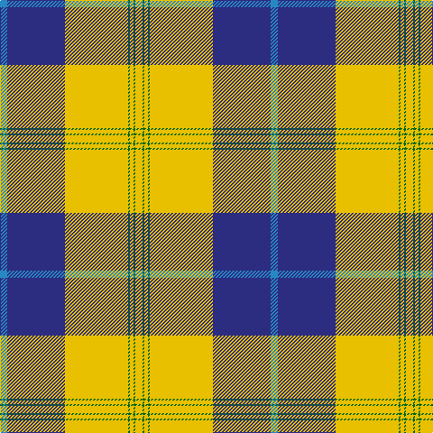

In pattern [BBYYGYGY](/patterns/bbyygygy/).

This was sourced from tartans-authority.  It is a [8 stripes tartan](/stripes/stripes8/).

Original link http://www.tartansauthority.com/tartan-ferret/display/7911/

## Thread count
B/8 DB64 Ya6 Ya64 G2 Ya4 G2 Y/8

## Palette
Each colour and its ΔE from the base-6 reference it is a variant of.

| Colour | Shade | Base | ΔE (OKLab) |
|---|---|---|---|
| B | <code style="background-color:#2888C4;">#2888C4</code> `#2888C4` | B <code style="background-color:#2A418A;">#2A418A</code> | 0.21 |
| DB | <code style="background-color:#2C2C80;">#2C2C80</code> `#2C2C80` | B <code style="background-color:#2A418A;">#2A418A</code> | 0.06 |
| G | <code style="background-color:#006818;">#006818</code> `#006818` | G <code style="background-color:#006100;">#006100</code> | 0.02 |
| Y | <code style="background-color:#E8C000;">#E8C000</code> `#E8C000` | Y <code style="background-color:#F2BF00;">#F2BF00</code> | 0.02 |
| Ya | <code style="background-color:#E8C000;">#E8C000</code> `#E8C000` | Y <code style="background-color:#F2BF00;">#F2BF00</code> | 0.02 |

# Sample pattern

## Nearest tartans

The nearest existing variants by ΔTartan distance.

1. [Drummond of Perth Dress (Dance)](/setts/s9/w50k3g10ga11w1k1r20w3r5~g006818-ga408060-k101010-r800028-we0e0e0~x2/) — ΔT 1.14
1. [Fiander, Julian (Personal)](/setts/s10/r6g2w21g2y2k8y2g32w1k3~g18453b-k101010-r960000-wffffff-yd09800~x2/) — ΔT 1.15
1. [Bro-Roazhon](/setts/s11/k28y1w2y1k3w17k5w3b2w10g2~b2c2c80-g006818-k101010-wfcf8ec-ye8c000~x2/) — ΔT 1.18
1. [Pearce Scotch Plaid 4 (Fashion)](/setts/s7/y6g36w5b4w30b1w2~b1474b4-g003820-we0e0e0-ye8c000~x2/) — ΔT 1.21
1. [Caig (Personal)](/setts/s7/w3r2b31g30y2g2y1~b800080-g008000-rdc0000-we0e0e0-ye8c000~x2/) — ΔT 1.22
1. [Hohenzollern](/setts/s11/k1w31k4g8r1g2b7r4k1r4w1~b003c64-g006818-k101010-rc80000-wf8f0d0~x2/) — ΔT 1.22
1. [Rothesay, Duke of](/setts/s11/r2w28b4w2k6w2g7r4k1r2w1~b304080-g008000-k000000-rc00000-we0e0e0~x2/) — ΔT 1.23
1. [Fiander, Julian (Personal)](/setts/s9/r6g2w21y2k8y2g32w1k3~g006818-k101010-rc80000-wfcfcfc-ye8c000~x2/) — ΔT 1.26
1. [Motherwell Football Club. Modern](/setts/s9/y60k6y8k2y8w2r12k49ya4~k101010-r880000-we0e0e0-ya0a0a0-yabc8c00/) — ΔT 1.27
1. [Harris (Personal)](/setts/s11/w1b3w8r1w1r1w20k15w2b8y1~b5c5c5c-k101010-r880000-wc0c0c0-yd09800~x2/) — ΔT 1.28

## Neighbour map

Every grey dot is one of 15726 variants placed by the first two principal components of the ΔTartan feature space (44% of its variance). Red is this tartan; blue dots are its nearest — click one to open its page.

<svg viewBox="0 0 640 380" role="img" style="max-width:100%;height:auto;border:1px solid #e0e0e0;border-radius:4px;display:block" xmlns="http://www.w3.org/2000/svg"><image href="/nn/cloud.v1.png" width="640" height="380"/><a href="/setts/s9/w50k3g10ga11w1k1r20w3r5~g006818-ga408060-k101010-r800028-we0e0e0~x2/"><circle cx="288.5" cy="64.3" r="4" fill="#3465a4"><title>Drummond of Perth Dress (Dance)</title></circle></a><a href="/setts/s10/r6g2w21g2y2k8y2g32w1k3~g18453b-k101010-r960000-wffffff-yd09800~x2/"><circle cx="225.8" cy="82.8" r="4" fill="#3465a4"><title>Fiander, Julian (Personal)</title></circle></a><a href="/setts/s11/k28y1w2y1k3w17k5w3b2w10g2~b2c2c80-g006818-k101010-wfcf8ec-ye8c000~x2/"><circle cx="261.6" cy="85.7" r="4" fill="#3465a4"><title>Bro-Roazhon</title></circle></a><a href="/setts/s7/y6g36w5b4w30b1w2~b1474b4-g003820-we0e0e0-ye8c000~x2/"><circle cx="267.0" cy="118.5" r="4" fill="#3465a4"><title>Pearce Scotch Plaid 4 (Fashion)</title></circle></a><a href="/setts/s7/w3r2b31g30y2g2y1~b800080-g008000-rdc0000-we0e0e0-ye8c000~x2/"><circle cx="296.6" cy="111.1" r="4" fill="#3465a4"><title>Caig (Personal)</title></circle></a><a href="/setts/s11/k1w31k4g8r1g2b7r4k1r4w1~b003c64-g006818-k101010-rc80000-wf8f0d0~x2/"><circle cx="244.7" cy="60.5" r="4" fill="#3465a4"><title>Hohenzollern</title></circle></a><a href="/setts/s11/r2w28b4w2k6w2g7r4k1r2w1~b304080-g008000-k000000-rc00000-we0e0e0~x2/"><circle cx="274.1" cy="68.5" r="4" fill="#3465a4"><title>Rothesay, Duke of</title></circle></a><a href="/setts/s9/r6g2w21y2k8y2g32w1k3~g006818-k101010-rc80000-wfcfcfc-ye8c000~x2/"><circle cx="214.4" cy="89.1" r="4" fill="#3465a4"><title>Fiander, Julian (Personal)</title></circle></a><a href="/setts/s9/y60k6y8k2y8w2r12k49ya4~k101010-r880000-we0e0e0-ya0a0a0-yabc8c00/"><circle cx="290.9" cy="100.4" r="4" fill="#3465a4"><title>Motherwell Football Club. Modern</title></circle></a><a href="/setts/s11/w1b3w8r1w1r1w20k15w2b8y1~b5c5c5c-k101010-r880000-wc0c0c0-yd09800~x2/"><circle cx="253.3" cy="104.4" r="4" fill="#3465a4"><title>Harris (Personal)</title></circle></a><circle cx="273.6" cy="91.0" r="5" fill="#c00000"/></svg>

ID: /setts/s8/b4ba32y3y32g1y2g1y4~b2888c4-ba2c2c80-g006818-ye8c000~x2/
