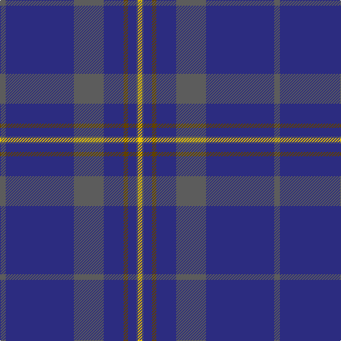

In pattern [BBBBGBBY](/patterns/bbbbgbby/).

This was sourced from tartans-authority.  It is a [8 stripes tartan](/stripes/stripes8/).

Original link http://www.tartansauthority.com/tartan-ferret/display/10799/

## Thread count
N/8 DB96 N42 DB28 T6 DB12 N2 Y/6

## Palette
Each colour and its ΔE from the base-6 reference it is a variant of.

| Colour | Shade | Base | ΔE (OKLab) |
|---|---|---|---|
| DB | <code style="background-color:#2C2C80;">#2C2C80</code> `#2C2C80` | B <code style="background-color:#2A418A;">#2A418A</code> | 0.06 |
| N | <code style="background-color:#5C5C5C;">#5C5C5C</code> `#5C5C5C` | B <code style="background-color:#2A418A;">#2A418A</code> | 0.15 |
| T | <code style="background-color:#604000;">#604000</code> `#604000` | G <code style="background-color:#006100;">#006100</code> | 0.14 |
| Y | <code style="background-color:#E8C000;">#E8C000</code> `#E8C000` | Y <code style="background-color:#F2BF00;">#F2BF00</code> | 0.02 |

# Sample pattern

## Nearest tartans

The nearest existing variants by ΔTartan distance.

1. [Affara (Personal)](/setts/s7/b80k5g12k2y2g2k10~b2c2c80-g006818-k101010-ye8c000~x2/) — ΔT 1.56
1. [Munster Ancestry](/setts/s8/b4ba48b21ba14y3ba6b1ya3~b332c2c-ba146a99-yc4950c-yae7b205~x2/) — ΔT 1.56
1. [Lewis Welsh Name Tartan Tartan Number: 5758. Earliest known date: 22002 The tartan for this Welsh surname and its variations, Lewis, Lewys, Lou, Louis, Lew, Lewes, is actually woven in Wales at the Cambrian Woollen Mill, weaving on the same site since 1830. This tartan differs from many traditional patterns in that the warp and weft differ, giving the finished worsted wool cloth more of a predominant stripe, vertically noticeable in the finished Kilt, or Cilt in Wales. See products available Copyright © Blair Urquhart, Comrie, 2015](/setts/s7/b56y2g19y1g2y1b2~b202060-g005c34-ya08858~x2/) — ΔT 1.60
1. [Marist School, The](/setts/s8/b29ba2b1ba1b1ba1bb8y1~b102040-ba4000ff-bb304080-yf0c000~x4/) — ΔT 1.61
1. [Federal Bureaux of Investigation](/setts/s6/b60ba19w3ba2r2ba7~b5480b0-ba304080-rc00000-we0e0e0~x2/) — ΔT 1.67
1. [Earl Blue Marl](/setts/s6/b80k28ba9k3r5k12~b2c2c80-ba780078-k101010-r9c68a4~x2/) — ΔT 1.74
1. [Wilson #2](/setts/s6/b48g14r3g2r3g2~b2c4084-g005020-rdc0000~x2/) — ΔT 1.74
1. [S.C.O.T.S.](/setts/s6/b55ba18w3ba2r2ba6~b304080-ba000050-rc00020-we0e0e0~x2/) — ΔT 1.75
1. [Ulster Scots (Fashion)](/setts/s10/b84ba1b1k2b2k30ba7b2g3y2~b2c2c80-ba780078-g006818-k101010-yd87c00~x2/) — ΔT 1.75
1. [Danzas](/setts/s7/y4b3y1b17ba40b2ba3~b102040-ba304080-yf0c000~x2/) — ΔT 1.76

## Neighbour map

Every grey dot is one of 15726 variants placed by the first two principal components of the ΔTartan feature space (44% of its variance). Red is this tartan; blue dots are its nearest — click one to open its page.

<svg viewBox="0 0 640 380" role="img" style="max-width:100%;height:auto;border:1px solid #e0e0e0;border-radius:4px;display:block" xmlns="http://www.w3.org/2000/svg"><image href="/nn/cloud.v1.png" width="640" height="380"/><a href="/setts/s7/b80k5g12k2y2g2k10~b2c2c80-g006818-k101010-ye8c000~x2/"><circle cx="533.5" cy="145.5" r="4" fill="#3465a4"><title>Affara (Personal)</title></circle></a><a href="/setts/s8/b4ba48b21ba14y3ba6b1ya3~b332c2c-ba146a99-yc4950c-yae7b205~x2/"><circle cx="502.3" cy="152.3" r="4" fill="#3465a4"><title>Munster Ancestry</title></circle></a><a href="/setts/s7/b56y2g19y1g2y1b2~b202060-g005c34-ya08858~x2/"><circle cx="579.7" cy="164.2" r="4" fill="#3465a4"><title>Lewis Welsh Name Tartan Tartan Number: 5758. Earliest known date: 22002 The tartan for this Welsh surname and its variations, Lewis, Lewys, Lou, Louis, Lew, Lewes, is actually woven in Wales at the Cambrian Woollen Mill, weaving on the same site since 1830. This tartan differs from many traditional patterns in that the warp and weft differ, giving the finished worsted wool cloth more of a predominant stripe, vertically noticeable in the finished Kilt, or Cilt in Wales. See products available Copyright © Blair Urquhart, Comrie, 2015</title></circle></a><a href="/setts/s8/b29ba2b1ba1b1ba1bb8y1~b102040-ba4000ff-bb304080-yf0c000~x4/"><circle cx="528.1" cy="156.1" r="4" fill="#3465a4"><title>Marist School, The</title></circle></a><a href="/setts/s6/b60ba19w3ba2r2ba7~b5480b0-ba304080-rc00000-we0e0e0~x2/"><circle cx="498.4" cy="174.9" r="4" fill="#3465a4"><title>Federal Bureaux of Investigation</title></circle></a><a href="/setts/s6/b80k28ba9k3r5k12~b2c2c80-ba780078-k101010-r9c68a4~x2/"><circle cx="451.2" cy="193.1" r="4" fill="#3465a4"><title>Earl Blue Marl</title></circle></a><a href="/setts/s6/b48g14r3g2r3g2~b2c4084-g005020-rdc0000~x2/"><circle cx="519.0" cy="200.1" r="4" fill="#3465a4"><title>Wilson #2</title></circle></a><a href="/setts/s6/b55ba18w3ba2r2ba6~b304080-ba000050-rc00020-we0e0e0~x2/"><circle cx="466.1" cy="175.3" r="4" fill="#3465a4"><title>S.C.O.T.S.</title></circle></a><a href="/setts/s10/b84ba1b1k2b2k30ba7b2g3y2~b2c2c80-ba780078-g006818-k101010-yd87c00~x2/"><circle cx="525.6" cy="105.6" r="4" fill="#3465a4"><title>Ulster Scots (Fashion)</title></circle></a><a href="/setts/s7/y4b3y1b17ba40b2ba3~b102040-ba304080-yf0c000~x2/"><circle cx="474.1" cy="167.7" r="4" fill="#3465a4"><title>Danzas</title></circle></a><circle cx="531.0" cy="161.9" r="5" fill="#c00000"/></svg>

ID: /setts/s8/b4ba48b21ba14g3ba6b1y3~b5c5c5c-ba2c2c80-g604000-ye8c000~x2/
