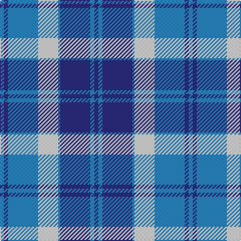

In pattern [BBBBWBBB](/patterns/bbbbwbbb/).

This was sourced from house-of-tartan.  It is a [8 stripes tartan](/stripes/stripes8/).

Original link http://www.house-of-tartan.scotland.net/house/TartanViewjs.asp?colr=Def&tnam=27

## Thread count
B/4 DB4 B30 LN20 B2 DB30 B4 DB/4

## Palette
Each colour and its ΔE from the base-6 reference it is a variant of.

| Colour | Shade | Base | ΔE (OKLab) |
|---|---|---|---|
| B | <code style="background-color:#2888C4;">#2888C4</code> `#2888C4` | B <code style="background-color:#2A418A;">#2A418A</code> | 0.21 |
| DB | <code style="background-color:#2C2C80;">#2C2C80</code> `#2C2C80` | B <code style="background-color:#2A418A;">#2A418A</code> | 0.06 |
| LN | <code style="background-color:#E0E0E0;">#E0E0E0</code> `#E0E0E0` | W <code style="background-color:#F7F7F7;">#F7F7F7</code> | 0.07 |

# Sample pattern

## Nearest tartans

The nearest existing variants by ΔTartan distance.

1. [Bannockbane Light Blue](/setts/s8/b4ba4b30w20b2ba30b4ba4-b2888c4-ba2c2c80-wfcfcfc/) — ΔT 0.43
1. [Bannockbane](/setts/s8/b4ba4b30ba2w20ba30b4ba4-b304080-ba8080d0-we0e0e0/) — ΔT 0.79
1. [Thorburn #1 (Name)](/setts/s9/b48w8b8ba24b16w12b16w72r4-b2c2c80-ba2888c4-rc80000-w98c8e8/) — ΔT 1.04
1. [Halesowen (District)](/setts/s8/w18b6y6b48ba48y4ba4y4-b1474b4-ba2c2c80-we0e0e0-ye8c000/) — ΔT 1.11
1. [Kildonan Blue (Fashion)](/setts/s9/b44ba6b6ba6b6ba18w56ba6w12-b2888c4-ba202060-wc0c0c0/) — ΔT 1.16
1. [Bannockbane Blue #2](/setts/s8/b6ba4b28ba2w20wa32ba4wa6-b1c0070-ba2c2c80-wc0c0c0-waa8ace8/) — ΔT 1.37
1. [Keela (Corporate)](/setts/s7/b14w6b4w12b32ba52r8-b003c64-ba5c8ca8-r880000-wfcfcfc/) — ΔT 1.40
1. [Thorburn (1992)](/setts/s9/b24w8b8ba24b16w10b16w70r8-b2c2c80-ba2888c4-rc80000-w98c8e8/) — ΔT 1.41
1. [Highlands Country Club](/setts/s12/b60w44wa8w4wa4g16wa4w4wa8w44b60g20-b1c0070-g006818-wa8ace8-wac0c0c0/) — ΔT 1.49
1. [Douglas, Variation](/setts/s6/w8b50ba50b4ba10w4-b000050-ba8080d0-we0e0e0/) — ΔT 1.55

## Neighbour map

Every grey dot is one of 15726 variants placed by the first two principal components of the ΔTartan feature space (44% of its variance). Red is this tartan; blue dots are its nearest — click one to open its page.

<svg viewBox="0 0 640 380" role="img" style="max-width:100%;height:auto;border:1px solid #e0e0e0;border-radius:4px;display:block" xmlns="http://www.w3.org/2000/svg"><image href="/nn/cloud.v1.png" width="640" height="380"/><a href="/setts/s8/b4ba4b30w20b2ba30b4ba4-b2888c4-ba2c2c80-wfcfcfc/"><circle cx="230.5" cy="177.7" r="4" fill="#3465a4"><title>Bannockbane Light Blue</title></circle></a><a href="/setts/s8/b4ba4b30ba2w20ba30b4ba4-b304080-ba8080d0-we0e0e0/"><circle cx="257.4" cy="183.6" r="4" fill="#3465a4"><title>Bannockbane</title></circle></a><a href="/setts/s9/b48w8b8ba24b16w12b16w72r4-b2c2c80-ba2888c4-rc80000-w98c8e8/"><circle cx="245.9" cy="156.0" r="4" fill="#3465a4"><title>Thorburn #1 (Name)</title></circle></a><a href="/setts/s8/w18b6y6b48ba48y4ba4y4-b1474b4-ba2c2c80-we0e0e0-ye8c000/"><circle cx="206.5" cy="166.9" r="4" fill="#3465a4"><title>Halesowen (District)</title></circle></a><a href="/setts/s9/b44ba6b6ba6b6ba18w56ba6w12-b2888c4-ba202060-wc0c0c0/"><circle cx="233.6" cy="188.2" r="4" fill="#3465a4"><title>Kildonan Blue (Fashion)</title></circle></a><a href="/setts/s8/b6ba4b28ba2w20wa32ba4wa6-b1c0070-ba2c2c80-wc0c0c0-waa8ace8/"><circle cx="179.7" cy="159.2" r="4" fill="#3465a4"><title>Bannockbane Blue #2</title></circle></a><a href="/setts/s7/b14w6b4w12b32ba52r8-b003c64-ba5c8ca8-r880000-wfcfcfc/"><circle cx="209.9" cy="180.9" r="4" fill="#3465a4"><title>Keela (Corporate)</title></circle></a><a href="/setts/s9/b24w8b8ba24b16w10b16w70r8-b2c2c80-ba2888c4-rc80000-w98c8e8/"><circle cx="223.9" cy="180.4" r="4" fill="#3465a4"><title>Thorburn (1992)</title></circle></a><a href="/setts/s12/b60w44wa8w4wa4g16wa4w4wa8w44b60g20-b1c0070-g006818-wa8ace8-wac0c0c0/"><circle cx="204.3" cy="144.8" r="4" fill="#3465a4"><title>Highlands Country Club</title></circle></a><a href="/setts/s6/w8b50ba50b4ba10w4-b000050-ba8080d0-we0e0e0/"><circle cx="280.0" cy="197.5" r="4" fill="#3465a4"><title>Douglas, Variation</title></circle></a><circle cx="243.2" cy="183.9" r="5" fill="#c00000"/></svg>

ID: /setts/s8/b4ba4b30w20b2ba30b4ba4-b2888c4-ba2c2c80-we0e0e0/
