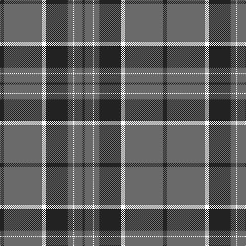

In pattern [BGKBGKGB](/patterns/bgkbgkgb/).

This was sourced from register-of-tartans.  It is a [8 stripes tartan](/stripes/stripes8/).

Original link https://www.tartanregister.gov.uk/tartanDetails.aspx?ref=10440

## Thread count
K/8 N74 LN8 K42 N11 P2 N16 K/4

## Palette
Each colour and its ΔE from the base-6 reference it is a variant of.

| Colour | Shade | Base | ΔE (OKLab) |
|---|---|---|---|
| K | <code style="background-color:#222222;">#222222</code> `#222222` | B <code style="background-color:#2C4084;">#2C4084</code> | 0.18 |
| N | <code style="background-color:#6A6A6A;">#6A6A6A</code> `#6A6A6A` | G <code style="background-color:#006400;">#006400</code> | 0.17 |

# Sample pattern

ID: /setts/s8/b4g16k2g11b42k8g74b8-b222222-g6a6a6a-k000000/
