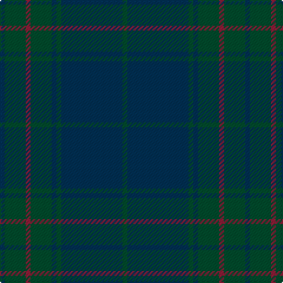

In pattern [BGRGBGBG](/patterns/bgrgbgbg/).

This was sourced from tartans-authority.  It is a [8 stripes tartan](/stripes/stripes8/).

Original link http://www.tartansauthority.com/tartan-ferret/display/2579/

## Thread count
DB/4 G18 DR4 G18 DB4 G4 DB52 G/4

## Palette
Each colour and its ΔE from the base-6 reference it is a variant of.

| Colour | Shade | Base | ΔE (OKLab) |
|---|---|---|---|
| DB | <code style="background-color:#003054;">#003054</code> `#003054` | B <code style="background-color:#2A418A;">#2A418A</code> | 0.11 |
| DR | <code style="background-color:#901C38;">#901C38</code> `#901C38` | R <code style="background-color:#CC0000;">#CC0000</code> | 0.13 |
| G | <code style="background-color:#004C2C;">#004C2C</code> `#004C2C` | G <code style="background-color:#006100;">#006100</code> | 0.09 |

# Sample pattern

## Nearest tartans

The nearest existing variants by ΔTartan distance.

1. [Tern House](/setts/s7/g23b3k8b4g4b56ga8-b141e46-g003820-ga604000-k101010/) — ΔT 1.46
1. [Hector, James (Corporate)](/setts/s5/b4g22ba54g16r4-b441800-ba003c64-g003820-r880000/) — ΔT 1.58
1. [Conlon](/setts/s9/g8b4g34ga4r8ga4g6ga22g4-b2c2c80-g005448-ga003820-r880000/) — ΔT 1.61
1. [Donachie of Brockloch Hunting Clan Tartan Tartan Number: 3002. Earliest known date: 2004 Based on the Robertson sett No. 893 with red changed to green. The Donachie's are part of the Robertson clan, also known as Clan Donnachaidh. See products available Copyright © Blair Urquhart, Comrie, 2015](/setts/s10/g48r4g4ga80g50ga4g4r4g4ga40-g006030-ga003820-r800000/) — ΔT 1.75
1. [Hector, James](/setts/s8/g16b54g22ba4g22b54g16r4-b003c64-ba441800-g003820-r880000/) — ΔT 1.84
1. [Hueg (Bavaria) Hunting (Personal)](/setts/s10/b34g10b10g34b8g34k4ka4k4g10-b433a5a-g23321b-k1c1714-ka000000/) — ΔT 1.85
1. [St Andrews Old Course Hotel, Golf Course and Spa](/setts/s6/g90b28k6b4ga4b10-b000048-g002814-ga604000-k101010/) — ΔT 1.86
1. [Montgomerie/Montgomery](/setts/s12/g54ga78b6ga6b8ga6b6ga78b6ga6b8ga6-b2c4084-g002814-ga005020/) — ΔT 1.94
1. [Hughes Welsh Name Tartan Tartan Number: 5756. Earliest known date: 2002 The tartan for this Welsh surname and its variations, Hugh, Hullin, Hullyn, Huws, Pugh, Tugh, Hoell, is actually woven in Wales at the Cambrian Woollen Mill, weaving on the same site since 1830. This tartan differs from many traditional patterns in that the warp and weft differ, giving the finished worsted wool cloth more of a predominant stripe, vertically noticeable in the finished Kilt, or Cilt in Wales. See products available Copyright © Blair Urquhart, Comrie, 2015](/setts/s11/g4b34ba20b4ba8b6r2b5ba2b3g4-b202060-ba003c64-g006818-rc80000/) — ΔT 1.95
1. [Wicklow, County (District)](/setts/s10/b4ba8g24ba4b12bb4ba48b4ba4g4-b4c3428-ba5c5c5c-bb5c8ca8-g006818/) — ΔT 1.96

## Neighbour map

Every grey dot is one of 15726 variants placed by the first two principal components of the ΔTartan feature space (44% of its variance). Red is this tartan; blue dots are its nearest — click one to open its page.

<svg viewBox="0 0 640 380" role="img" style="max-width:100%;height:auto;border:1px solid #e0e0e0;border-radius:4px;display:block" xmlns="http://www.w3.org/2000/svg"><image href="/nn/cloud.v1.png" width="640" height="380"/><a href="/setts/s7/g23b3k8b4g4b56ga8-b141e46-g003820-ga604000-k101010/"><circle cx="522.5" cy="248.1" r="4" fill="#3465a4"><title>Tern House</title></circle></a><a href="/setts/s5/b4g22ba54g16r4-b441800-ba003c64-g003820-r880000/"><circle cx="488.1" cy="293.4" r="4" fill="#3465a4"><title>Hector, James (Corporate)</title></circle></a><a href="/setts/s9/g8b4g34ga4r8ga4g6ga22g4-b2c2c80-g005448-ga003820-r880000/"><circle cx="440.2" cy="273.1" r="4" fill="#3465a4"><title>Conlon</title></circle></a><a href="/setts/s10/g48r4g4ga80g50ga4g4r4g4ga40-g006030-ga003820-r800000/"><circle cx="511.5" cy="251.9" r="4" fill="#3465a4"><title>Donachie of Brockloch Hunting Clan Tartan Tartan Number: 3002. Earliest known date: 2004 Based on the Robertson sett No. 893 with red changed to green. The Donachie's are part of the Robertson clan, also known as Clan Donnachaidh. See products available Copyright © Blair Urquhart, Comrie, 2015</title></circle></a><a href="/setts/s8/g16b54g22ba4g22b54g16r4-b003c64-ba441800-g003820-r880000/"><circle cx="504.8" cy="297.0" r="4" fill="#3465a4"><title>Hector, James</title></circle></a><a href="/setts/s10/b34g10b10g34b8g34k4ka4k4g10-b433a5a-g23321b-k1c1714-ka000000/"><circle cx="466.9" cy="283.1" r="4" fill="#3465a4"><title>Hueg (Bavaria) Hunting (Personal)</title></circle></a><a href="/setts/s6/g90b28k6b4ga4b10-b000048-g002814-ga604000-k101010/"><circle cx="557.3" cy="238.6" r="4" fill="#3465a4"><title>St Andrews Old Course Hotel, Golf Course and Spa</title></circle></a><a href="/setts/s12/g54ga78b6ga6b8ga6b6ga78b6ga6b8ga6-b2c4084-g002814-ga005020/"><circle cx="545.5" cy="240.7" r="4" fill="#3465a4"><title>Montgomerie/Montgomery</title></circle></a><a href="/setts/s11/g4b34ba20b4ba8b6r2b5ba2b3g4-b202060-ba003c64-g006818-rc80000/"><circle cx="472.0" cy="223.7" r="4" fill="#3465a4"><title>Hughes Welsh Name Tartan Tartan Number: 5756. Earliest known date: 2002 The tartan for this Welsh surname and its variations, Hugh, Hullin, Hullyn, Huws, Pugh, Tugh, Hoell, is actually woven in Wales at the Cambrian Woollen Mill, weaving on the same site since 1830. This tartan differs from many traditional patterns in that the warp and weft differ, giving the finished worsted wool cloth more of a predominant stripe, vertically noticeable in the finished Kilt, or Cilt in Wales. See products available Copyright © Blair Urquhart, Comrie, 2015</title></circle></a><a href="/setts/s10/b4ba8g24ba4b12bb4ba48b4ba4g4-b4c3428-ba5c5c5c-bb5c8ca8-g006818/"><circle cx="451.8" cy="230.6" r="4" fill="#3465a4"><title>Wicklow, County (District)</title></circle></a><circle cx="518.9" cy="270.4" r="5" fill="#c00000"/></svg>

ID: /setts/s8/b4g18r4g18b4g4b52g4-b003054-g004c2c-r901c38/
