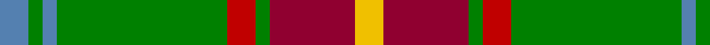
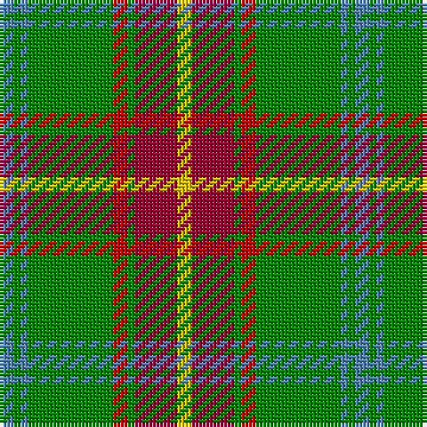

In pattern [BGBGRGRY](/patterns/bgbgrgry/).

This was sourced from weddslist.  It is a [8 stripes tartan](/stripes/stripes8/).

Original link http://www.weddslist.com/cgi-bin/tartans/pg.pl?source=sts

## Thread count
B/4 G2 B2 G24 R4 G2 DR12 Y/4

## Palette
Each colour and its ΔE from the base-6 reference it is a variant of.

| Colour | Shade | Base | ΔE (OKLab) |
|---|---|---|---|
| B | <code style="background-color:#5480B0;">#5480B0</code> `#5480B0` | B <code style="background-color:#2A418A;">#2A418A</code> | 0.19 |
| DR | <code style="background-color:#900030;">#900030</code> `#900030` | R <code style="background-color:#CC0000;">#CC0000</code> | 0.14 |
| G | <code style="background-color:#008000;">#008000</code> `#008000` | G <code style="background-color:#006100;">#006100</code> | 0.10 |
| R | <code style="background-color:#C00000;">#C00000</code> `#C00000` | R <code style="background-color:#CC0000;">#CC0000</code> | 0.03 |
| Y | <code style="background-color:#F0C000;">#F0C000</code> `#F0C000` | Y <code style="background-color:#F2BF00;">#F2BF00</code> | 0.00 |

# Sample pattern

## Nearest tartans

The nearest existing variants by ΔTartan distance.

1. [Manitoba District Tartan Tartan Number: 146. Earliest known date: 1962 The tartan as it would appear with red in place of green, the 'G' of green having been interpreted as 'Gules'. The designer, Hugh Kirkwood Rankine, clearly intended a green stripe. This version can be found in the shops. See products available Copyright © Blair Urquhart, Comrie, 2015](/setts/s8/b4g2b2g24r4g2ra12y4-b5c8ca8-g006818-rc80000-raa00048-ye8c000/) — ΔT 0.51
1. [Manitoba](/setts/s8/b8g4b4g48ga8g4r24y8-b5480b0-g008000-ga003000-r802040-yf0c000/) — ΔT 0.61
1. [Manitoba District Tartan Tartan Number: 144. Earliest known date: 1962 The official recording of the sett shows the letter G for the dark green stripe. In heraldic terms this means 'Gules' - red. The designer, Hugh Kirkwood Rankine, clearly intended dark green and this is reproduced here.It was given Royal Assent in 1962. See products available Copyright © Blair Urquhart, Comrie, 2015](/setts/s8/b8g4b4g48ga8g4r24y8-b5c8ca8-g006818-ga003820-r901c38-ye8c000/) — ΔT 0.71
1. [O'Neill (Name)](/setts/s8/w12g10r10g90k8y48k8g10-g006818-k101010-ra00024-we0e0e0-ya08858/) — ΔT 0.88
1. [Manitoba Red](/setts/s8/b4g2b2g24r4g2ra12y4-b3c82af-g005020-rdc0000-ra960028-ye8c000/) — ΔT 0.93
1. [Botherston (Name)](/setts/s8/r4y48r4y6r4g48k16ya4-g006818-k101010-r880000-ya08858-yae8c000/) — ΔT 0.99
1. [O'Neill](/setts/s8/w12g10r10g90k8ra48k8g10-g008000-k000000-rc00020-ra906030-we0e0e0/) — ΔT 1.09
1. [Connacht #2](/setts/s8/r4ra4g24ra60ga8ra4ga24w4-g005020-ga2a2303-rdc0000-rabe7832-we0e0e0/) — ΔT 1.09
1. [Invertere (Daks #2) (Fashion)](/setts/s8/y10g28ga8b8ga54g6ga8y10-b2c2c80-g289c18-ga604000-ye8c000/) — ΔT 1.13
1. [Manitoba](/setts/s8/b6g2b2g41ga6g2r21y6-b3c82af-g309c18-ga002814-rdc0000-ye8c000/) — ΔT 1.15

## Neighbour map

Every grey dot is one of 15726 variants placed by the first two principal components of the ΔTartan feature space (44% of its variance). Red is this tartan; blue dots are its nearest — click one to open its page.

<svg viewBox="0 0 640 380" role="img" style="max-width:100%;height:auto;border:1px solid #e0e0e0;border-radius:4px;display:block" xmlns="http://www.w3.org/2000/svg"><image href="/nn/cloud.v1.png" width="640" height="380"/><a href="/setts/s8/b4g2b2g24r4g2ra12y4-b5c8ca8-g006818-rc80000-raa00048-ye8c000/"><circle cx="271.6" cy="161.0" r="4" fill="#3465a4"><title>Manitoba District Tartan Tartan Number: 146. Earliest known date: 1962 The tartan as it would appear with red in place of green, the 'G' of green having been interpreted as 'Gules'. The designer, Hugh Kirkwood Rankine, clearly intended a green stripe. This version can be found in the shops. See products available Copyright © Blair Urquhart, Comrie, 2015</title></circle></a><a href="/setts/s8/b8g4b4g48ga8g4r24y8-b5480b0-g008000-ga003000-r802040-yf0c000/"><circle cx="264.1" cy="164.2" r="4" fill="#3465a4"><title>Manitoba</title></circle></a><a href="/setts/s8/b8g4b4g48ga8g4r24y8-b5c8ca8-g006818-ga003820-r901c38-ye8c000/"><circle cx="277.3" cy="169.3" r="4" fill="#3465a4"><title>Manitoba District Tartan Tartan Number: 144. Earliest known date: 1962 The official recording of the sett shows the letter G for the dark green stripe. In heraldic terms this means 'Gules' - red. The designer, Hugh Kirkwood Rankine, clearly intended dark green and this is reproduced here.It was given Royal Assent in 1962. See products available Copyright © Blair Urquhart, Comrie, 2015</title></circle></a><a href="/setts/s8/w12g10r10g90k8y48k8g10-g006818-k101010-ra00024-we0e0e0-ya08858/"><circle cx="296.6" cy="164.5" r="4" fill="#3465a4"><title>O'Neill (Name)</title></circle></a><a href="/setts/s8/b4g2b2g24r4g2ra12y4-b3c82af-g005020-rdc0000-ra960028-ye8c000/"><circle cx="271.3" cy="161.6" r="4" fill="#3465a4"><title>Manitoba Red</title></circle></a><a href="/setts/s8/r4y48r4y6r4g48k16ya4-g006818-k101010-r880000-ya08858-yae8c000/"><circle cx="223.3" cy="159.3" r="4" fill="#3465a4"><title>Botherston (Name)</title></circle></a><a href="/setts/s8/w12g10r10g90k8ra48k8g10-g008000-k000000-rc00020-ra906030-we0e0e0/"><circle cx="280.7" cy="157.8" r="4" fill="#3465a4"><title>O'Neill</title></circle></a><a href="/setts/s8/r4ra4g24ra60ga8ra4ga24w4-g005020-ga2a2303-rdc0000-rabe7832-we0e0e0/"><circle cx="282.4" cy="142.5" r="4" fill="#3465a4"><title>Connacht #2</title></circle></a><a href="/setts/s8/y10g28ga8b8ga54g6ga8y10-b2c2c80-g289c18-ga604000-ye8c000/"><circle cx="277.0" cy="193.2" r="4" fill="#3465a4"><title>Invertere (Daks #2) (Fashion)</title></circle></a><a href="/setts/s8/b6g2b2g41ga6g2r21y6-b3c82af-g309c18-ga002814-rdc0000-ye8c000/"><circle cx="286.3" cy="126.2" r="4" fill="#3465a4"><title>Manitoba</title></circle></a><circle cx="266.2" cy="159.6" r="5" fill="#c00000"/></svg>

ID: /setts/s8/b4g2b2g24r4g2ra12y4-b5480b0-g008000-rc00000-ra900030-yf0c000/
