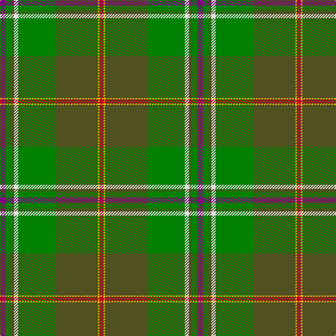

In pattern [BGGWGGYR](/patterns/bggwggyr/).

This was sourced from weddslist.  It is a [8 stripes tartan](/stripes/stripes8/).

Original link http://www.weddslist.com/cgi-bin/tartans/pg.pl?source=sts

## Thread count
P/8 G8 T4 LN6 G54 T60 Y2 R/6

## Palette
Each colour and its ΔE from the base-6 reference it is a variant of.

| Colour | Shade | Base | ΔE (OKLab) |
|---|---|---|---|
| G | <code style="background-color:#008000;">#008000</code> `#008000` | G <code style="background-color:#006100;">#006100</code> | 0.10 |
| LN | <code style="background-color:#E0E0E0;">#E0E0E0</code> `#E0E0E0` | W <code style="background-color:#F7F7F7;">#F7F7F7</code> | 0.07 |
| P | <code style="background-color:#800080;">#800080</code> `#800080` | B <code style="background-color:#2A418A;">#2A418A</code> | 0.17 |
| R | <code style="background-color:#C00020;">#C00020</code> `#C00020` | R <code style="background-color:#CC0000;">#CC0000</code> | 0.03 |
| T | <code style="background-color:#505020;">#505020</code> `#505020` | G <code style="background-color:#006100;">#006100</code> | 0.10 |
| Y | <code style="background-color:#F0C000;">#F0C000</code> `#F0C000` | Y <code style="background-color:#F2BF00;">#F2BF00</code> | 0.00 |

# Sample pattern

## Nearest tartans

The nearest existing variants by ΔTartan distance.

1. [Elbrick Hunting (Personal)](/setts/s8/g6b22g6ga20y1g45ba1w5x2~b5c8ca8-ba2888c4-g006818-ga604000-we0e0e0-ye8c000/) — ΔT 1.25
1. [Hannigan of Dirleton (Personal)](/setts/s8/b4g4ga2w3g27ga30y1r3x2~b780078-g006818-ga5c6428-rc8002c-we0e0e0-ye8c000/) — ΔT 1.26
1. [T.H.E. C.O.G. USA (Corporate)](/setts/s6/y9g18b9r1w1ba1x4~b5c7888-ba2c2c80-g006818-rc8002c-we0e0e0-ybc8c00/) — ΔT 1.35
1. [Chisholm Colonial](/setts/s10/b6w1y24g6ba3g1ba3g1ba12r1x2~b003c64-ba0c585c-g006818-rc80000-we0e0e0-ya08858/) — ΔT 1.41
1. [Sheffield, City of (District)](/setts/s8/g62r3g3r31k4ga5b5ra3x2~b2888c4-g006818-ga289c18-k101010-r888888-rac80000/) — ΔT 1.48
1. [Snelgrove Htg (Name)](/setts/s7/k3r12g8y2ga36g10b2x2~b2888c4-g642000-ga006818-k101010-rc80000-ybc8c00/) — ΔT 1.55
1. [Carter (Savannah) (Personal)](/setts/s10/g4ga26w1ga2w2g4y26g4gb3ya3x2~g604000-ga006818-gb289c18-wb4ccbc-y48a4c0-yae8c000/) — ΔT 1.57
1. [Stirling University (Corporate)](/setts/s8/g22r3w1g2r3b16k3y2x4~b5c8ca8-g006818-k101010-rc80000-wfcfcfc-ye8c000/) — ΔT 1.57
1. [Shiach (Personal)](/setts/s8/g45k4r2g4r2k4b21ra5x2~b506878-g006818-k101010-re87878-rac80000/) — ΔT 1.57
1. [Stirling, University of Corporate Univ Tartan Tartan Number: 2297. Earliest known date: 1994 This is the accepted University design. See products available Copyright © Blair Urquhart, Comrie, 2015](/setts/s8/g22r3k1g2r3b16ka3y2x4~b5c8ca8-g006818-k000000-ka101010-rc80000-ye8c000/) — ΔT 1.57

## Neighbour map

Every grey dot is one of 15726 variants placed by the first two principal components of the ΔTartan feature space (44% of its variance). Red is this tartan; blue dots are its nearest — click one to open its page.

<svg viewBox="0 0 640 380" role="img" style="max-width:100%;height:auto;border:1px solid #e0e0e0;border-radius:4px;display:block" xmlns="http://www.w3.org/2000/svg"><image href="/nn/cloud.v1.png" width="640" height="380"/><a href="/setts/s8/g6b22g6ga20y1g45ba1w5x2~b5c8ca8-ba2888c4-g006818-ga604000-we0e0e0-ye8c000/"><circle cx="343.8" cy="120.0" r="4" fill="#3465a4"><title>Elbrick Hunting (Personal)</title></circle></a><a href="/setts/s8/b4g4ga2w3g27ga30y1r3x2~b780078-g006818-ga5c6428-rc8002c-we0e0e0-ye8c000/"><circle cx="331.6" cy="135.0" r="4" fill="#3465a4"><title>Hannigan of Dirleton (Personal)</title></circle></a><a href="/setts/s6/y9g18b9r1w1ba1x4~b5c7888-ba2c2c80-g006818-rc8002c-we0e0e0-ybc8c00/"><circle cx="267.1" cy="164.6" r="4" fill="#3465a4"><title>T.H.E. C.O.G. USA (Corporate)</title></circle></a><a href="/setts/s10/b6w1y24g6ba3g1ba3g1ba12r1x2~b003c64-ba0c585c-g006818-rc80000-we0e0e0-ya08858/"><circle cx="263.0" cy="118.3" r="4" fill="#3465a4"><title>Chisholm Colonial</title></circle></a><a href="/setts/s8/g62r3g3r31k4ga5b5ra3x2~b2888c4-g006818-ga289c18-k101010-r888888-rac80000/"><circle cx="362.5" cy="134.2" r="4" fill="#3465a4"><title>Sheffield, City of (District)</title></circle></a><a href="/setts/s7/k3r12g8y2ga36g10b2x2~b2888c4-g642000-ga006818-k101010-rc80000-ybc8c00/"><circle cx="286.1" cy="148.5" r="4" fill="#3465a4"><title>Snelgrove Htg (Name)</title></circle></a><a href="/setts/s10/g4ga26w1ga2w2g4y26g4gb3ya3x2~g604000-ga006818-gb289c18-wb4ccbc-y48a4c0-yae8c000/"><circle cx="225.4" cy="105.1" r="4" fill="#3465a4"><title>Carter (Savannah) (Personal)</title></circle></a><a href="/setts/s8/g22r3w1g2r3b16k3y2x4~b5c8ca8-g006818-k101010-rc80000-wfcfcfc-ye8c000/"><circle cx="248.0" cy="120.2" r="4" fill="#3465a4"><title>Stirling University (Corporate)</title></circle></a><a href="/setts/s8/g45k4r2g4r2k4b21ra5x2~b506878-g006818-k101010-re87878-rac80000/"><circle cx="367.3" cy="148.2" r="4" fill="#3465a4"><title>Shiach (Personal)</title></circle></a><a href="/setts/s8/g22r3k1g2r3b16ka3y2x4~b5c8ca8-g006818-k000000-ka101010-rc80000-ye8c000/"><circle cx="247.9" cy="121.0" r="4" fill="#3465a4"><title>Stirling, University of Corporate Univ Tartan Tartan Number: 2297. Earliest known date: 1994 This is the accepted University design. See products available Copyright © Blair Urquhart, Comrie, 2015</title></circle></a><circle cx="304.1" cy="122.4" r="5" fill="#c00000"/></svg>

ID: /setts/s8/b4g4ga2w3g27ga30y1r3x2~b800080-g008000-ga505020-rc00020-we0e0e0-yf0c000/
