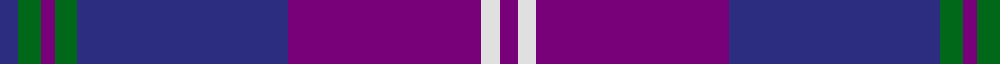
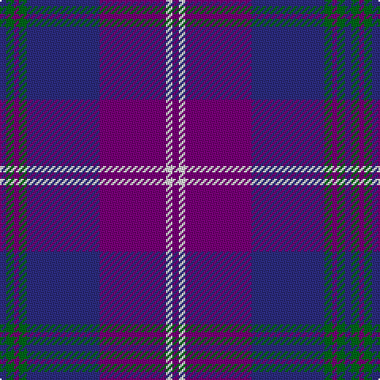

In pattern [BGBGBBWB](/patterns/bgbgbbwb/).

This was sourced from register-of-tartans.  It is a [8 stripes tartan](/stripes/stripes8/).

Original link https://www.tartanregister.gov.uk/tartanDetails.aspx?ref=662

## Attestations

This cloth appears in 2 source records; the oldest owns this page.

- 01/09/2003 — Clans of Caledonia (register-of-tartans, [record](https://www.tartanregister.gov.uk/tartanDetails.aspx?ref=662))
- September 2003 — Clans of Caledonia (Corporate) (tartans-authority, [record](http://www.tartansauthority.com/tartan-ferret/display/5923/))

## Thread count
DB/4 G5 P3 G5 DB46 P42 LN4 P/4

## Palette
Each colour and its ΔE from the base-6 reference it is a variant of.

| Colour | Shade | Base | ΔE (OKLab) |
|---|---|---|---|
| DB | <code style="background-color:#2C2C80;">#2C2C80</code> `#2C2C80` | B <code style="background-color:#2A418A;">#2A418A</code> | 0.06 |
| G | <code style="background-color:#006818;">#006818</code> `#006818` | G <code style="background-color:#006100;">#006100</code> | 0.02 |
| K | <code style="background-color:#101010;">#101010</code> `#101010` | K <code style="background-color:#000000;">#000000</code> | 0.17 |
| LN | <code style="background-color:#E0E0E0;">#E0E0E0</code> `#E0E0E0` | W <code style="background-color:#F7F7F7;">#F7F7F7</code> | 0.07 |
| P | <code style="background-color:#780078;">#780078</code> `#780078` | B <code style="background-color:#2A418A;">#2A418A</code> | 0.17 |

# Sample pattern

## Nearest tartans

The nearest existing variants by ΔTartan distance.

1. [BABC](/setts/s8/r3b4w2b33ba32b2r4w3~b003c64-ba2c2c80-rc80000-wf8f8f8/) — ΔT 1.53
1. [B.A.B.C. (Corporate)](/setts/s8/r3b4w2b33ba32b2r4w3~b003c64-ba2c2c80-rc80000-wf8f8f8~x2/) — ΔT 1.53
1. [Pride of Fife](/setts/s10/b2w2ba16y2ba2r5b37ba6y2b2~b202060-ba440044-r800028-wfcfcfc-y48a4c0~x2/) — ΔT 1.59
1. [British American School (Corporate)](/setts/s7/b2ba2r1ba16w1b20r2~b2c2c80-ba3850c8-rc80000-we0e0e0~x2/) — ΔT 1.64
1. [Cheadle (Personal)](/setts/s6/b10y3b8ba42g5r5~b780078-ba2c2c80-g006818-r888888-ye8c000~x2/) — ΔT 1.66
1. [First](/setts/s8/b1r4b1r1b12k6ba16w1~b780078-ba003c64-k101010-ra00048-we0e0e0~x2/) — ΔT 1.66
1. [Wcwm 1475-2](/setts/s9/r2b34k2w2k2ba30b3ba6r2~b1c0070-ba5c5c5c-k101010-r880000-wc0c0c0~x2/) — ΔT 1.69
1. [POF (Fashion)](/setts/s9/b27ba8b14ba8b14ba26r84ba6r12~b1474b4-ba1c1c50-r901c38/) — ΔT 1.71
1. [Heddle](/setts/s13/b8ba24k2ba2b8ba2k2ba4y2ba4k2b12w3~b684074-ba2c2c80-k101010-wf8f8f8-ye8c000~x2/) — ΔT 1.71
1. [Clydebank (Fashion)](/setts/s12/g2b3g1b15ba3b9ba9b2ba16r1ba3r2~b145c88-ba6c28b8-g289c18-rc80000~x2/) — ΔT 1.75

## Neighbour map

Every grey dot is one of 15726 variants placed by the first two principal components of the ΔTartan feature space (44% of its variance). Red is this tartan; blue dots are its nearest — click one to open its page.

<svg viewBox="0 0 640 380" role="img" style="max-width:100%;height:auto;border:1px solid #e0e0e0;border-radius:4px;display:block" xmlns="http://www.w3.org/2000/svg"><image href="/nn/cloud.v1.png" width="640" height="380"/><a href="/setts/s8/r3b4w2b33ba32b2r4w3~b003c64-ba2c2c80-rc80000-wf8f8f8/"><circle cx="322.9" cy="172.4" r="4" fill="#3465a4"><title>BABC</title></circle></a><a href="/setts/s8/r3b4w2b33ba32b2r4w3~b003c64-ba2c2c80-rc80000-wf8f8f8~x2/"><circle cx="322.9" cy="172.4" r="4" fill="#3465a4"><title>B.A.B.C. (Corporate)</title></circle></a><a href="/setts/s10/b2w2ba16y2ba2r5b37ba6y2b2~b202060-ba440044-r800028-wfcfcfc-y48a4c0~x2/"><circle cx="371.2" cy="143.0" r="4" fill="#3465a4"><title>Pride of Fife</title></circle></a><a href="/setts/s7/b2ba2r1ba16w1b20r2~b2c2c80-ba3850c8-rc80000-we0e0e0~x2/"><circle cx="392.5" cy="188.1" r="4" fill="#3465a4"><title>British American School (Corporate)</title></circle></a><a href="/setts/s6/b10y3b8ba42g5r5~b780078-ba2c2c80-g006818-r888888-ye8c000~x2/"><circle cx="354.6" cy="181.7" r="4" fill="#3465a4"><title>Cheadle (Personal)</title></circle></a><a href="/setts/s8/b1r4b1r1b12k6ba16w1~b780078-ba003c64-k101010-ra00048-we0e0e0~x2/"><circle cx="252.6" cy="164.8" r="4" fill="#3465a4"><title>First</title></circle></a><a href="/setts/s9/r2b34k2w2k2ba30b3ba6r2~b1c0070-ba5c5c5c-k101010-r880000-wc0c0c0~x2/"><circle cx="315.1" cy="145.7" r="4" fill="#3465a4"><title>Wcwm 1475-2</title></circle></a><a href="/setts/s9/b27ba8b14ba8b14ba26r84ba6r12~b1474b4-ba1c1c50-r901c38/"><circle cx="338.0" cy="194.3" r="4" fill="#3465a4"><title>POF (Fashion)</title></circle></a><a href="/setts/s13/b8ba24k2ba2b8ba2k2ba4y2ba4k2b12w3~b684074-ba2c2c80-k101010-wf8f8f8-ye8c000~x2/"><circle cx="283.5" cy="155.3" r="4" fill="#3465a4"><title>Heddle</title></circle></a><a href="/setts/s12/g2b3g1b15ba3b9ba9b2ba16r1ba3r2~b145c88-ba6c28b8-g289c18-rc80000~x2/"><circle cx="353.0" cy="187.4" r="4" fill="#3465a4"><title>Clydebank (Fashion)</title></circle></a><circle cx="344.2" cy="177.0" r="5" fill="#c00000"/></svg>

ID: /setts/s8/b4g5ba3g5b46ba42w4ba4~b2c2c80-ba780078-g006818-we0e0e0/
