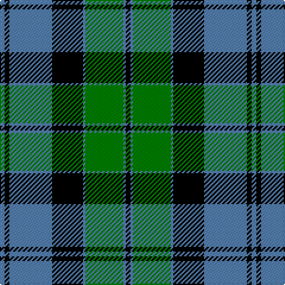

In pattern [BKBKBGBK](/patterns/bkbkbgbk/).

This was sourced from weddslist.  It is a [8 stripes tartan](/stripes/stripes8/).

Original link http://www.weddslist.com/cgi-bin/tartans/pg.pl?source=sts

## Thread count
B/4 K4 B36 K26 B2 G32 B2 K/4

## Palette
Each colour and its ΔE from the base-6 reference it is a variant of.

| Colour | Shade | Base | ΔE (OKLab) |
|---|---|---|---|
| B | <code style="background-color:#5480B0;">#5480B0</code> `#5480B0` | B <code style="background-color:#2C4084;">#2C4084</code> | 0.20 |
| G | <code style="background-color:#008000;">#008000</code> `#008000` | G <code style="background-color:#006400;">#006400</code> | 0.09 |
| K | <code style="background-color:#000000;">#000000</code> `#000000` | K <code style="background-color:#000000;">#000000</code> | 0.00 |

# Sample pattern

## Nearest tartans

The nearest existing variants by ΔTartan distance.

1. [Kerr, hunting](/setts/s10/g28k4g4k4g6k20b32k2b4k4-b304080-g008000-k000000/) — ΔT 0.93
1. [Lochaber District](/setts/s8/b2g1b16r1k12g16r1g2-b3c779d-g2d783e-k000000-rc80000/) — ΔT 1.04
1. [Hebridean Old](/setts/s9/b4k4b36ba2k26ba2g32b6k4-b304080-ba8080d0-g008000-k000000/) — ΔT 1.20
1. [Utah Valley University](/setts/s8/k6w14g6k32g34w2g16k2-g005020-k101010-wffffff/) — ΔT 1.23
1. [Gordon 3](/setts/s10/b56k6b6k6b6k44g44y4g5y8-b304080-g008000-k000000-yf0c000/) — ΔT 1.25
1. [Ayrton](/setts/s9/r6b4k2b40k18g40k2g4r6-b5480b0-g008000-k000000-rc00000/) — ΔT 1.29
1. [Rangers F.C.](/setts/s11/r6g32k24b68k24g4k4g4k4g14r6-b304080-g30a010-k000000-rc00000/) — ΔT 1.32
1. [MacTaggert](/setts/s7/g60b8g4k40b36r2b8-b304080-g008000-k000000-rc00000/) — ΔT 1.32
1. [Johnstone / Johnston](/setts/s8/k6b6k6b44g52k4b2y6-b304080-g008000-k000000-yf0c000/) — ΔT 1.32
1. [Unidentified Portrait](/setts/s9/g20r2g2r2g2r8b24r2b4-b000050-g007800-r8c0000/) — ΔT 1.35

## Neighbour map

Every grey dot is one of 15726 variants placed by the first two principal components of the ΔTartan feature space (44% of its variance). Red is this tartan; blue dots are its nearest — click one to open its page.

<svg viewBox="0 0 640 380" role="img" style="max-width:100%;height:auto;border:1px solid #e0e0e0;border-radius:4px;display:block" xmlns="http://www.w3.org/2000/svg"><image href="/nn/cloud.v1.png" width="640" height="380"/><a href="/setts/s10/g28k4g4k4g6k20b32k2b4k4-b304080-g008000-k000000/"><circle cx="212.4" cy="176.4" r="4" fill="#3465a4"><title>Kerr, hunting</title></circle></a><a href="/setts/s8/b2g1b16r1k12g16r1g2-b3c779d-g2d783e-k000000-rc80000/"><circle cx="204.4" cy="164.7" r="4" fill="#3465a4"><title>Lochaber District</title></circle></a><a href="/setts/s9/b4k4b36ba2k26ba2g32b6k4-b304080-ba8080d0-g008000-k000000/"><circle cx="215.3" cy="158.1" r="4" fill="#3465a4"><title>Hebridean Old</title></circle></a><a href="/setts/s8/k6w14g6k32g34w2g16k2-g005020-k101010-wffffff/"><circle cx="273.5" cy="189.3" r="4" fill="#3465a4"><title>Utah Valley University</title></circle></a><a href="/setts/s10/b56k6b6k6b6k44g44y4g5y8-b304080-g008000-k000000-yf0c000/"><circle cx="180.5" cy="154.9" r="4" fill="#3465a4"><title>Gordon 3</title></circle></a><a href="/setts/s9/r6b4k2b40k18g40k2g4r6-b5480b0-g008000-k000000-rc00000/"><circle cx="199.0" cy="141.3" r="4" fill="#3465a4"><title>Ayrton</title></circle></a><a href="/setts/s11/r6g32k24b68k24g4k4g4k4g14r6-b304080-g30a010-k000000-rc00000/"><circle cx="182.4" cy="140.3" r="4" fill="#3465a4"><title>Rangers F.C.</title></circle></a><a href="/setts/s7/g60b8g4k40b36r2b8-b304080-g008000-k000000-rc00000/"><circle cx="239.2" cy="158.6" r="4" fill="#3465a4"><title>MacTaggert</title></circle></a><a href="/setts/s8/k6b6k6b44g52k4b2y6-b304080-g008000-k000000-yf0c000/"><circle cx="262.0" cy="140.4" r="4" fill="#3465a4"><title>Johnstone / Johnston</title></circle></a><a href="/setts/s9/g20r2g2r2g2r8b24r2b4-b000050-g007800-r8c0000/"><circle cx="263.2" cy="187.5" r="4" fill="#3465a4"><title>Unidentified Portrait</title></circle></a><circle cx="227.5" cy="173.6" r="5" fill="#c00000"/></svg>

ID: /setts/s8/b4k4b36k26b2g32b2k4-b5480b0-g008000-k000000/
