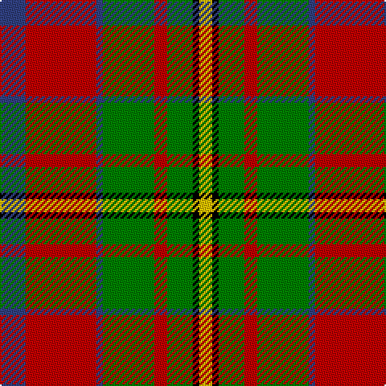

In pattern [BRBGRGKY](/patterns/brbgrgky/).

This was sourced from weddslist.  It is a [8 stripes tartan](/stripes/stripes8/).

Original link http://www.weddslist.com/cgi-bin/tartans/pg.pl?source=sts

## Thread count
B/16 R44 B4 G32 R8 G16 K4 Y/8

## Palette
Each colour and its ΔE from the base-6 reference it is a variant of.

| Colour | Shade | Base | ΔE (OKLab) |
|---|---|---|---|
| B | <code style="background-color:#304080;">#304080</code> `#304080` | B <code style="background-color:#2A418A;">#2A418A</code> | 0.02 |
| G | <code style="background-color:#008000;">#008000</code> `#008000` | G <code style="background-color:#006100;">#006100</code> | 0.10 |
| K | <code style="background-color:#000000;">#000000</code> `#000000` | K <code style="background-color:#000000;">#000000</code> | 0.00 |
| R | <code style="background-color:#C00000;">#C00000</code> `#C00000` | R <code style="background-color:#CC0000;">#CC0000</code> | 0.03 |
| Y | <code style="background-color:#F0C000;">#F0C000</code> `#F0C000` | Y <code style="background-color:#F2BF00;">#F2BF00</code> | 0.00 |

# Sample pattern

## Nearest tartans

The nearest existing variants by ΔTartan distance.

1. [Craik of Assington Personal Tartan Tartan Number: 494. Earliest known date: 1981 Restricted See products available Copyright © Blair Urquhart, Comrie, 2015](/setts/s8/b4r11b1g8r2g4k1y2x4~b2c2c80-g006818-k101010-rc80000-ye8c000/) — ΔT 0.45
1. [Caledonian Brewery](/setts/s7/w4g20ga10r25b2r2ga2x2~b8080d0-g003000-ga008000-rc00000-we0e0e0/) — ΔT 0.70
1. [Sikh (Corporate)](/setts/s8/r30k4r3k4r3g20b20y4x2~b14283c-g006818-k101010-rb84c00-ye8c000/) — ΔT 0.83
1. [Sawyer Family Tartan Tartan Number: 2162. Earliest known date: 1994 Information from Dr. Phil Smith, Narvon, USA. See products available Copyright © Blair Urquhart, Comrie, 2015](/setts/s8/g2w1g10b1k4r8ba1r2x4~b2c2c80-ba5c8ca8-g006818-k101010-rc80000-we0e0e0/) — ΔT 1.01
1. [Hynde](/setts/s11/g14r1g14r7w1r7w1r7b5ba3w1x4~b000050-ba800080-g008000-rc00000-we0e0e0/) — ΔT 1.02
1. [Hynde Artifact Tartan Tartan Number: 976. Earliest known date: 1744 Trews belonging to Sir John Hynde. See products available Copyright © Blair Urquhart, Comrie, 2015](/setts/s11/g14r1g14r7w1r7w1r7b5ba3w1x4~b202060-ba780078-g006818-rc80000-we0e0e0/) — ΔT 1.03
1. [MacLachlan Old Clan Tartan Tartan Number: 1710. Earliest known date: 1790 It is the oldest MacLachlan tartan actually bearing the name. The sett has been refered to as Old MacLachlan, MacLachlan and Hunting MacLachlan. Although the sett did not appear in books until D.W. Stewart's Old & Rare Scottish Tartans of 1893, there are samples of it in the collections of Campbell of Craignish in 1790 and in the Highland Society of London (circa 1816). See products available Copyright © Blair Urquhart, Comrie, 2015](/setts/s7/r24w2y3g16k16w2y3x2~g006818-k101010-rc80000-we0e0e0-ye8c000/) — ΔT 1.04
1. [Connolly Dress (Name)](/setts/s10/g6k2g3k2g6b8r20y2r3g2x2~b2c2c80-g006818-k101010-rc80000-ye8c000/) — ΔT 1.04
1. [George Watson's College](/setts/s7/b1r8y1g4w1g4ra1x6~b2888c4-g006818-r880000-rac80000-wfcfcfc-ye8c000/) — ΔT 1.05
1. [MacAart](/setts/s10/r9k2r2ra2g6k1y1k1g6ra3x2~g008000-k000000-r806050-rac00000-yf0c000/) — ΔT 1.05

## Neighbour map

Every grey dot is one of 15726 variants placed by the first two principal components of the ΔTartan feature space (44% of its variance). Red is this tartan; blue dots are its nearest — click one to open its page.

<svg viewBox="0 0 640 380" role="img" style="max-width:100%;height:auto;border:1px solid #e0e0e0;border-radius:4px;display:block" xmlns="http://www.w3.org/2000/svg"><image href="/nn/cloud.v1.png" width="640" height="380"/><a href="/setts/s8/b4r11b1g8r2g4k1y2x4~b2c2c80-g006818-k101010-rc80000-ye8c000/"><circle cx="194.2" cy="172.3" r="4" fill="#3465a4"><title>Craik of Assington Personal Tartan Tartan Number: 494. Earliest known date: 1981 Restricted See products available Copyright © Blair Urquhart, Comrie, 2015</title></circle></a><a href="/setts/s7/w4g20ga10r25b2r2ga2x2~b8080d0-g003000-ga008000-rc00000-we0e0e0/"><circle cx="205.8" cy="159.3" r="4" fill="#3465a4"><title>Caledonian Brewery</title></circle></a><a href="/setts/s8/r30k4r3k4r3g20b20y4x2~b14283c-g006818-k101010-rb84c00-ye8c000/"><circle cx="193.7" cy="173.2" r="4" fill="#3465a4"><title>Sikh (Corporate)</title></circle></a><a href="/setts/s8/g2w1g10b1k4r8ba1r2x4~b2c2c80-ba5c8ca8-g006818-k101010-rc80000-we0e0e0/"><circle cx="180.4" cy="154.2" r="4" fill="#3465a4"><title>Sawyer Family Tartan Tartan Number: 2162. Earliest known date: 1994 Information from Dr. Phil Smith, Narvon, USA. See products available Copyright © Blair Urquhart, Comrie, 2015</title></circle></a><a href="/setts/s11/g14r1g14r7w1r7w1r7b5ba3w1x4~b000050-ba800080-g008000-rc00000-we0e0e0/"><circle cx="220.0" cy="147.4" r="4" fill="#3465a4"><title>Hynde</title></circle></a><a href="/setts/s11/g14r1g14r7w1r7w1r7b5ba3w1x4~b202060-ba780078-g006818-rc80000-we0e0e0/"><circle cx="233.1" cy="151.4" r="4" fill="#3465a4"><title>Hynde Artifact Tartan Tartan Number: 976. Earliest known date: 1744 Trews belonging to Sir John Hynde. See products available Copyright © Blair Urquhart, Comrie, 2015</title></circle></a><a href="/setts/s7/r24w2y3g16k16w2y3x2~g006818-k101010-rc80000-we0e0e0-ye8c000/"><circle cx="153.4" cy="156.6" r="4" fill="#3465a4"><title>MacLachlan Old Clan Tartan Tartan Number: 1710. Earliest known date: 1790 It is the oldest MacLachlan tartan actually bearing the name. The sett has been refered to as Old MacLachlan, MacLachlan and Hunting MacLachlan. Although the sett did not appear in books until D.W. Stewart's Old &amp; Rare Scottish Tartans of 1893, there are samples of it in the collections of Campbell of Craignish in 1790 and in the Highland Society of London (circa 1816). See products available Copyright © Blair Urquhart, Comrie, 2015</title></circle></a><a href="/setts/s10/g6k2g3k2g6b8r20y2r3g2x2~b2c2c80-g006818-k101010-rc80000-ye8c000/"><circle cx="208.5" cy="153.3" r="4" fill="#3465a4"><title>Connolly Dress (Name)</title></circle></a><a href="/setts/s7/b1r8y1g4w1g4ra1x6~b2888c4-g006818-r880000-rac80000-wfcfcfc-ye8c000/"><circle cx="176.2" cy="170.8" r="4" fill="#3465a4"><title>George Watson's College</title></circle></a><a href="/setts/s10/r9k2r2ra2g6k1y1k1g6ra3x2~g008000-k000000-r806050-rac00000-yf0c000/"><circle cx="144.6" cy="173.2" r="4" fill="#3465a4"><title>MacAart</title></circle></a><circle cx="187.0" cy="170.1" r="5" fill="#c00000"/></svg>

ID: /setts/s8/b4r11b1g8r2g4k1y2x4~b304080-g008000-k000000-rc00000-yf0c000/
