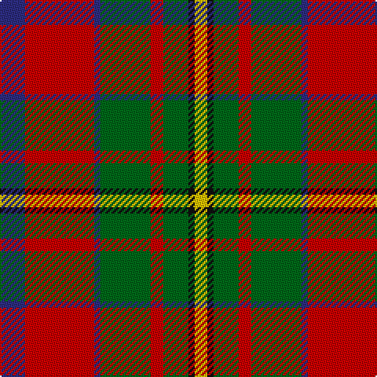

In pattern [BRBGRGKY](/patterns/brbgrgky/).

This was sourced from house-of-tartan.  It is a [8 stripes tartan](/stripes/stripes8/).

Original link http://www.house-of-tartan.scotland.net/house/TartanViewjs.asp?colr=Def&tnam=494

## Thread count
DB/16 R44 DB4 G32 R8 G16 K4 Y/8

## Palette
Each colour and its ΔE from the base-6 reference it is a variant of.

| Colour | Shade | Base | ΔE (OKLab) |
|---|---|---|---|
| DB | <code style="background-color:#2C2C80;">#2C2C80</code> `#2C2C80` | B <code style="background-color:#2A418A;">#2A418A</code> | 0.06 |
| G | <code style="background-color:#006818;">#006818</code> `#006818` | G <code style="background-color:#006100;">#006100</code> | 0.02 |
| K | <code style="background-color:#101010;">#101010</code> `#101010` | K <code style="background-color:#000000;">#000000</code> | 0.17 |
| R | <code style="background-color:#C80000;">#C80000</code> `#C80000` | R <code style="background-color:#CC0000;">#CC0000</code> | 0.01 |
| Y | <code style="background-color:#E8C000;">#E8C000</code> `#E8C000` | Y <code style="background-color:#F2BF00;">#F2BF00</code> | 0.02 |

# Sample pattern

## Nearest tartans

The nearest existing variants by ΔTartan distance.

1. [Craik, of Assington](/setts/s8/b4r11b1g8r2g4k1y2~b304080-g008000-k000000-rc00000-yf0c000~x4/) — ΔT 0.45
1. [Sikh (Corporate)](/setts/s8/r30k4r3k4r3g20b20y4~b14283c-g006818-k101010-rb84c00-ye8c000~x2/) — ΔT 0.74
1. [Caledonian Brewery](/setts/s7/w4g20ga10r25b2r2ga2~b8080d0-g003000-ga008000-rc00000-we0e0e0~x2/) — ΔT 0.77
1. [Connolly Dress (Name)](/setts/s10/g6k2g3k2g6b8r20y2r3g2~b2c2c80-g006818-k101010-rc80000-ye8c000~x2/) — ΔT 0.80
1. [Graham of Montrose Red](/setts/s9/w1k1r10g10k5w5r10k1w1~g006818-k101010-r880000-wa8ace8~x4/) — ΔT 0.84
1. [Craik of Assington (Personal)](/setts/s8/b4r11b1g8r2g4k1y2~b1c0070-g006818-k101010-r880000-yd09800~x4/) — ΔT 0.88
1. [Caledonian Brewery (Corporate)](/setts/s7/w4g20ga10r25b2r2ga2~b0596fa-g002814-ga005020-rdc0000-we0e0e0~x2/) — ΔT 0.91
1. [Caledonian Brewery (Corporate)](/setts/s7/w4g13ga6r16wa2r2ga2~g003820-ga006818-r880000-wc0c0c0-waa8ace8~x2/) — ΔT 0.91
1. [Hynde Artifact Tartan Tartan Number: 976. Earliest known date: 1744 Trews belonging to Sir John Hynde. See products available Copyright © Blair Urquhart, Comrie, 2015](/setts/s11/g14r1g14r7w1r7w1r7b5ba3w1~b202060-ba780078-g006818-rc80000-we0e0e0~x4/) — ΔT 1.00
1. [Sawyer Family Tartan Tartan Number: 2162. Earliest known date: 1994 Information from Dr. Phil Smith, Narvon, USA. See products available Copyright © Blair Urquhart, Comrie, 2015](/setts/s8/g2w1g10b1k4r8ba1r2~b2c2c80-ba5c8ca8-g006818-k101010-rc80000-we0e0e0~x4/) — ΔT 1.02

## Neighbour map

Every grey dot is one of 15726 variants placed by the first two principal components of the ΔTartan feature space (44% of its variance). Red is this tartan; blue dots are its nearest — click one to open its page.

<svg viewBox="0 0 640 380" role="img" style="max-width:100%;height:auto;border:1px solid #e0e0e0;border-radius:4px;display:block" xmlns="http://www.w3.org/2000/svg"><image href="/nn/cloud.v1.png" width="640" height="380"/><a href="/setts/s8/b4r11b1g8r2g4k1y2~b304080-g008000-k000000-rc00000-yf0c000~x4/"><circle cx="187.0" cy="170.1" r="4" fill="#3465a4"><title>Craik, of Assington</title></circle></a><a href="/setts/s8/r30k4r3k4r3g20b20y4~b14283c-g006818-k101010-rb84c00-ye8c000~x2/"><circle cx="193.7" cy="173.2" r="4" fill="#3465a4"><title>Sikh (Corporate)</title></circle></a><a href="/setts/s7/w4g20ga10r25b2r2ga2~b8080d0-g003000-ga008000-rc00000-we0e0e0~x2/"><circle cx="205.8" cy="159.3" r="4" fill="#3465a4"><title>Caledonian Brewery</title></circle></a><a href="/setts/s10/g6k2g3k2g6b8r20y2r3g2~b2c2c80-g006818-k101010-rc80000-ye8c000~x2/"><circle cx="208.5" cy="153.3" r="4" fill="#3465a4"><title>Connolly Dress (Name)</title></circle></a><a href="/setts/s9/w1k1r10g10k5w5r10k1w1~g006818-k101010-r880000-wa8ace8~x4/"><circle cx="197.3" cy="172.0" r="4" fill="#3465a4"><title>Graham of Montrose Red</title></circle></a><a href="/setts/s8/b4r11b1g8r2g4k1y2~b1c0070-g006818-k101010-r880000-yd09800~x4/"><circle cx="207.4" cy="183.9" r="4" fill="#3465a4"><title>Craik of Assington (Personal)</title></circle></a><a href="/setts/s7/w4g20ga10r25b2r2ga2~b0596fa-g002814-ga005020-rdc0000-we0e0e0~x2/"><circle cx="201.5" cy="155.6" r="4" fill="#3465a4"><title>Caledonian Brewery (Corporate)</title></circle></a><a href="/setts/s7/w4g13ga6r16wa2r2ga2~g003820-ga006818-r880000-wc0c0c0-waa8ace8~x2/"><circle cx="183.5" cy="194.8" r="4" fill="#3465a4"><title>Caledonian Brewery (Corporate)</title></circle></a><a href="/setts/s11/g14r1g14r7w1r7w1r7b5ba3w1~b202060-ba780078-g006818-rc80000-we0e0e0~x4/"><circle cx="233.1" cy="151.4" r="4" fill="#3465a4"><title>Hynde Artifact Tartan Tartan Number: 976. Earliest known date: 1744 Trews belonging to Sir John Hynde. See products available Copyright © Blair Urquhart, Comrie, 2015</title></circle></a><a href="/setts/s8/g2w1g10b1k4r8ba1r2~b2c2c80-ba5c8ca8-g006818-k101010-rc80000-we0e0e0~x4/"><circle cx="180.4" cy="154.2" r="4" fill="#3465a4"><title>Sawyer Family Tartan Tartan Number: 2162. Earliest known date: 1994 Information from Dr. Phil Smith, Narvon, USA. See products available Copyright © Blair Urquhart, Comrie, 2015</title></circle></a><circle cx="194.2" cy="172.3" r="5" fill="#c00000"/></svg>

ID: /setts/s8/b4r11b1g8r2g4k1y2~b2c2c80-g006818-k101010-rc80000-ye8c000~x4/
