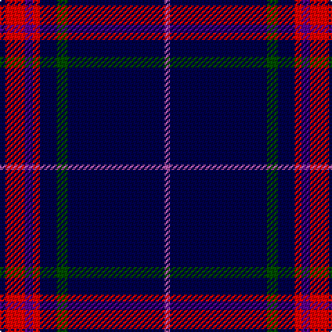

In pattern [BRBRBGBR](/patterns/brbrbgbr/).

This was sourced from register-of-tartans.  It is a [8 stripes tartan](/stripes/stripes8/).

Original link https://www.tartanregister.gov.uk/tartanDetails.aspx?ref=11334

## Thread count
DB/4 R14 P6 R5 DB12 G8 DB70 Pa/4

## Palette
Each colour and its ΔE from the base-6 reference it is a variant of.

| Colour | Shade | Base | ΔE (OKLab) |
|---|---|---|---|
| DB | <code style="background-color:#000048;">#000048</code> `#000048` | B <code style="background-color:#2A418A;">#2A418A</code> | 0.22 |
| G | <code style="background-color:#004C00;">#004C00</code> `#004C00` | G <code style="background-color:#006100;">#006100</code> | 0.07 |
| P | <code style="background-color:#5A008C;">#5A008C</code> `#5A008C` | B <code style="background-color:#2A418A;">#2A418A</code> | 0.13 |
| Pa | <code style="background-color:#B458AC;">#B458AC</code> `#B458AC` | R <code style="background-color:#CC0000;">#CC0000</code> | 0.20 |
| R | <code style="background-color:#FF0000;">#FF0000</code> `#FF0000` | R <code style="background-color:#CC0000;">#CC0000</code> | 0.11 |

# Sample pattern

## Nearest tartans

The nearest existing variants by ΔTartan distance.

1. [Indiana #2](/setts/s8/b50y4b3y4b8k2ba12w5~b141e46-ba2c4084-k101010-we0e0e0-ye8c000~x2/) — ΔT 1.15
1. [Laidlaw's Highland Drovers (Corp)](/setts/s7/b35k10b4w2b3r2y2~b2c2c80-k101010-rc80000-we0e0e0-ye8c000~x2/) — ΔT 1.19
1. [Ailsa, Navy (Fashion)](/setts/s6/k60r3k5r3y18ra3~k00002c-r880000-ra888888-ya0a0a0~x2/) — ΔT 1.29
1. [SPA Association (Corporate)](/setts/s10/w1b5y1b1y1k4b15w1b2y1~b202060-k101010-we0e0e0-ye8c000~x4/) — ΔT 1.32
1. [Oxford University Dress (Corporate)](/setts/s10/y4b44g5w2g2b2g2r2b3y3~b1c0070-g006818-rc8002c-wfcfcfc-yc4bc68~x2/) — ΔT 1.38
1. [Pride of Nova Scotia (Corporate)](/setts/s7/k3y2k36b16k5b2w3~b344454-k00002c-we0e0e0-ybc8c00~x2/) — ΔT 1.41
1. [Ikelman #5 (Personal)](/setts/s12/b15g2b2w1b1w1b1w1b2g2b15r10~b1c0070-g006818-r880000-we0e0e0~x4/) — ΔT 1.44
1. [Warren Wilson College (Corporate)](/setts/s8/g20y6b20ya3b48r6b4r6~b1c0070-g006818-r880000-ya0a0a0-yae8c000~x2/) — ΔT 1.46
1. [Tokyo Bluebells](/setts/s8/b18r1b1r1b1k7b13w2~b304080-k000000-rc00000-we0e0e0~x4/) — ΔT 1.50
1. [Massachusetts-The Bay State](/setts/s13/g6b3g3b11w2b4g2r4b5r2b24ba2b4~b080848-ba0596fa-g005020-rdc0000-wf5dca0~x2/) — ΔT 1.54

## Neighbour map

Every grey dot is one of 15726 variants placed by the first two principal components of the ΔTartan feature space (44% of its variance). Red is this tartan; blue dots are its nearest — click one to open its page.

<svg viewBox="0 0 640 380" role="img" style="max-width:100%;height:auto;border:1px solid #e0e0e0;border-radius:4px;display:block" xmlns="http://www.w3.org/2000/svg"><image href="/nn/cloud.v1.png" width="640" height="380"/><a href="/setts/s8/b50y4b3y4b8k2ba12w5~b141e46-ba2c4084-k101010-we0e0e0-ye8c000~x2/"><circle cx="409.9" cy="125.9" r="4" fill="#3465a4"><title>Indiana #2</title></circle></a><a href="/setts/s7/b35k10b4w2b3r2y2~b2c2c80-k101010-rc80000-we0e0e0-ye8c000~x2/"><circle cx="450.6" cy="154.3" r="4" fill="#3465a4"><title>Laidlaw's Highland Drovers (Corp)</title></circle></a><a href="/setts/s6/k60r3k5r3y18ra3~k00002c-r880000-ra888888-ya0a0a0~x2/"><circle cx="433.6" cy="164.7" r="4" fill="#3465a4"><title>Ailsa, Navy (Fashion)</title></circle></a><a href="/setts/s10/w1b5y1b1y1k4b15w1b2y1~b202060-k101010-we0e0e0-ye8c000~x4/"><circle cx="418.1" cy="152.2" r="4" fill="#3465a4"><title>SPA Association (Corporate)</title></circle></a><a href="/setts/s10/y4b44g5w2g2b2g2r2b3y3~b1c0070-g006818-rc8002c-wfcfcfc-yc4bc68~x2/"><circle cx="426.0" cy="101.1" r="4" fill="#3465a4"><title>Oxford University Dress (Corporate)</title></circle></a><a href="/setts/s7/k3y2k36b16k5b2w3~b344454-k00002c-we0e0e0-ybc8c00~x2/"><circle cx="411.0" cy="178.0" r="4" fill="#3465a4"><title>Pride of Nova Scotia (Corporate)</title></circle></a><a href="/setts/s12/b15g2b2w1b1w1b1w1b2g2b15r10~b1c0070-g006818-r880000-we0e0e0~x4/"><circle cx="400.5" cy="153.7" r="4" fill="#3465a4"><title>Ikelman #5 (Personal)</title></circle></a><a href="/setts/s8/g20y6b20ya3b48r6b4r6~b1c0070-g006818-r880000-ya0a0a0-yae8c000~x2/"><circle cx="348.3" cy="165.0" r="4" fill="#3465a4"><title>Warren Wilson College (Corporate)</title></circle></a><a href="/setts/s8/b18r1b1r1b1k7b13w2~b304080-k000000-rc00000-we0e0e0~x4/"><circle cx="458.1" cy="172.1" r="4" fill="#3465a4"><title>Tokyo Bluebells</title></circle></a><a href="/setts/s13/g6b3g3b11w2b4g2r4b5r2b24ba2b4~b080848-ba0596fa-g005020-rdc0000-wf5dca0~x2/"><circle cx="382.8" cy="158.0" r="4" fill="#3465a4"><title>Massachusetts-The Bay State</title></circle></a><circle cx="408.8" cy="140.4" r="5" fill="#c00000"/></svg>

ID: /setts/s8/b4r14ba6r5b12g8b70ra4~b000048-ba5a008c-g004c00-rff0000-rab458ac/
