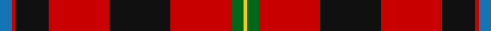

In pattern [BRKRKRGY](/stripes/brkrkrgy/).

This was sourced from tartans-authority.  It is a [8 stripe tartan](/stripes/stripes8/).

Original link http://www.tartansauthority.com/tartan-ferret/display/8512/

## Thread count
B/8 R2 K22 R40 K40 R40 G8 Y/2

## Palette
Each colour and the base-6 reference it is a variant of.

| Colour | Shade | Base |
|---|---|---|
| B | <code style="background-color:#1474B4;">#1474B4</code> `oklch(54.0% 0.129 245.1)` <small>#1474B4</small> | B <code style="background-color:#2A418A;">#2A418A</code> |
| G | <code style="background-color:#006818;">#006818</code> `oklch(45.0% 0.142 145.0)` <small>#006818</small> | G <code style="background-color:#006100;">#006100</code> |
| K | <code style="background-color:#101010;">#101010</code> `oklch(17.3% 0.000 89.9)` <small>#101010</small> | K <code style="background-color:#000000;">#000000</code> |
| R | <code style="background-color:#C80000;">#C80000</code> `oklch(52.3% 0.215 29.2)` <small>#C80000</small> | R <code style="background-color:#CC0000;">#CC0000</code> |
| Y | <code style="background-color:#FCCC00;">#FCCC00</code> `oklch(86.2% 0.176 91.5)` <small>#FCCC00</small> | Y <code style="background-color:#F2BF00;">#F2BF00</code> |

# Sample pattern

## Nearest tartans

The nearest existing variants by ΔTartan distance.

1. [Sturrock](/setts/s7/r52db16k16g22r16ly3r16/) — ΔT 1.05
1. [MacDuff](/setts/s7/r96db16dg34dg48r18k6r9/) — ΔT 1.06
1. [Ulster Ancestry](/setts/s9/do47r8k22r7w3r24do9r10ly3~x2/) — ΔT 1.11
1. [Sinclair](/setts/s10/r30g12k5w2db6r30db12w2k5g12~x2/) — ΔT 1.16
1. [State Seal of Alabama (Fashion)](/setts/s9/r60lo4k22g5k25t8k4r4k4~x2/) — ΔT 1.22
1. [Fraser](/setts/s6/r2db12r2dg12r24w1~x2/) — ΔT 1.25
1. [MacQuarrie LO](/setts/s7/r6dg16r4db12r16lb1r2~x2/) — ΔT 1.27
1. [Wormeck (2013) Germany](/setts/s5/db4lo4r33k30w2~x2/) — ΔT 1.27
1. [MacGleish Formal (Personal)](/setts/s5/r50k25g10o5ly2~x2/) — ΔT 1.29
1. [Thompson/Thomson/MacTavish (Mackinlay)](/setts/s6/r40t11w2k12dg36r32~x2/) — ΔT 1.29

## Neighbour map

Every grey dot is one of 14299 variants placed by the first two principal components of the ΔTartan feature space (44% of its variance). Red is this tartan; blue dots are its nearest — click one to open its page.

<svg viewBox="0 0 640 380" role="img" style="max-width:100%;height:auto;border:1px solid #e0e0e0;border-radius:4px;display:block" xmlns="http://www.w3.org/2000/svg"><image href="/nn/cloud.v1.png" width="640" height="380"/><a href="/setts/s7/r52db16k16g22r16ly3r16/"><circle cx="296.5" cy="164.0" r="4" fill="#3465a4"><title>Sturrock</title></circle></a><a href="/setts/s7/r96db16dg34dg48r18k6r9/"><circle cx="294.1" cy="155.8" r="4" fill="#3465a4"><title>MacDuff</title></circle></a><a href="/setts/s9/do47r8k22r7w3r24do9r10ly3~x2/"><circle cx="228.2" cy="142.3" r="4" fill="#3465a4"><title>Ulster Ancestry</title></circle></a><a href="/setts/s10/r30g12k5w2db6r30db12w2k5g12~x2/"><circle cx="257.7" cy="144.8" r="4" fill="#3465a4"><title>Sinclair</title></circle></a><a href="/setts/s9/r60lo4k22g5k25t8k4r4k4~x2/"><circle cx="279.5" cy="128.1" r="4" fill="#3465a4"><title>State Seal of Alabama (Fashion)</title></circle></a><a href="/setts/s6/r2db12r2dg12r24w1~x2/"><circle cx="322.0" cy="161.5" r="4" fill="#3465a4"><title>Fraser</title></circle></a><a href="/setts/s7/r6dg16r4db12r16lb1r2~x2/"><circle cx="268.3" cy="186.1" r="4" fill="#3465a4"><title>MacQuarrie LO</title></circle></a><a href="/setts/s5/db4lo4r33k30w2~x2/"><circle cx="267.9" cy="163.6" r="4" fill="#3465a4"><title>Wormeck (2013) Germany</title></circle></a><a href="/setts/s5/r50k25g10o5ly2~x2/"><circle cx="322.3" cy="146.3" r="4" fill="#3465a4"><title>MacGleish Formal (Personal)</title></circle></a><a href="/setts/s6/r40t11w2k12dg36r32~x2/"><circle cx="282.9" cy="173.6" r="4" fill="#3465a4"><title>Thompson/Thomson/MacTavish (Mackinlay)</title></circle></a><circle cx="286.4" cy="149.0" r="5" fill="#c00000"/></svg>

ID: /setts/s8/b4r1k11r20k20r20g4ly1~x2/
