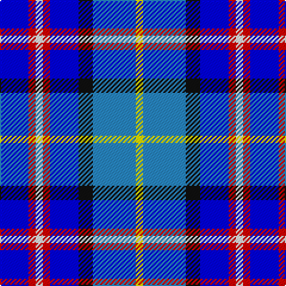

In pattern [BRWRBKBY](/stripes/brwrbkby/).

This was sourced from register-of-tartans.  It is a [8 stripe tartan](/stripes/stripes8/).

Original link https://www.tartanregister.gov.uk/tartanDetails.aspx?ref=5745

## Register references

External register numbers recorded for this tartan.

- Scottish Register of Tartans: [5745](https://www.tartanregister.gov.uk/tartanDetails.aspx?ref=5745)
- Scottish Tartans Authority (ITI): 7770

## Thread count
B/24 R6 W6 R6 B24 K12 Ba36 Y/6

## Palette
Each colour and the base-6 reference it is a variant of.

| Colour | Shade | Base |
|---|---|---|
| B | <code style="background-color:#0000FF;">#0000FF</code> `oklch(45.2% 0.313 264.1)` <small>#0000FF</small> | B <code style="background-color:#2A418A;">#2A418A</code> |
| Ba | <code style="background-color:#2888C4;">#2888C4</code> `oklch(60.1% 0.125 241.5)` <small>#2888C4</small> | B <code style="background-color:#2A418A;">#2A418A</code> |
| K | <code style="background-color:#101010;">#101010</code> `oklch(17.3% 0.000 89.9)` <small>#101010</small> | K <code style="background-color:#000000;">#000000</code> |
| R | <code style="background-color:#DC0000;">#DC0000</code> `oklch(56.2% 0.230 29.2)` <small>#DC0000</small> | R <code style="background-color:#CC0000;">#CC0000</code> |
| W | <code style="background-color:#FFFFFF;">#FFFFFF</code> `oklch(100.0% 0.000 89.9)` <small>#FFFFFF</small> | W <code style="background-color:#F7F7F7;">#F7F7F7</code> |
| Y | <code style="background-color:#FFFF00;">#FFFF00</code> `oklch(96.8% 0.211 109.8)` <small>#FFFF00</small> | Y <code style="background-color:#F2BF00;">#F2BF00</code> |

# Sample pattern

## Nearest tartans

The nearest existing variants by ΔTartan distance.

1. [Ballater](/setts/s10/db3t1db6r2b6k1r1k1b6r3~x4/) — ΔT 1.53
1. [Hummelt, Katherine (Personal)](/setts/s8/db11dg10y6db7lt2db3dp10lt2~x2/) — ΔT 1.59
1. [American Express](/setts/s6/db2b9r1db5g5lb2~x4/) — ΔT 1.61
1. [American Express Corporate Tartan Tartan Number: 2354. Earliest known date: April 1997 American Express began operating in Glasgow in 1903 and in 1920 acquired WA Williamson Ltd of Glasgow. This tartan (commissioned by VP Donald Daly) was designed for the 1997 American Association of Travel Agents conference in Glasgow and based on the MacWilliam tartan. For more details see archives. See products available Copyright © Blair Urquhart, Comrie, 2015](/setts/s10/b9r1db5g5lb2g5db5r1b9db2~x4/) — ΔT 1.64
1. [EAIE 2015](/setts/s10/b4g1b2g2lr6g2k3r1b8w1~x2/) — ΔT 1.77
1. [Greer (Name?)](/setts/s8/t16db3t3o3t3db10r12w4~x2/) — ΔT 1.81
1. [Bryson (1988)](/setts/s5/y16r8b57db56lb8/) — ΔT 1.81
1. [Shanghai Scottish](/setts/s11/w4lt13db5lt8db27lt15db16r3db3r23ly4/) — ΔT 1.82
1. [Lopatinsky (Personal)](/setts/s10/db24r6w6r6w6r6db25k12b36ly6/) — ΔT 1.83
1. [Manchester City Football Club "Blue](/setts/s11/db4b13r2db2k2db2w5db2ly2db2b2~x2/) — ΔT 1.86

## Neighbour map

Every grey dot is one of 14299 variants placed by the first two principal components of the ΔTartan feature space (44% of its variance). Red is this tartan; blue dots are its nearest — click one to open its page.

<svg viewBox="0 0 640 380" role="img" style="max-width:100%;height:auto;border:1px solid #e0e0e0;border-radius:4px;display:block" xmlns="http://www.w3.org/2000/svg"><image href="/nn/cloud.v1.png" width="640" height="380"/><a href="/setts/s10/db3t1db6r2b6k1r1k1b6r3~x4/"><circle cx="133.6" cy="200.8" r="4" fill="#3465a4"><title>Ballater</title></circle></a><a href="/setts/s8/db11dg10y6db7lt2db3dp10lt2~x2/"><circle cx="108.6" cy="230.6" r="4" fill="#3465a4"><title>Hummelt, Katherine (Personal)</title></circle></a><a href="/setts/s6/db2b9r1db5g5lb2~x4/"><circle cx="129.3" cy="208.4" r="4" fill="#3465a4"><title>American Express</title></circle></a><a href="/setts/s10/b9r1db5g5lb2g5db5r1b9db2~x4/"><circle cx="136.6" cy="194.6" r="4" fill="#3465a4"><title>American Express Corporate Tartan Tartan Number: 2354. Earliest known date: April 1997 American Express began operating in Glasgow in 1903 and in 1920 acquired WA Williamson Ltd of Glasgow. This tartan (commissioned by VP Donald Daly) was designed for the 1997 American Association of Travel Agents conference in Glasgow and based on the MacWilliam tartan. For more details see archives. See products available Copyright © Blair Urquhart, Comrie, 2015</title></circle></a><a href="/setts/s10/b4g1b2g2lr6g2k3r1b8w1~x2/"><circle cx="140.7" cy="161.5" r="4" fill="#3465a4"><title>EAIE 2015</title></circle></a><a href="/setts/s8/t16db3t3o3t3db10r12w4~x2/"><circle cx="124.6" cy="203.5" r="4" fill="#3465a4"><title>Greer (Name?)</title></circle></a><a href="/setts/s5/y16r8b57db56lb8/"><circle cx="177.2" cy="220.1" r="4" fill="#3465a4"><title>Bryson (1988)</title></circle></a><a href="/setts/s11/w4lt13db5lt8db27lt15db16r3db3r23ly4/"><circle cx="49.1" cy="138.0" r="4" fill="#3465a4"><title>Shanghai Scottish</title></circle></a><a href="/setts/s10/db24r6w6r6w6r6db25k12b36ly6/"><circle cx="91.4" cy="167.4" r="4" fill="#3465a4"><title>Lopatinsky (Personal)</title></circle></a><a href="/setts/s11/db4b13r2db2k2db2w5db2ly2db2b2~x2/"><circle cx="112.2" cy="148.3" r="4" fill="#3465a4"><title>Manchester City Football Club &quot;Blue</title></circle></a><circle cx="92.4" cy="181.2" r="5" fill="#c00000"/></svg>

ID: /setts/s8/b4r1w1r1b4k2t6ly1~x6/
