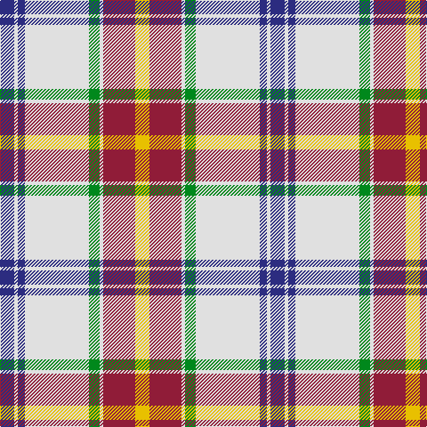

In pattern [BWBWGWRY](/patterns/bwbwgwry/).

This was sourced from tartans-authority.  It is a [8 stripes tartan](/stripes/stripes8/).

Original link http://www.tartansauthority.com/tartan-ferret/display/7697/

## Attestations

This cloth appears in 2 source records; the oldest owns this page.

- 1958 — Manitoba Dress (1958) (District) (tartans-authority, [record](http://www.tartansauthority.com/tartan-ferret/display/7697/))
- undated — Manitoba Dress (1958) (register-of-tartans, [record](https://www.tartanregister.gov.uk/tartanDetails.aspx?ref=5694))

## Register references

External register numbers recorded for this tartan.

- Scottish Register of Tartans: [5694](https://www.tartanregister.gov.uk/tartanDetails.aspx?ref=5694)
- Scottish Tartans Authority (ITI): 7697

## Thread count
DB/16 LN4 DB8 LN72 G12 LN4 DR36 Y/16

## Palette
Each colour and its ΔE from the base-6 reference it is a variant of.

| Colour | Shade | Base | ΔE (OKLab) |
|---|---|---|---|
| DB | <code style="background-color:#2C2C80;">#2C2C80</code> `#2C2C80` | B <code style="background-color:#2A418A;">#2A418A</code> | 0.06 |
| DR | <code style="background-color:#901C38;">#901C38</code> `#901C38` | R <code style="background-color:#CC0000;">#CC0000</code> | 0.13 |
| G | <code style="background-color:#00881C;">#00881C</code> `#00881C` | G <code style="background-color:#006100;">#006100</code> | 0.12 |
| LN | <code style="background-color:#E0E0E0;">#E0E0E0</code> `#E0E0E0` | W <code style="background-color:#F7F7F7;">#F7F7F7</code> | 0.07 |
| Y | <code style="background-color:#E8C000;">#E8C000</code> `#E8C000` | Y <code style="background-color:#F2BF00;">#F2BF00</code> | 0.02 |

# Sample pattern

## Nearest tartans

The nearest existing variants by ΔTartan distance.

1. [Shiel, Magenta (Dance)](/setts/s7/w8b5ba10bb24w30b2g2~b9080b8-ba7490a4-bb542850-g003820-wf0e0c8~x2/) — ΔT 0.73
1. [Shiel, Purple (Dance)](/setts/s7/w8g5b10ba24w30g2wa2~b5c8ca8-ba440044-g006818-wf0e0c8-wac49cd8~x2/) — ΔT 0.85
1. [Shiel, Purple V2 (Dance)](/setts/s7/w8g5b10ba24w30g2wa2~b440044-ba5c8ca8-g006818-wf0e0c8-wac49cd8~x2/) — ΔT 0.91
1. [MacDuff Dress #5](/setts/s7/w39b9k10g11r7k3r7~b2c4084-g005020-k101010-rdc0000-we0e0e0~x2/) — ΔT 1.01
1. [MacDuff Dress Clan Tartan Tartan Number: 1601. Earliest known date: pre 2003 From Scott Adie pattern. See products available Copyright © Blair Urquhart, Comrie, 2015](/setts/s7/w39b9k10g11r7k3r7~b2c2c80-g006818-k101010-rc80000-we0e0e0~x2/) — ΔT 1.02
1. [Lalage (Personal)](/setts/s8/w4k13w17y2r2y24w2wa2~k101010-rdc0000-wdcecf4-waf8f8f8-ya08858~x2/) — ΔT 1.08
1. [Lalage (Personal)](/setts/s8/w4k13w17y2r2y24w2wa2~k101010-rc80000-wdcecf4-waf8f8f8-ya08858~x2/) — ΔT 1.09
1. [Glenmore Pink](/setts/s11/w60b24r3b5w3b5ra16r8k3r6w4~b1c1c1c-k101010-r888888-ra946880-wf8e8d8/) — ΔT 1.10
1. [Henderson Dress](/setts/s9/w1b6w4b1w16k1g4k6y1~b8080d0-g008000-k000000-we0e0e0-yf0c000~x2/) — ΔT 1.16
1. [Ben Vorlich](/setts/s11/w68y3w3y8w3y3r24b16ra3b20y3~b1c1c1c-r858585-ra70000c-we0e0e0-yb8b8b8~x2/) — ΔT 1.17

## Neighbour map

Every grey dot is one of 15726 variants placed by the first two principal components of the ΔTartan feature space (44% of its variance). Red is this tartan; blue dots are its nearest — click one to open its page.

<svg viewBox="0 0 640 380" role="img" style="max-width:100%;height:auto;border:1px solid #e0e0e0;border-radius:4px;display:block" xmlns="http://www.w3.org/2000/svg"><image href="/nn/cloud.v1.png" width="640" height="380"/><a href="/setts/s7/w8b5ba10bb24w30b2g2~b9080b8-ba7490a4-bb542850-g003820-wf0e0c8~x2/"><circle cx="206.7" cy="143.5" r="4" fill="#3465a4"><title>Shiel, Magenta (Dance)</title></circle></a><a href="/setts/s7/w8g5b10ba24w30g2wa2~b5c8ca8-ba440044-g006818-wf0e0c8-wac49cd8~x2/"><circle cx="196.8" cy="141.5" r="4" fill="#3465a4"><title>Shiel, Purple (Dance)</title></circle></a><a href="/setts/s7/w8g5b10ba24w30g2wa2~b440044-ba5c8ca8-g006818-wf0e0c8-wac49cd8~x2/"><circle cx="206.6" cy="146.6" r="4" fill="#3465a4"><title>Shiel, Purple V2 (Dance)</title></circle></a><a href="/setts/s7/w39b9k10g11r7k3r7~b2c4084-g005020-k101010-rdc0000-we0e0e0~x2/"><circle cx="169.2" cy="142.6" r="4" fill="#3465a4"><title>MacDuff Dress #5</title></circle></a><a href="/setts/s7/w39b9k10g11r7k3r7~b2c2c80-g006818-k101010-rc80000-we0e0e0~x2/"><circle cx="168.7" cy="143.0" r="4" fill="#3465a4"><title>MacDuff Dress Clan Tartan Tartan Number: 1601. Earliest known date: pre 2003 From Scott Adie pattern. See products available Copyright © Blair Urquhart, Comrie, 2015</title></circle></a><a href="/setts/s8/w4k13w17y2r2y24w2wa2~k101010-rdc0000-wdcecf4-waf8f8f8-ya08858~x2/"><circle cx="164.4" cy="136.9" r="4" fill="#3465a4"><title>Lalage (Personal)</title></circle></a><a href="/setts/s8/w4k13w17y2r2y24w2wa2~k101010-rc80000-wdcecf4-waf8f8f8-ya08858~x2/"><circle cx="164.4" cy="137.0" r="4" fill="#3465a4"><title>Lalage (Personal)</title></circle></a><a href="/setts/s11/w60b24r3b5w3b5ra16r8k3r6w4~b1c1c1c-k101010-r888888-ra946880-wf8e8d8/"><circle cx="227.4" cy="83.4" r="4" fill="#3465a4"><title>Glenmore Pink</title></circle></a><a href="/setts/s9/w1b6w4b1w16k1g4k6y1~b8080d0-g008000-k000000-we0e0e0-yf0c000~x2/"><circle cx="214.7" cy="118.6" r="4" fill="#3465a4"><title>Henderson Dress</title></circle></a><a href="/setts/s11/w68y3w3y8w3y3r24b16ra3b20y3~b1c1c1c-r858585-ra70000c-we0e0e0-yb8b8b8~x2/"><circle cx="231.3" cy="80.4" r="4" fill="#3465a4"><title>Ben Vorlich</title></circle></a><circle cx="211.0" cy="117.9" r="5" fill="#c00000"/></svg>

ID: /setts/s8/b4w1b2w18g3w1r9y4~b2c2c80-g00881c-r901c38-we0e0e0-ye8c000~x4/
