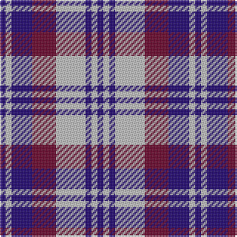

In pattern [BWBBWBWB](/patterns/bwbbwbwb/).

This was sourced from register-of-tartans.  It is a [8 stripes tartan](/stripes/stripes8/).

Original link https://www.tartanregister.gov.uk/tartanDetails.aspx?ref=2063

## Attestations

This cloth appears in 2 source records; the oldest owns this page.

- 01/01/1988 — Laval Dress, Tartan de (register-of-tartans, [record](https://www.tartanregister.gov.uk/tartanDetails.aspx?ref=2063))
- 1988 — Laval Dress, Tartan de (District) (tartans-authority, [record](http://www.tartansauthority.com/tartan-ferret/display/2121/))

## Thread count
DB/4 N4 DB14 DR16 N20 DB4 N4 DB/4

## Palette
Each colour and its ΔE from the base-6 reference it is a variant of.

| Colour | Shade | Base | ΔE (OKLab) |
|---|---|---|---|
| DB | <code style="background-color:#1C0070;">#1C0070</code> `#1C0070` | B <code style="background-color:#2C4084;">#2C4084</code> | 0.14 |
| DR | <code style="background-color:#680028;">#680028</code> `#680028` | B <code style="background-color:#2C4084;">#2C4084</code> | 0.20 |
| N | <code style="background-color:#C0C0C0;">#C0C0C0</code> `#C0C0C0` | W <code style="background-color:#F4F4F0;">#F4F4F0</code> | 0.16 |

# Sample pattern

ID: /setts/s8/b4w4b14ba16w20b4w4b4-b1c0070-ba680028-wc0c0c0/
