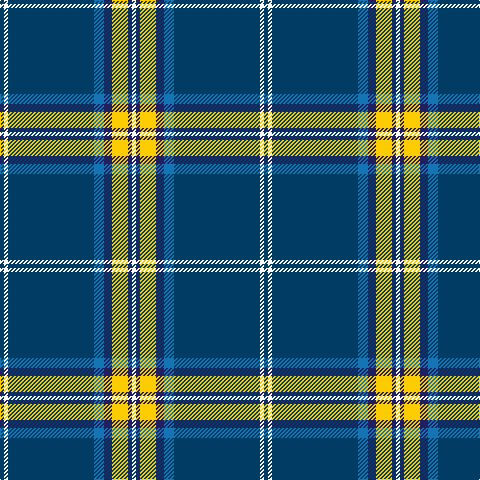

In pattern [BWBBBYBW](/patterns/bwbbbybw/).

This was sourced from tartans-authority.  It is a [8 stripes tartan](/stripes/stripes8/).

Original link http://www.tartansauthority.com/tartan-ferret/display/4534/

## Thread count
DB/4 W4 DB86 B10 DBa8 Y16 DBa4 W/4

## Palette
Each colour and its ΔE from the base-6 reference it is a variant of.

| Colour | Shade | Base | ΔE (OKLab) |
|---|---|---|---|
| B | <code style="background-color:#1474B4;">#1474B4</code> `#1474B4` | B <code style="background-color:#2C4084;">#2C4084</code> | 0.15 |
| DB | <code style="background-color:#003C64;">#003C64</code> `#003C64` | B <code style="background-color:#2C4084;">#2C4084</code> | 0.07 |
| DBa | <code style="background-color:#202060;">#202060</code> `#202060` | B <code style="background-color:#2C4084;">#2C4084</code> | 0.11 |
| W | <code style="background-color:#FCFCFC;">#FCFCFC</code> `#FCFCFC` | W <code style="background-color:#F4F4F0;">#F4F4F0</code> | 0.03 |
| Y | <code style="background-color:#FCCC00;">#FCCC00</code> `#FCCC00` | Y <code style="background-color:#E8C000;">#E8C000</code> | 0.04 |

# Sample pattern

## Nearest tartans

The nearest existing variants by ΔTartan distance.

1. [Leblant-Macqueron (Personal)](/setts/s7/y10k12w4g14w4b88w4-b003c64-g23321b-k000000-wf9f5ef-yccbaaf/) — ΔT 0.63
1. [Fife Flyers](/setts/s8/b4w4b86ba10bb8k16bb4w4-b003c64-ba1474b4-bb202060-k000000-wfcfcfc/) — ΔT 1.07
1. [Indiana #2](/setts/s8/b100y8b6y8b16k4ba24w10-b141e46-ba2c4084-k101010-we0e0e0-ye8c000/) — ΔT 1.16
1. [X Marks the Scot](/setts/s10/w12b64r6b6r2b6r4ba8b2y4-b202060-ba2c2c80-r888888-we0e0e0-ye8c000/) — ΔT 1.33
1. [Oliver, hunting](/setts/s9/b80g6b4g24k4g4y4g4k6-b304080-g008000-k000000-yf0c000/) — ΔT 1.33
1. [Mullikin (2013)](/setts/s8/r10w8y12b4g86b4y8r6-b000080-g003820-rc80000-wffffff-y48a4c0/) — ΔT 1.36
1. [Bundanoon](/setts/s9/b34r6g110b6g8b6g8y6w10-b2c2c80-g003820-rc80000-wfcfcfc-ye8c000/) — ΔT 1.37
1. [Parr](/setts/s10/b106r3b4r6b8k28g8w4g12k8-b1474b4-g408060-k101010-rc80000-we8ccb8/) — ΔT 1.38
1. [Tartan Day SA (Corporate)](/setts/s8/w4b80g44y6g4r6g4w4-b1c0070-g006818-rc80000-we0e0e0-ye8c000/) — ΔT 1.39
1. [Royal Troon Golf Club, The](/setts/s8/y6b68g10w4g4w20b8ya6-b2c2c80-g003820-wfcfcfc-ye8c000-yafcb464/) — ΔT 1.39

## Neighbour map

Every grey dot is one of 15726 variants placed by the first two principal components of the ΔTartan feature space (44% of its variance). Red is this tartan; blue dots are its nearest — click one to open its page.

<svg viewBox="0 0 640 380" role="img" style="max-width:100%;height:auto;border:1px solid #e0e0e0;border-radius:4px;display:block" xmlns="http://www.w3.org/2000/svg"><image href="/nn/cloud.v1.png" width="640" height="380"/><a href="/setts/s7/y10k12w4g14w4b88w4-b003c64-g23321b-k000000-wf9f5ef-yccbaaf/"><circle cx="360.2" cy="122.0" r="4" fill="#3465a4"><title>Leblant-Macqueron (Personal)</title></circle></a><a href="/setts/s8/b4w4b86ba10bb8k16bb4w4-b003c64-ba1474b4-bb202060-k000000-wfcfcfc/"><circle cx="391.0" cy="125.1" r="4" fill="#3465a4"><title>Fife Flyers</title></circle></a><a href="/setts/s8/b100y8b6y8b16k4ba24w10-b141e46-ba2c4084-k101010-we0e0e0-ye8c000/"><circle cx="408.8" cy="121.9" r="4" fill="#3465a4"><title>Indiana #2</title></circle></a><a href="/setts/s10/w12b64r6b6r2b6r4ba8b2y4-b202060-ba2c2c80-r888888-we0e0e0-ye8c000/"><circle cx="410.2" cy="89.9" r="4" fill="#3465a4"><title>X Marks the Scot</title></circle></a><a href="/setts/s9/b80g6b4g24k4g4y4g4k6-b304080-g008000-k000000-yf0c000/"><circle cx="393.7" cy="136.2" r="4" fill="#3465a4"><title>Oliver, hunting</title></circle></a><a href="/setts/s8/r10w8y12b4g86b4y8r6-b000080-g003820-rc80000-wffffff-y48a4c0/"><circle cx="350.5" cy="114.0" r="4" fill="#3465a4"><title>Mullikin (2013)</title></circle></a><a href="/setts/s9/b34r6g110b6g8b6g8y6w10-b2c2c80-g003820-rc80000-wfcfcfc-ye8c000/"><circle cx="388.0" cy="128.4" r="4" fill="#3465a4"><title>Bundanoon</title></circle></a><a href="/setts/s10/b106r3b4r6b8k28g8w4g12k8-b1474b4-g408060-k101010-rc80000-we8ccb8/"><circle cx="397.6" cy="94.3" r="4" fill="#3465a4"><title>Parr</title></circle></a><a href="/setts/s8/w4b80g44y6g4r6g4w4-b1c0070-g006818-rc80000-we0e0e0-ye8c000/"><circle cx="298.7" cy="122.8" r="4" fill="#3465a4"><title>Tartan Day SA (Corporate)</title></circle></a><a href="/setts/s8/y6b68g10w4g4w20b8ya6-b2c2c80-g003820-wfcfcfc-ye8c000-yafcb464/"><circle cx="300.2" cy="117.9" r="4" fill="#3465a4"><title>Royal Troon Golf Club, The</title></circle></a><circle cx="374.0" cy="112.6" r="5" fill="#c00000"/></svg>

ID: /setts/s8/b4w4b86ba10bb8y16bb4w4-b003c64-ba1474b4-bb202060-wfcfcfc-yfccc00/
