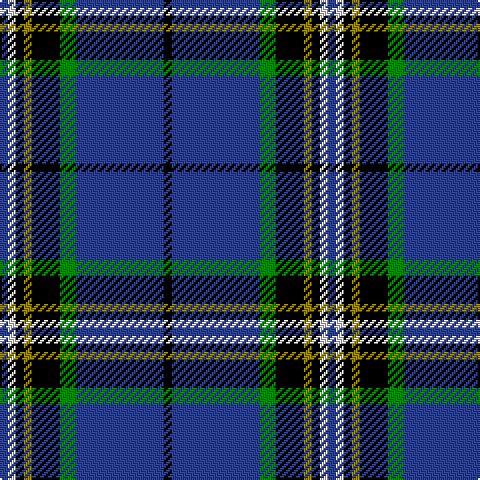

In pattern [BWKGKGBK](/patterns/bwkgkgbk/).

This was sourced from weddslist.  It is a [8 stripes tartan](/stripes/stripes8/).

Original link http://www.weddslist.com/cgi-bin/tartans/pg.pl?source=sts

## Thread count
B/4 LN4 K4 LG4 K14 G8 B44 K/4

## Palette
Each colour and its ΔE from the base-6 reference it is a variant of.

| Colour | Shade | Base | ΔE (OKLab) |
|---|---|---|---|
| B | <code style="background-color:#304080;">#304080</code> `#304080` | B <code style="background-color:#2A418A;">#2A418A</code> | 0.02 |
| G | <code style="background-color:#008000;">#008000</code> `#008000` | G <code style="background-color:#006100;">#006100</code> | 0.10 |
| K | <code style="background-color:#000000;">#000000</code> `#000000` | K <code style="background-color:#000000;">#000000</code> | 0.00 |
| LG | <code style="background-color:#908000;">#908000</code> `#908000` | G <code style="background-color:#006100;">#006100</code> | 0.20 |
| LN | <code style="background-color:#E0E0E0;">#E0E0E0</code> `#E0E0E0` | W <code style="background-color:#F7F7F7;">#F7F7F7</code> | 0.07 |

# Sample pattern

## Nearest tartans

The nearest existing variants by ΔTartan distance.

1. [East Tennessee State University](/setts/s7/y4w2b12w2ya4k34ya2-b202060-k00002c-wfcfcfc-yd09800-yafccc00/) — ΔT 0.95
1. [Glasgow, University of](/setts/s8/b4w4k4y4k14g8b44k4-b2c2c80-g006818-k101010-we0e0e0-ybc8c00/) — ΔT 1.02
1. [East Tennessee State University](/setts/s8/y4b4w2ba12w2ya4b34ya2-b000048-ba1c0070-wffffff-ybc8c00-yafccc00/) — ΔT 1.13
1. [Tartan Day SA (Corporate)](/setts/s8/w4b80g44y6g4r6g4w4-b1c0070-g006818-rc80000-we0e0e0-ye8c000/) — ΔT 1.14
1. [Mensa](/setts/s7/w6k38b48r4b4y4b4-b1c1c50-k000000-rc82828-w98c8e8-yfcc000/) — ΔT 1.15
1. [Croy, Jake (Personal)](/setts/s8/b20k14w4wa4k54ba14w4ba14-b505050-ba1870a4-k1c1714-w82cffd-wae8ccb8/) — ΔT 1.19
1. [Tartan Day SA](/setts/s8/w4k80g44y6g4r6g4w4-g004600-k000037-rbd0000-wffffff-yffa000/) — ΔT 1.22
1. [Rhys (Welsh Name)](/setts/s10/y6b3y3b15ba7y7ba5y17ba46y4-b202060-ba000048-ya08858/) — ΔT 1.28
1. [Reese (Personal)](/setts/s6/r16g8r8k20b88w8-b003c64-g006818-k101010-rc80000-we0e0e0/) — ΔT 1.28
1. [Ewbank](/setts/s9/r6b28y4k4b28k72y4k4y4-b1474b4-k101010-rc80000-ye8c000/) — ΔT 1.30

## Neighbour map

Every grey dot is one of 15726 variants placed by the first two principal components of the ΔTartan feature space (44% of its variance). Red is this tartan; blue dots are its nearest — click one to open its page.

<svg viewBox="0 0 640 380" role="img" style="max-width:100%;height:auto;border:1px solid #e0e0e0;border-radius:4px;display:block" xmlns="http://www.w3.org/2000/svg"><image href="/nn/cloud.v1.png" width="640" height="380"/><a href="/setts/s7/y4w2b12w2ya4k34ya2-b202060-k00002c-wfcfcfc-yd09800-yafccc00/"><circle cx="278.8" cy="132.2" r="4" fill="#3465a4"><title>East Tennessee State University</title></circle></a><a href="/setts/s8/b4w4k4y4k14g8b44k4-b2c2c80-g006818-k101010-we0e0e0-ybc8c00/"><circle cx="298.8" cy="162.9" r="4" fill="#3465a4"><title>Glasgow, University of</title></circle></a><a href="/setts/s8/y4b4w2ba12w2ya4b34ya2-b000048-ba1c0070-wffffff-ybc8c00-yafccc00/"><circle cx="297.0" cy="128.9" r="4" fill="#3465a4"><title>East Tennessee State University</title></circle></a><a href="/setts/s8/w4b80g44y6g4r6g4w4-b1c0070-g006818-rc80000-we0e0e0-ye8c000/"><circle cx="298.7" cy="122.8" r="4" fill="#3465a4"><title>Tartan Day SA (Corporate)</title></circle></a><a href="/setts/s7/w6k38b48r4b4y4b4-b1c1c50-k000000-rc82828-w98c8e8-yfcc000/"><circle cx="273.7" cy="163.7" r="4" fill="#3465a4"><title>Mensa</title></circle></a><a href="/setts/s8/b20k14w4wa4k54ba14w4ba14-b505050-ba1870a4-k1c1714-w82cffd-wae8ccb8/"><circle cx="263.0" cy="166.5" r="4" fill="#3465a4"><title>Croy, Jake (Personal)</title></circle></a><a href="/setts/s8/w4k80g44y6g4r6g4w4-g004600-k000037-rbd0000-wffffff-yffa000/"><circle cx="297.5" cy="126.2" r="4" fill="#3465a4"><title>Tartan Day SA</title></circle></a><a href="/setts/s10/y6b3y3b15ba7y7ba5y17ba46y4-b202060-ba000048-ya08858/"><circle cx="281.0" cy="156.5" r="4" fill="#3465a4"><title>Rhys (Welsh Name)</title></circle></a><a href="/setts/s6/r16g8r8k20b88w8-b003c64-g006818-k101010-rc80000-we0e0e0/"><circle cx="319.3" cy="174.5" r="4" fill="#3465a4"><title>Reese (Personal)</title></circle></a><a href="/setts/s9/r6b28y4k4b28k72y4k4y4-b1474b4-k101010-rc80000-ye8c000/"><circle cx="304.7" cy="141.9" r="4" fill="#3465a4"><title>Ewbank</title></circle></a><circle cx="271.9" cy="153.0" r="5" fill="#c00000"/></svg>

ID: /setts/s8/b4w4k4g4k14ga8b44k4-b304080-g908000-ga008000-k000000-we0e0e0/
