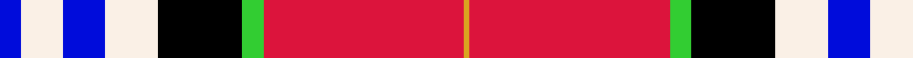
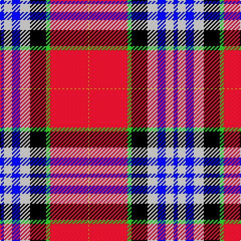

In pattern [BWBWKYRY](/patterns/bwbwkyry/).

This was sourced from register-of-tartans.  It is a [8 stripes tartan](/stripes/stripes8/).

Original link https://www.tartanregister.gov.uk/tartanDetails.aspx?ref=10005

## Thread count
B/4 W8 B8 W10 K16 G4 R38 Y/1

## Palette
Each colour and its ΔE from the base-6 reference it is a variant of.

| Colour | Shade | Base | ΔE (OKLab) |
|---|---|---|---|
| B | <code style="background-color:#000CDB;">#000CDB</code> `#000CDB` | B <code style="background-color:#2A418A;">#2A418A</code> | 0.15 |
| G | <code style="background-color:#32CD32;">#32CD32</code> `#32CD32` | Y <code style="background-color:#F2BF00;">#F2BF00</code> | 0.21 |
| K | <code style="background-color:#000000;">#000000</code> `#000000` | K <code style="background-color:#000000;">#000000</code> | 0.00 |
| R | <code style="background-color:#DC143C;">#DC143C</code> `#DC143C` | R <code style="background-color:#CC0000;">#CC0000</code> | 0.05 |
| W | <code style="background-color:#FAF0E6;">#FAF0E6</code> `#FAF0E6` | W <code style="background-color:#F7F7F7;">#F7F7F7</code> | 0.02 |
| Y | <code style="background-color:#DAA520;">#DAA520</code> `#DAA520` | Y <code style="background-color:#F2BF00;">#F2BF00</code> | 0.08 |

# Sample pattern

## Nearest tartans

The nearest existing variants by ΔTartan distance.

1. [Lermontov](/setts/s9/b4w4b48r18ra58y16k4y2k4-b202060-k101010-r888888-rac80000-we0e0e0-ye8c000/) — ΔT 1.29
1. [McKnight Dress #2 (Personal)](/setts/s8/b16y4w40r112b100k40ba20k12-b2c2c80-ba2888c4-k101010-rc80000-wfcfcfc-ye8c000/) — ΔT 1.31
1. [Bro-sant-Malou](/setts/s6/g6y2w22b32r48k6-b1c3054-g006818-k101010-rc83c28-wf8f8f8-yd8c800/) — ΔT 1.31
1. [S.O.B.H.D. (Corporate)](/setts/s8/r6w60b20k6ba30g4ba6g2-b2c3c98-ba640064-g208414-k101010-rc80000-wf0e4cc/) — ΔT 1.38
1. [Scotland's Charity Air Ambulance](/setts/s9/w4b54k2g6k2ba20k2r48w4-b3850c8-ba646464-g289c18-k101010-rff0000-wffffff/) — ΔT 1.50
1. [SOBHD](/setts/s8/r6w60b20k6ba30g4ba6g2-b2c3c98-ba640064-g208414-k101010-rc80000-we0e0e0/) — ΔT 1.54
1. [Rosevear](/setts/s9/r100y8w32b4w8b4w30g54ra8-b2c2c80-g006818-r901c38-rac80000-we0e0e0-ye8c000/) — ΔT 1.54
1. [Edinburgh Napier University (Corp.)](/setts/s8/b8w8b8w10k16g4r38y2-b5c8ca8-g289c18-k101010-rc80000-wf0e4cc-ybc8c00/) — ΔT 1.56
1. [Clyde Family (Hurleford) (Personal)](/setts/s7/r64k30g30b18w4b2w3-b271b86-g649848-k1c1714-rca2625-wf7f1e8/) — ΔT 1.58
1. [Clinton Wedding](/setts/s12/w10b12r40k12ba10k6b52r4y2r4b6w6-b082c54-ba486488-k101010-re01c18-we8e8e8-yf4bc3c/) — ΔT 1.63

## Neighbour map

Every grey dot is one of 15726 variants placed by the first two principal components of the ΔTartan feature space (44% of its variance). Red is this tartan; blue dots are its nearest — click one to open its page.

<svg viewBox="0 0 640 380" role="img" style="max-width:100%;height:auto;border:1px solid #e0e0e0;border-radius:4px;display:block" xmlns="http://www.w3.org/2000/svg"><image href="/nn/cloud.v1.png" width="640" height="380"/><a href="/setts/s9/b4w4b48r18ra58y16k4y2k4-b202060-k101010-r888888-rac80000-we0e0e0-ye8c000/"><circle cx="190.7" cy="81.7" r="4" fill="#3465a4"><title>Lermontov</title></circle></a><a href="/setts/s8/b16y4w40r112b100k40ba20k12-b2c2c80-ba2888c4-k101010-rc80000-wfcfcfc-ye8c000/"><circle cx="149.1" cy="102.4" r="4" fill="#3465a4"><title>McKnight Dress #2 (Personal)</title></circle></a><a href="/setts/s6/g6y2w22b32r48k6-b1c3054-g006818-k101010-rc83c28-wf8f8f8-yd8c800/"><circle cx="179.3" cy="118.9" r="4" fill="#3465a4"><title>Bro-sant-Malou</title></circle></a><a href="/setts/s8/r6w60b20k6ba30g4ba6g2-b2c3c98-ba640064-g208414-k101010-rc80000-wf0e4cc/"><circle cx="200.5" cy="76.1" r="4" fill="#3465a4"><title>S.O.B.H.D. (Corporate)</title></circle></a><a href="/setts/s9/w4b54k2g6k2ba20k2r48w4-b3850c8-ba646464-g289c18-k101010-rff0000-wffffff/"><circle cx="200.7" cy="76.1" r="4" fill="#3465a4"><title>Scotland's Charity Air Ambulance</title></circle></a><a href="/setts/s8/r6w60b20k6ba30g4ba6g2-b2c3c98-ba640064-g208414-k101010-rc80000-we0e0e0/"><circle cx="201.8" cy="77.8" r="4" fill="#3465a4"><title>SOBHD</title></circle></a><a href="/setts/s9/r100y8w32b4w8b4w30g54ra8-b2c2c80-g006818-r901c38-rac80000-we0e0e0-ye8c000/"><circle cx="191.3" cy="85.6" r="4" fill="#3465a4"><title>Rosevear</title></circle></a><a href="/setts/s8/b8w8b8w10k16g4r38y2-b5c8ca8-g289c18-k101010-rc80000-wf0e4cc-ybc8c00/"><circle cx="159.1" cy="108.8" r="4" fill="#3465a4"><title>Edinburgh Napier University (Corp.)</title></circle></a><a href="/setts/s7/r64k30g30b18w4b2w3-b271b86-g649848-k1c1714-rca2625-wf7f1e8/"><circle cx="228.0" cy="117.9" r="4" fill="#3465a4"><title>Clyde Family (Hurleford) (Personal)</title></circle></a><a href="/setts/s12/w10b12r40k12ba10k6b52r4y2r4b6w6-b082c54-ba486488-k101010-re01c18-we8e8e8-yf4bc3c/"><circle cx="196.8" cy="79.5" r="4" fill="#3465a4"><title>Clinton Wedding</title></circle></a><circle cx="187.3" cy="72.3" r="5" fill="#c00000"/></svg>

ID: /setts/s8/b4w8b8w10k16y4r38ya1-b000cdb-k000000-rdc143c-wfaf0e6-y32cd32-yadaa520/
