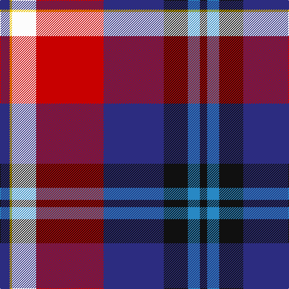

In pattern [BYWRBKBK](/patterns/bywrbkbk/).

This was sourced from register-of-tartans.  It is a [8 stripes tartan](/stripes/stripes8/).

Original link https://www.tartanregister.gov.uk/tartanDetails.aspx?ref=2895

## Attestations

This cloth appears in 2 source records; the oldest owns this page.

- 01/01/2004 — McKnight Dress #2 (Personal) (register-of-tartans, [record](https://www.tartanregister.gov.uk/tartanDetails.aspx?ref=2895))
- pre 2004 — McKnight Dress (Personal) (tartans-authority, [record](http://www.tartansauthority.com/tartan-ferret/display/6214/))

## Register references

External register numbers recorded for this tartan.

- Scottish Register of Tartans: [2895](https://www.tartanregister.gov.uk/tartanDetails.aspx?ref=2895)
- Scottish Tartans Authority (ITI): 6214

## Thread count
DB/16 Y4 W40 R112 DB100 K40 B20 K/12

## Palette
Each colour and its ΔE from the base-6 reference it is a variant of.

| Colour | Shade | Base | ΔE (OKLab) |
|---|---|---|---|
| B | <code style="background-color:#2888C4;">#2888C4</code> `#2888C4` | B <code style="background-color:#2A418A;">#2A418A</code> | 0.21 |
| DB | <code style="background-color:#2C2C80;">#2C2C80</code> `#2C2C80` | B <code style="background-color:#2A418A;">#2A418A</code> | 0.06 |
| K | <code style="background-color:#101010;">#101010</code> `#101010` | K <code style="background-color:#000000;">#000000</code> | 0.17 |
| R | <code style="background-color:#C80000;">#C80000</code> `#C80000` | R <code style="background-color:#CC0000;">#CC0000</code> | 0.01 |
| W | <code style="background-color:#FCFCFC;">#FCFCFC</code> `#FCFCFC` | W <code style="background-color:#F7F7F7;">#F7F7F7</code> | 0.01 |
| Y | <code style="background-color:#E8C000;">#E8C000</code> `#E8C000` | Y <code style="background-color:#F2BF00;">#F2BF00</code> | 0.02 |

# Sample pattern

## Nearest tartans

The nearest existing variants by ΔTartan distance.

1. [Vinther, Niels Christian (Personal)](/setts/s8/w3r14wa1k2g2k16b20w1~b5c8ca8-g649848-k101010-ra00048-we8ccb8-waf0e0c8~x2/) — ΔT 1.01
1. [Lermontov](/setts/s9/b2w2b24r9ra29y8k2y1k2~b202060-k101010-r888888-rac80000-we0e0e0-ye8c000~x2/) — ΔT 1.17
1. [Aberdeen Asset Management (Corp)](/setts/s11/b6w1b2r20g10y2g2y2b18r2k6~b1c0070-g006818-k101010-rc80000-wc0c0c0-yd09800~x2/) — ΔT 1.29
1. [Edinburgh Napier University](/setts/s8/b4w8b8w10k16y4r38ya1~b000cdb-k000000-rdc143c-wfaf0e6-y32cd32-yadaa520/) — ΔT 1.31
1. [Tribal](/setts/s10/y2k16r5k1ra8k1r5k1b16ya2~b5a008c-k101010-rdc0000-rafa4b00-y00c814-yae8c000~x4/) — ΔT 1.35
1. [Scotland's Charity Air Ambulance](/setts/s9/w2b27k1g3k1ba10k1r24w2~b3850c8-ba646464-g289c18-k101010-rff0000-wffffff~x2/) — ΔT 1.35
1. [Clinton Wedding](/setts/s12/w5b6r20k6ba5k3b26r2y1r2b3w3~b082c54-ba486488-k101010-re01c18-we8e8e8-yf4bc3c~x2/) — ΔT 1.37
1. [Clinton Wedding (Personal)](/setts/s12/w5b6r20k6ba5k3b26r2y1r2b3w3~b2c2c80-ba5c788c-k101010-rc8002c-we0e0e0-yc4bc68~x2/) — ΔT 1.42
1. [Longhaugh Primary School](/setts/s8/g20b2w2b12ba29r1ba1k3~b202060-ba780078-g289c18-k101010-rc80000-wfcfcfc~x2/) — ΔT 1.43
1. [Culloden, Dress](/setts/s8/r6b3ba24y2k23w23k2w6~b5480b0-ba800080-k000000-rc00000-we0e0e0-yf0c000~x2/) — ΔT 1.44

## Neighbour map

Every grey dot is one of 15726 variants placed by the first two principal components of the ΔTartan feature space (44% of its variance). Red is this tartan; blue dots are its nearest — click one to open its page.

<svg viewBox="0 0 640 380" role="img" style="max-width:100%;height:auto;border:1px solid #e0e0e0;border-radius:4px;display:block" xmlns="http://www.w3.org/2000/svg"><image href="/nn/cloud.v1.png" width="640" height="380"/><a href="/setts/s8/w3r14wa1k2g2k16b20w1~b5c8ca8-g649848-k101010-ra00048-we8ccb8-waf0e0c8~x2/"><circle cx="155.4" cy="114.1" r="4" fill="#3465a4"><title>Vinther, Niels Christian (Personal)</title></circle></a><a href="/setts/s9/b2w2b24r9ra29y8k2y1k2~b202060-k101010-r888888-rac80000-we0e0e0-ye8c000~x2/"><circle cx="193.2" cy="82.1" r="4" fill="#3465a4"><title>Lermontov</title></circle></a><a href="/setts/s11/b6w1b2r20g10y2g2y2b18r2k6~b1c0070-g006818-k101010-rc80000-wc0c0c0-yd09800~x2/"><circle cx="169.1" cy="104.8" r="4" fill="#3465a4"><title>Aberdeen Asset Management (Corp)</title></circle></a><a href="/setts/s8/b4w8b8w10k16y4r38ya1~b000cdb-k000000-rdc143c-wfaf0e6-y32cd32-yadaa520/"><circle cx="189.1" cy="73.9" r="4" fill="#3465a4"><title>Edinburgh Napier University</title></circle></a><a href="/setts/s10/y2k16r5k1ra8k1r5k1b16ya2~b5a008c-k101010-rdc0000-rafa4b00-y00c814-yae8c000~x4/"><circle cx="136.8" cy="108.6" r="4" fill="#3465a4"><title>Tribal</title></circle></a><a href="/setts/s9/w2b27k1g3k1ba10k1r24w2~b3850c8-ba646464-g289c18-k101010-rff0000-wffffff~x2/"><circle cx="203.3" cy="76.4" r="4" fill="#3465a4"><title>Scotland's Charity Air Ambulance</title></circle></a><a href="/setts/s12/w5b6r20k6ba5k3b26r2y1r2b3w3~b082c54-ba486488-k101010-re01c18-we8e8e8-yf4bc3c~x2/"><circle cx="199.3" cy="80.1" r="4" fill="#3465a4"><title>Clinton Wedding</title></circle></a><a href="/setts/s12/w5b6r20k6ba5k3b26r2y1r2b3w3~b2c2c80-ba5c788c-k101010-rc8002c-we0e0e0-yc4bc68~x2/"><circle cx="208.7" cy="82.1" r="4" fill="#3465a4"><title>Clinton Wedding (Personal)</title></circle></a><a href="/setts/s8/g20b2w2b12ba29r1ba1k3~b202060-ba780078-g289c18-k101010-rc80000-wfcfcfc~x2/"><circle cx="227.0" cy="98.1" r="4" fill="#3465a4"><title>Longhaugh Primary School</title></circle></a><a href="/setts/s8/r6b3ba24y2k23w23k2w6~b5480b0-ba800080-k000000-rc00000-we0e0e0-yf0c000~x2/"><circle cx="95.5" cy="128.3" r="4" fill="#3465a4"><title>Culloden, Dress</title></circle></a><circle cx="151.1" cy="102.8" r="5" fill="#c00000"/></svg>

ID: /setts/s8/b4y1w10r28b25k10ba5k3~b2c2c80-ba2888c4-k101010-rc80000-wfcfcfc-ye8c000~x4/
