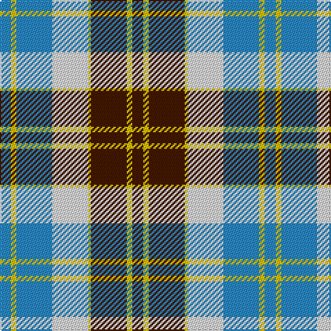

In pattern [BYBWYBYB](/patterns/bybwybyb/).

This was sourced from register-of-tartans.  It is a [8 stripes tartan](/stripes/stripes8/).

Original link https://www.tartanregister.gov.uk/tartanDetails.aspx?ref=206

## Attestations

This cloth appears in 2 source records; the oldest owns this page.

- 01/01/1975 — Bannockbane Tan (register-of-tartans, [record](https://www.tartanregister.gov.uk/tartanDetails.aspx?ref=206))
- pre 1975 — Bannockbane, Tan (Fashion) (tartans-authority, [record](http://www.tartansauthority.com/tartan-ferret/display/669/))

## Thread count
B/8 Y4 B26 LN26 Y2 DR26 Y4 DR/8

## Palette
Each colour and its ΔE from the base-6 reference it is a variant of.

| Colour | Shade | Base | ΔE (OKLab) |
|---|---|---|---|
| B | <code style="background-color:#2888C4;">#2888C4</code> `#2888C4` | B <code style="background-color:#2A418A;">#2A418A</code> | 0.21 |
| DR | <code style="background-color:#441800;">#441800</code> `#441800` | B <code style="background-color:#2A418A;">#2A418A</code> | 0.23 |
| LN | <code style="background-color:#E0E0E0;">#E0E0E0</code> `#E0E0E0` | W <code style="background-color:#F7F7F7;">#F7F7F7</code> | 0.07 |
| Y | <code style="background-color:#E8C000;">#E8C000</code> `#E8C000` | Y <code style="background-color:#F2BF00;">#F2BF00</code> | 0.02 |

# Sample pattern

## Nearest tartans

The nearest existing variants by ΔTartan distance.

1. [Bannockbane, Dark Tan](/setts/s8/b4y2b13y1w8ba13y2ba4~b401000-ba5480b0-we0e0e0-yf0c000~x2/) — ΔT 0.61
1. [Bannockbane Blue Trade Tartan Tartan Number: 665. Earliest known date: c.1984 A fashion pattern from the early 1970s. Other variants of the design appeared up to 1984. No place or family of the name is known and the pattern has no association with Bannockburn, or famous battle of 1314. Donald Broun may have been a designer with Edinburgh Woollen Mills. See products available Copyright © Blair Urquhart, Comrie, 2015](/setts/s8/b4y2b13w8y1k13y2k4~b5c8ca8-k101010-we0e0e0-ye8c000~x2/) — ΔT 0.70
1. [Bannockbane Grey #1](/setts/s8/k4y2k13y1w8r13y2r4~k101010-r888888-wfcfcfc-ye8c000~x2/) — ΔT 0.72
1. [Bannockbane Hunting (MacBean and Bishop)](/setts/s8/g3r2g14r1w10ga14r2ga3~g002814-ga808080-rbe7832-we0e0e0~x2/) — ΔT 0.74
1. [Robertson Dress (Dalgleish) #2](/setts/s8/b24r4g24r4w20r10g3w4~b2c2c80-g006818-rc80000-we0e0e0~x2/) — ΔT 0.95
1. [Robertson Dress Clan Tartan Tartan Number: 539. Earliest known date: pre 2003 This is a phantom tartan. (STS archive) See products available Copyright © Blair Urquhart, Comrie, 2015](/setts/s9/b24r4g24r4b4w20r10g3w4~b2c2c80-g006818-rc80000-we0e0e0~x2/) — ΔT 0.99
1. [MacKintosh (Artefact)](/setts/s7/r5w36b14r9g28r8b2~b780078-g006818-r880000-we0e0e0~x2/) — ΔT 1.00
1. [Bannock Bane M.407](/setts/s8/b4g3b21g2w14r22g3r4~b080848-g604000-rbe7832-we0e0e0~x2/) — ΔT 1.00
1. [Robertson, dress](/setts/s9/b24r4g24r4b4w20r10g3w4~b304080-g008000-rc00000-we0e0e0~x2/) — ΔT 1.02
1. [Unidentified (ex Tony Murray)](/setts/s8/b8w22b5w4k24r6k2r6~b003c64-k101010-rc80000-we0e0e0~x2/) — ΔT 1.02

## Neighbour map

Every grey dot is one of 15726 variants placed by the first two principal components of the ΔTartan feature space (44% of its variance). Red is this tartan; blue dots are its nearest — click one to open its page.

<svg viewBox="0 0 640 380" role="img" style="max-width:100%;height:auto;border:1px solid #e0e0e0;border-radius:4px;display:block" xmlns="http://www.w3.org/2000/svg"><image href="/nn/cloud.v1.png" width="640" height="380"/><a href="/setts/s8/b4y2b13y1w8ba13y2ba4~b401000-ba5480b0-we0e0e0-yf0c000~x2/"><circle cx="161.4" cy="173.1" r="4" fill="#3465a4"><title>Bannockbane, Dark Tan</title></circle></a><a href="/setts/s8/b4y2b13w8y1k13y2k4~b5c8ca8-k101010-we0e0e0-ye8c000~x2/"><circle cx="150.8" cy="174.4" r="4" fill="#3465a4"><title>Bannockbane Blue Trade Tartan Tartan Number: 665. Earliest known date: c.1984 A fashion pattern from the early 1970s. Other variants of the design appeared up to 1984. No place or family of the name is known and the pattern has no association with Bannockburn, or famous battle of 1314. Donald Broun may have been a designer with Edinburgh Woollen Mills. See products available Copyright © Blair Urquhart, Comrie, 2015</title></circle></a><a href="/setts/s8/k4y2k13y1w8r13y2r4~k101010-r888888-wfcfcfc-ye8c000~x2/"><circle cx="149.4" cy="170.1" r="4" fill="#3465a4"><title>Bannockbane Grey #1</title></circle></a><a href="/setts/s8/g3r2g14r1w10ga14r2ga3~g002814-ga808080-rbe7832-we0e0e0~x2/"><circle cx="165.0" cy="168.1" r="4" fill="#3465a4"><title>Bannockbane Hunting (MacBean and Bishop)</title></circle></a><a href="/setts/s8/b24r4g24r4w20r10g3w4~b2c2c80-g006818-rc80000-we0e0e0~x2/"><circle cx="103.3" cy="189.8" r="4" fill="#3465a4"><title>Robertson Dress (Dalgleish) #2</title></circle></a><a href="/setts/s9/b24r4g24r4b4w20r10g3w4~b2c2c80-g006818-rc80000-we0e0e0~x2/"><circle cx="105.1" cy="181.6" r="4" fill="#3465a4"><title>Robertson Dress Clan Tartan Tartan Number: 539. Earliest known date: pre 2003 This is a phantom tartan. (STS archive) See products available Copyright © Blair Urquhart, Comrie, 2015</title></circle></a><a href="/setts/s7/r5w36b14r9g28r8b2~b780078-g006818-r880000-we0e0e0~x2/"><circle cx="164.8" cy="159.3" r="4" fill="#3465a4"><title>MacKintosh (Artefact)</title></circle></a><a href="/setts/s8/b4g3b21g2w14r22g3r4~b080848-g604000-rbe7832-we0e0e0~x2/"><circle cx="156.8" cy="169.5" r="4" fill="#3465a4"><title>Bannock Bane M.407</title></circle></a><a href="/setts/s9/b24r4g24r4b4w20r10g3w4~b304080-g008000-rc00000-we0e0e0~x2/"><circle cx="107.6" cy="182.7" r="4" fill="#3465a4"><title>Robertson, dress</title></circle></a><a href="/setts/s8/b8w22b5w4k24r6k2r6~b003c64-k101010-rc80000-we0e0e0~x2/"><circle cx="137.4" cy="167.7" r="4" fill="#3465a4"><title>Unidentified (ex Tony Murray)</title></circle></a><circle cx="139.4" cy="169.8" r="5" fill="#c00000"/></svg>

ID: /setts/s8/b4y2b13w13y1ba13y2ba4~b2888c4-ba441800-we0e0e0-ye8c000~x2/
