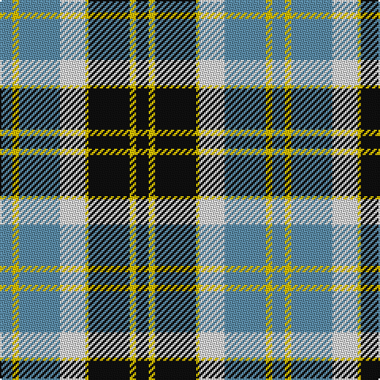

In pattern [BYBWYKYK](/patterns/bybwykyk/).

This was sourced from house-of-tartan.  It is a [8 stripes tartan](/stripes/stripes8/).

Original link http://www.house-of-tartan.scotland.net/house/TartanViewjs.asp?colr=Def&tnam=665

## Thread count
B/8 Y4 B26 LN16 Y2 K26 Y4 K/8

## Palette
Each colour and its ΔE from the base-6 reference it is a variant of.

| Colour | Shade | Base | ΔE (OKLab) |
|---|---|---|---|
| B | <code style="background-color:#5C8CA8;">#5C8CA8</code> `#5C8CA8` | B <code style="background-color:#2A418A;">#2A418A</code> | 0.23 |
| K | <code style="background-color:#101010;">#101010</code> `#101010` | K <code style="background-color:#000000;">#000000</code> | 0.17 |
| LN | <code style="background-color:#E0E0E0;">#E0E0E0</code> `#E0E0E0` | W <code style="background-color:#F7F7F7;">#F7F7F7</code> | 0.07 |
| Y | <code style="background-color:#E8C000;">#E8C000</code> `#E8C000` | Y <code style="background-color:#F2BF00;">#F2BF00</code> | 0.02 |

# Sample pattern

## Nearest tartans

The nearest existing variants by ΔTartan distance.

1. [Bannockbane Grey #1](/setts/s8/k4y2k13y1w8r13y2r4~k101010-r888888-wfcfcfc-ye8c000~x2/) — ΔT 0.54
1. [Bannockbane, Dark Tan](/setts/s8/b4y2b13y1w8ba13y2ba4~b401000-ba5480b0-we0e0e0-yf0c000~x2/) — ΔT 0.67
1. [Bannockbane Tan](/setts/s8/b4y2b13w13y1ba13y2ba4~b2888c4-ba441800-we0e0e0-ye8c000~x2/) — ΔT 0.70
1. [Bannockbane Hunting (MacBean and Bishop)](/setts/s8/g3r2g14r1w10ga14r2ga3~g002814-ga808080-rbe7832-we0e0e0~x2/) — ΔT 0.71
1. [Bannockbane, Blue](/setts/s8/b4y2b13w8y1k13y2k4~b5480b0-k000000-we0e0e0-yf0c000~x2/) — ΔT 0.75
1. [Cape Breton (yellow stripes)](/setts/s7/y6k6g30k8w18k6y3~g789484-k000000-wc0c0c0-ye8c000~x2/) — ΔT 0.81
1. [Unidentified (ex Tony Murray)](/setts/s8/b8w22b5w4k24r6k2r6~b003c64-k101010-rc80000-we0e0e0~x2/) — ΔT 0.93
1. [National Trust](/setts/s8/g2b8g8r3b1w12g2b1~b401000-g004010-r906030-we0e0e0~x2/) — ΔT 0.94
1. [Bannock Bane M.407](/setts/s8/b4g3b21g2w14r22g3r4~b080848-g604000-rbe7832-we0e0e0~x2/) — ΔT 0.95
1. [MacKay Dress](/setts/s6/b4w23g2k23g23k4~b1474b4-g006818-k101010-we0e0e0~x2/) — ΔT 0.99

## Neighbour map

Every grey dot is one of 15726 variants placed by the first two principal components of the ΔTartan feature space (44% of its variance). Red is this tartan; blue dots are its nearest — click one to open its page.

<svg viewBox="0 0 640 380" role="img" style="max-width:100%;height:auto;border:1px solid #e0e0e0;border-radius:4px;display:block" xmlns="http://www.w3.org/2000/svg"><image href="/nn/cloud.v1.png" width="640" height="380"/><a href="/setts/s8/k4y2k13y1w8r13y2r4~k101010-r888888-wfcfcfc-ye8c000~x2/"><circle cx="149.4" cy="170.1" r="4" fill="#3465a4"><title>Bannockbane Grey #1</title></circle></a><a href="/setts/s8/b4y2b13y1w8ba13y2ba4~b401000-ba5480b0-we0e0e0-yf0c000~x2/"><circle cx="161.4" cy="173.1" r="4" fill="#3465a4"><title>Bannockbane, Dark Tan</title></circle></a><a href="/setts/s8/b4y2b13w13y1ba13y2ba4~b2888c4-ba441800-we0e0e0-ye8c000~x2/"><circle cx="139.4" cy="169.8" r="4" fill="#3465a4"><title>Bannockbane Tan</title></circle></a><a href="/setts/s8/g3r2g14r1w10ga14r2ga3~g002814-ga808080-rbe7832-we0e0e0~x2/"><circle cx="165.0" cy="168.1" r="4" fill="#3465a4"><title>Bannockbane Hunting (MacBean and Bishop)</title></circle></a><a href="/setts/s8/b4y2b13w8y1k13y2k4~b5480b0-k000000-we0e0e0-yf0c000~x2/"><circle cx="143.0" cy="174.4" r="4" fill="#3465a4"><title>Bannockbane, Blue</title></circle></a><a href="/setts/s7/y6k6g30k8w18k6y3~g789484-k000000-wc0c0c0-ye8c000~x2/"><circle cx="145.2" cy="182.8" r="4" fill="#3465a4"><title>Cape Breton (yellow stripes)</title></circle></a><a href="/setts/s8/b8w22b5w4k24r6k2r6~b003c64-k101010-rc80000-we0e0e0~x2/"><circle cx="137.4" cy="167.7" r="4" fill="#3465a4"><title>Unidentified (ex Tony Murray)</title></circle></a><a href="/setts/s8/g2b8g8r3b1w12g2b1~b401000-g004010-r906030-we0e0e0~x2/"><circle cx="141.1" cy="171.1" r="4" fill="#3465a4"><title>National Trust</title></circle></a><a href="/setts/s8/b4g3b21g2w14r22g3r4~b080848-g604000-rbe7832-we0e0e0~x2/"><circle cx="156.8" cy="169.5" r="4" fill="#3465a4"><title>Bannock Bane M.407</title></circle></a><a href="/setts/s6/b4w23g2k23g23k4~b1474b4-g006818-k101010-we0e0e0~x2/"><circle cx="141.0" cy="197.0" r="4" fill="#3465a4"><title>MacKay Dress</title></circle></a><circle cx="150.8" cy="174.4" r="5" fill="#c00000"/></svg>

ID: /setts/s8/b4y2b13w8y1k13y2k4~b5c8ca8-k101010-we0e0e0-ye8c000~x2/
